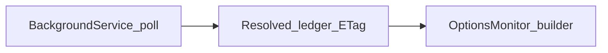

# Lyo.Config.Api.Hosting

Bridges **`IConfigApiClient`** ([`Lyo.Config.Api.Client`](../Lyo.Config.Api.Client/README.md)) into **`Microsoft.Extensions.DependencyInjection`** and **`Microsoft.Extensions.Options`**: a **`BackgroundService`** keeps a shared **`ResolvedConfigRecord`** ledger (ETags + **304** polling), then **one definition key JSON blob** binds each **`IOptionsMonitor<TOptions>`**.

Prefer **`IOptionsMonitor<TOptions>.CurrentValue`** (or **`OnChange`**) for values that reload at runtime. **`IOptions<TOptions>`** is not registered here and would not observe remote updates anyway.

## Registration order

```csharp
using Lyo.Config.Api.Client;
using Lyo.Config.Api.Hosting;

// 1 — HTTP client (`BaseUrl`, optional `ApiKey`)
services.AddConfigApiClientFromConfiguration(configuration);

// 2 — ledger + polling (binds configuration section defaults below)
services.AddConfigApiPolling(configuration);

// 3 — one registrant per POCO keyed by Config API definition Key
services.AddConfigApiOptions<MyFeatureOptions>(
    definitionKey: "myFeature",
    missingDefinitionKeyBehavior: ConfigApiMissingDefinitionKeyBehavior.Throw);
```

Reference the project `Lyo.Config.Api.Hosting` from your worker/API host (`Microsoft.Extensions.Hosting` is assumed).

## Configuration

**Client** (`ConfigApi` section) — see [`ConfigApiClientOptions`](../Lyo.Config.Api.Client/ConfigApiClientOptions.cs) in **`Lyo.Config.Api.Client`**.

**Polling identity + timing** (`ConfigApiPolling` section, **`ConfigApiPollingOptions.SectionName`**):

```json
{
  "ConfigApi": {
    "BaseUrl": "http://localhost:5088/",
    "ApiKey": ""
  },
  "ConfigApiPolling": {
    "Enabled": true,
    "AppKind": "worker",
    "AppId": "image-processor",
    "DelayWhenNotModified": "00:00:15",
    "StartupTimeout": "00:05:00",
    "RequireSuccessOnStartup": true
  }
}
```

- **`StartupTimeout`** — omit or **`null`** to wait indefinitely for the first **200**.
- **`RequireSuccessOnStartup`** — **`false`** allows the host to start after **`StartupTimeout`** even if no snapshot arrived (ledger stays empty unless you later reload manually; prefer keeping **`true`** unless you tolerate cold-start without remote config).

## Missing definition key behaviour

Defaults to **`ConfigApiMissingDefinitionKeyBehavior.Throw`** when:

- Ledger has never received a snapshot (and **`Throw`** is selected), **or**
- The definition key JSON is absent or deserialization returns **`null`**.

Choose **`UseDefaultInstance`** during optional features that may have no bindings yet (**`new TOptions()`** used as fallback).

## Runtime behaviour summary



1. Hosted service probes **`IConfigApiClient.ResolveForAppAsync`** with **`AppKind`/`AppId`** and **`If-None-Match`** from **`ConfigApiResolvedLedger.CurrentEtag`**.
2. On **200**, the ledger swaps in the new **`ResolvedConfigRecord`** and invalidates **`IChangeToken`** listeners.
3. Each **`ConfigApiOptionsMonitor<T>`** reacts by re-materializing **`T`** via **`ResolvedConfigRecord.TryGetValue(definitionKey, …)`** + JSON deserialize (same **`ConfigJsonSerializerOptions.Default`** semantics as **`GetValue<T>`** elsewhere).

REST paths remain in **[`../Lyo.Config.Api/README.md`](../Lyo.Config.Api/README.md)**. Resolve outcomes (**`ConfigResolveOutcome`**) are in **[`Lyo.Config.Api.Models`](../Lyo.Config.Api.Models/README.md)**; HTTP registration and **`ConfigPolling`** in **[`Lyo.Config.Api.Client`](../Lyo.Config.Api.Client/README.md)**.
