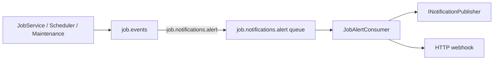

# Lyo.Job.Alerts

Hosted `JobAlertConsumer` that binds the `job.notifications.alert` routing key on the `job.events` exchange, deserializes `JobAlertEvent` payloads, and sends them through `INotificationPublisher` (in-process handlers) and/or an optional HTTP webhook.

Alert producers include `JobService` (SLA breaches), `JobScheduler` (failures, circuit breaker), and `JobMaintenanceService` (dead jobs, SLA scans) via `IJobEventPublisher.PublishAlertAsync`.

## Examples

### Register in DI

```csharp
services.AddJobAlerts(configuration);

// Or inline options:
services.AddJobAlerts(o => {
    o.AlertWebhookUrl = "https://hooks.example.com/job-alerts";
});
```

### Options (`JobAlertsOptions.SectionName` = `"JobAlerts"`)

```json
{
  "JobAlerts": {
    "AlertWebhookUrl": "https://hooks.example.com/job-alerts"
  }
}
```

## Registration

`IMqService` must already be registered and connected. `INotificationPublisher` is optional. When it is missing, only the webhook path runs (if configured).

## Options (`JobAlertsOptions.SectionName` = `"JobAlerts"`)

| Property | Default | Notes |
| ----------------- | ------- | -------------------------------------------------------- |
| `AlertWebhookUrl` | `null` | Each alert is POSTed as JSON to this URL when it is set. |

`JobAlertConsumer` does **not** read per-definition `AlertWebhookUrl` on `JobDefinition` (that field is persisted for custom integrations). Alerts from this package leave through `JobAlertsOptions.AlertWebhookUrl` (or `INotificationPublisher` handlers).

## Alert kinds (`JobAlertType`)

| Type | Usually produced by |
| ----------------------- | ----------------------------------------------------------------- |
| `Failure` | After consecutive failures the scheduler fires (`AlertOnFailure`) |
| `CircuitBreakerTripped` | The scheduler turns the definition off |
| `DeadJob` | Maintenance timeout (heartbeat missing) |
| `SlaBreach` | SLA checks in `JobService` start/finish; maintenance SLA scan |

## `JobAlertEvent` payload

```csharp
public sealed record JobAlertEvent(
    Guid DefinitionId,
    Guid? RunId,
    JobAlertType AlertType,
    string Message,
    DateTime Timestamp) : INotification;
```

When you use `INotificationPublisher`, implement `INotificationHandler<JobAlertEvent>` (or your app's notification pipeline).

## How it flows



A transient dispatch failure requeues the message (`HandleMessageAsync` returns `true`).

## Metrics

- `job.scheduler.circuit_breaker.tripped`
- `job.sla.breach` (`Constants.Metrics.Sla.Breach`)
- `job.maintenance.dead_jobs.failed`

## Dependencies

Generated from `ProjectReference` / `PackageReference` (same model as `docs/Lyo.ProjectGraph.html`).

- `Lyo.Common.Core` (direct, lyo)
- `Lyo.Job.Models` (direct, lyo)
- `Lyo.MessageQueue` (direct, lyo)
- `Lyo.Metrics` (direct, lyo)
- `Lyo.Notification` (direct, lyo)
- `Microsoft.Extensions.Hosting.Abstractions` `10.0.5` (direct, microsoft)
- `Microsoft.Extensions.Http` `10.0.5` (direct, microsoft)
- `Microsoft.Extensions.Options.ConfigurationExtensions` `10.0.5` (direct, microsoft)
- `Lyo.Api.Models` (transitive, lyo)
- `Lyo.Common.Json` (transitive, lyo)
- `Lyo.Common.Metadata` (transitive, lyo)
- `Lyo.DateAndTime` (transitive, lyo)
- `Lyo.Exceptions` (transitive, lyo)
- `Lyo.Health` (transitive, lyo)
- `Lyo.Parameters` (transitive, lyo)
- `Lyo.Query.Models` (transitive, lyo)
- `Lyo.Result` (transitive, lyo)
- `Lyo.Schedule.Models` (transitive, lyo)
- `Microsoft.Bcl.AsyncInterfaces` `10.0.5` (transitive, microsoft, netstandard2.0)
- `Microsoft.Extensions.DependencyInjection` `10.0.5` (transitive, microsoft)
- `Microsoft.Extensions.Logging.Abstractions` `10.0.5` (transitive, microsoft)
- `System.Diagnostics.DiagnosticSource` `10.0.5` (transitive, microsoft, netstandard2.0)
- `System.Memory` `4.6.3` (transitive, microsoft, netstandard2.0)
- `System.Text.Json` `10.0.5` (transitive, microsoft, netstandard2.0)