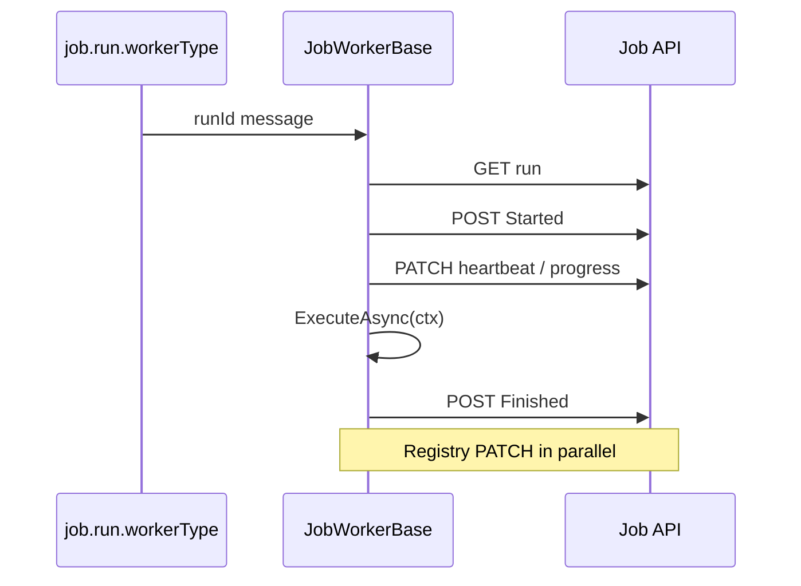

# Lyo.Job.Worker

Lyo job-system worker SDK. Subclass `JobWorkerBase` and implement `ExecuteAsync(IJobWorkerContext)`. The base class consumes the priority-enabled worker-type queue (`job.run.{workerType}` with `x-max-priority=10`), drives the run lifecycle (fetch, start, heartbeat, progress, finish), registers in the worker registry, decrypts encrypted parameters, supports batch child runs, subscribes to cancellation messages, links distributed traces from queue envelopes, and reports results back to the Job API.

`JobWorkerBase` extends `Lyo.MessageQueue.QueueWorkerBase<Guid, Result<Unit>>`, inheriting DLQ / requeue / ack semantics and `queue.worker.*` metrics.

## Examples

### Register in DI

```csharp
// IMqService (RabbitMQ) + Job.Client publisher — not Lyo.Job.Postgres
services.AddMqJobEventPublisher(); // Lyo.Job.Client — IMqService + Job.Client, not Postgres/Scheduler

services.AddJobWorker<MyImportWorker>(
    workerType: "csharp",
    apiBaseUrl: "https://api.example.com",
    maxRequeueCount: 5,
    dlqName: "job.run.csharp.dlq");

// Bind QueueWorkerOptions (section QueueWorkerOptions) for DefaultMaxRequeueCount / RequeueDelay:
services.AddJobWorkerFromConfiguration<MyImportWorker>(
    configuration, workerType: "csharp", apiBaseUrl: "https://api.example.com");
```

### Sample worker

```csharp
public sealed class MyImportWorker : JobWorkerBase
{
    public MyImportWorker(
        IMqService mq, IApiClient api, IJobEventPublisher events,
        string workerType, string apiBaseUrl,
        ILogger<MyImportWorker>? logger = null, IMetrics? metrics = null,
        int? maxRequeueCount = null, string? dlqName = null,
        IJobParameterEncryptionService? parameterEncryption = null)
        : base(mq, api, events, workerType, apiBaseUrl, logger, metrics,
               maxRequeueCount, dlqName, parameterEncryption) { }

    protected override async Task ExecuteAsync(IJobWorkerContext ctx)
    {
        await ctx.ReportProgressAsync(10, "Starting import");
        var batch = ctx.Run.JobRunParameters.GetInt("BatchSize") ?? 100;
        ctx.Results.AddCreateCount(batch);
        await ctx.ReportProgressAsync(100, "Complete");
    }
}
```

## Registration

Needs `IMqService`, `IJobClient` (registered automatically via `AddJobWorker` when `IApiClient` and `apiBaseUrl` are available), and `IJobEventPublisher`. Register the publisher with `Lyo.Job.Client.AddMqJobEventPublisher()` / `AddMqJobEventPublisherFromConfiguration()` (`IMqService` + Job.Client). Do **not** use `Lyo.Job.Postgres.AddMqJobEventPublisher*` on worker hosts, and do **not** reference `Lyo.Job.Scheduler` just for the publisher. Optional: `IJobParameterEncryptionService` (`AddJobParameterEncryption`), `ILogger<TWorker>`, `IMetrics`. When `dlqName` or `maxRequeueCount` are omitted, defaults derive from `QueueWorkerOptions` or `job.run.{workerType}.dlq`.

## Settings (`QueueWorkerOptions.SectionName` = `"QueueWorkerOptions"`)

These members are shared with `Lyo.MessageQueue.QueueWorkerBase` (see [`Lyo.MessageQueue`](../../../Communication/MessageQueue/Lyo.MessageQueue/README.md)):

| Property | Default | Purpose |
| ------------------------ | ------- | ---------------------------------------------- |
| `DefaultMaxRequeueCount` | `5` | Ceiling before DLQ routing |
| `RequeueDelay` | `2s` | Linear retry delay (needs `IDelayedMqService`) |

## Metrics (`job.worker.*`)

| Metric | Description |
| --------------------------------- | -------------------------------------------------------------------------------------------------------------- |
| `job.worker.run.executed` | Execute finished (tag `outcome`) |
| `job.worker.run.duration` | Wall time for the execute phase |
| `job.worker.heartbeat.sent` | Heartbeat PATCH on the run succeeded |
| `job.worker.heartbeat.failed` | Heartbeat PATCH on the run failed |
| `job.worker.cancellation.honored` | Run cancelled via an MQ signal |
| `job.worker.progress.reported` | `ReportProgressAsync` calls |
| `job.worker.start.rejected` | `Started` rejected by the API CAS guard (cancelled run / duplicate delivery). Message dropped, not requeued |
| `job.worker.shutdown.requeued` | Run handed back to `Queued` during graceful host shutdown |
| `job.worker.late_finish.dropped` | `Finished` report rejected as terminal (run already finalized, e.g. timed out by maintenance). Dropped cleanly |

The message-queue worker base also contributes inherited `queue.worker.*` metrics.

## Features of a worker

| Feature | Implementation |
| ------------------- | ------------------------------------------------------------------------------------------------------------------------------------------------------------------------------------------------------------------------------------------------------------------------------------------------------------------ |
| **Priority queues** | Worker declares `x-max-priority=10`; run priority from `JobRunReq` / definition. |
| **Worker registry** | `POST Job/WorkerInstance` on start (soft-fail if the Job API is down) with system info (memory, CPU, OS/runtime) and queue subscriptions; periodic PATCH with `InFlightCount` plus live working-set/GC; re-register on missing id / heartbeat `404`; `Stopped` on shutdown. Host extras via `GetWorkerMetadata()`. |
| **Progress** | Heartbeat PATCH includes `ProgressMessage` / `ProgressPercent`; `ctx.ReportProgressAsync(percent, message)`. |
| **Batch jobs** | `ctx.CreateChildRunsAsync(JobCreateChildRunsReq)` → `POST Job/Run/{parentId}/Children`. |
| **Encryption** | Decrypts `EncryptedValue` parameters when `IJobParameterEncryptionService` is registered. |
| **Tracing** | `JobTracing.StartWorkerExecution` links to envelope `TraceId`. |
| **Cancellation** | Per-run CTS + `SubscribeToRunCancellationsAsync`. |
| **Dry run** | Not applicable. Dry-run requests are validated and returned by `JobService` without MQ publish, so workers never receive them. |

Long-running jobs can change heartbeat/progress PATCH cadence by overriding `HeartbeatInterval` (default 30 s) on a subclass.

## How cancellation is topologized

Broadcast, not compete: each worker instance binds its **own exclusive auto-delete queue** (`job.run.{workerType}.cancel.{instanceId}`) to the `job.events` exchange on the `job.notifications.run.cancelled` routing key. Every instance of a scaled-out worker type therefore sees every cancel message; instances not executing that run simply ignore it. (A single shared cancel queue would deliver each cancel to only one competing consumer and silently lose cancellations for scaled-out workers.) Disconnect deletes those queues.

## Rejection and shutdown

- **Graceful host shutdown**. Via `POST Job/Run/{id}/Requeue`, a run interrupted by host shutdown (not by a user cancel) is handed back, which CAS-transitions it `Running -> Queued` for redelivery on restart instead of terminally cancelling it. If the requeue fails (API down, or the run is `Cancelling` because a user cancel is pending), the run is left for the maintenance dead-job watchdog.
- **`Started` rejected (400)**. Starts for non-`Queued` runs (run cancelled while queued, duplicate dispatch delivery) are rejected by the API's CAS guard. The worker drops the message without requeueing. Retrying can never succeed.
- **`Finished` rejected (400)**. The run was already finalized (e.g. timed out by maintenance while the worker was still executing). The worker logs and drops the report as terminal instead of churning it through DLQ/requeue. Transient finish failures (5xx, network) are retried before giving up.

## Lifecycle of a worker



1. **Fetch**. Full includes on `GET Job/Run/{id}`.
2. **Start**. Decrypt parameters; `POST Job/Run/{id}/Started`.
3. **Heartbeat loop**. Every `HeartbeatInterval` (default 30 s), PATCH `LastHeartbeatUtc` plus progress fields.
4. `ExecuteAsync(ctx)`. Subclass work; use `ctx.CreateChildRunsAsync`, `ctx.ReportProgressAsync`, `ctx.CancellationToken`.
5. **Finish**. `JobWorkerResultBuilder` results go to `POST Job/Run/{id}/Finished`.

`StartAsync` also declares `job.events` and `job.run.{workerType}` (and the worker DLQ when configured) when they are missing, registers the worker instance, and subscribes to cancellation messages for this `WorkerType`. Registry registration is best-effort: a failed
`POST Job/WorkerInstance` (for example when the Job API is unreachable) does not stop the worker from consuming jobs. Unregistered workers retry registration on every
`HeartbeatInterval` until the Job API accepts the request; a later heartbeat `404` also triggers re-registration.

## `IJobWorkerContext`

| Member | Purpose |
| ---------------------------------------- | ------------------------------------------------------------------------------------------------ |
| `Run` | `JobRunRes` loaded in full |
| `Logger` | Structured logger scoped to the run |
| `CancellationToken` | MQ cancel + host shutdown |
| `Results` | `JobWorkerResultBuilder` |
| `ReportProgressAsync(percent, message?)` | Progress PATCH immediately |
| `CreateChildRunsAsync(request)` | Fan-out child runs for a batch |
| `AddContext(name, value)` | Bind an object into the format bag and re-format String parameters from their original templates |
| `Format(template)` | Format an ad-hoc string against `jobrun` plus anything added via `AddContext` |

## Placeholders in string parameters

Once decrypt finishes, `JobWorkerBase` seeds the format bag with `jobrun` (run properties plus a `Parameters` map of coerced values — not a property on `JobRunRes`) and formats `FormatterLyoType.IsFormattable` JSON values that contain `{` (CLR `string` and `FormatterLyoType.Template` / formatter editor kind). Collections, Xml, and Json are skipped so JSON braces are not eaten. Unresolved tokens stay (`MaintainTokens`).

`AddContext("client", client)` re-formats from the **original** templates (multi-pass, cap 8) so `{jobrun.parameters.emailTo}` can resolve after `EmailTo` itself resolves. Values change in-memory only; there is no Job API PATCH. `IFormatterService` is property-injected (same as `RequeueDelay`); `AddJobWorker` registers `AddFormatterService()` when missing. No formatter means templates are left unchanged.

Write `{client.contact.emailAddress}` and `{Definition.Name}` — not `{{Name}}`. `DateTime.UtcNow` comes from the formatter clock; `lastSuccessJobRun` is whatever the worker puts in the bag.

```csharp
protected override async Task ExecuteAsync(IJobWorkerContext ctx)
{
    var client = await LoadClientAsync(ctx.Run.JobRunParameters.GetGuid("ClientId"), ctx.CancellationToken);
    ctx.AddContext("client", client);
    var to = ctx.Run.JobRunParameters.GetString("EmailTo");
    var subject = ctx.Run.JobRunParameters.GetString("EmailSubject");
}
```

Example stored values: `StartDate` = `2026-08-01`, `EmailTo` = `{client.contact.emailAddress}`, `EmailSubject` = `Since {DateTime.UtcNow.AddDays(-1):yyyy-MM-dd}`.

## `JobWorkerResultBuilder`

Fluent builder for finish results. `Build()` appends the `Result` key. Helpers: `Fail`, `SetOutcome`, `Cancel`, counter helpers, `AddFailedItem`, `AddError`, `AddApiCallTime`.

## Dependencies

Generated from `ProjectReference` / `PackageReference` (same model as `docs/Lyo.ProjectGraph.html`).

- `Lyo.Api.Client` (direct, lyo)
- `Lyo.Api.Models` (direct, lyo)
- `Lyo.Common.Metadata` (direct, lyo)
- `Lyo.Formatter` (direct, lyo)
- `Lyo.Http.Client` (direct, lyo)
- `Lyo.Job.Client` (direct, lyo)
- `Lyo.Job.Models` (direct, lyo)
- `Lyo.MessageQueue` (direct, lyo)
- `Lyo.Query.Models` (direct, lyo)
- `Lyo.SystemInformation` (direct, lyo)
- `Microsoft.Extensions.Hosting` `10.0.5` (direct, microsoft)
- `Microsoft.Extensions.Logging.Abstractions` `10.0.5` (direct, microsoft)
- `Lyo.Common.Core` (transitive, lyo)
- `Lyo.Common.Json` (transitive, lyo)
- `Lyo.DateAndTime` (transitive, lyo)
- `Lyo.Diagnostic` (transitive, lyo)
- `Lyo.Exceptions` (transitive, lyo)
- `Lyo.Hashing` (transitive, lyo)
- `Lyo.Health` (transitive, lyo)
- `Lyo.Metrics` (transitive, lyo)
- `Lyo.PackageMetadata` (transitive, lyo)
- `Lyo.Parameters` (transitive, lyo)
- `Lyo.Result` (transitive, lyo)
- `Lyo.Schedule.Models` (transitive, lyo)
- `AngleSharp` `1.5.0` (transitive, third-party)
- `DynamicExpresso.Core` `2.19.3` (transitive, third-party)
- `Microsoft.Bcl.AsyncInterfaces` `10.0.5` (transitive, microsoft, netstandard2.0)
- `Microsoft.Extensions.Configuration.Binder` `10.0.5` (transitive, microsoft)
- `Microsoft.Extensions.DependencyInjection` `10.0.5` (transitive, microsoft)
- `Microsoft.Extensions.DependencyInjection.Abstractions` `10.0.5` (transitive, microsoft)
- `Microsoft.Extensions.Hosting.Abstractions` `10.0.5` (transitive, microsoft)
- `Microsoft.Extensions.Http` `10.0.5` (transitive, microsoft)
- `Microsoft.Extensions.Options.ConfigurationExtensions` `10.0.5` (transitive, microsoft)
- `SmartFormat.NET` `3.6.1` (transitive, third-party)
- `System.Diagnostics.DiagnosticSource` `10.0.5` (transitive, microsoft, netstandard2.0)
- `System.IO.Hashing` `10.0.5` (transitive, microsoft, net10.0)
- `System.Memory` `4.6.3` (transitive, microsoft, netstandard2.0)
- `System.Text.Json` `10.0.5` (transitive, microsoft, netstandard2.0)
- `System.Threading.RateLimiting` `10.0.5` (transitive, microsoft)
- `System.Threading.Tasks.Extensions` `4.6.3` (transitive, microsoft)