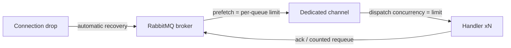

# Lyo.MessageQueue.RabbitMq

`IMqService` implementation (`RabbitMqService`) on `RabbitMQ.Client`. Also wired as `IRabbitMqService` when RabbitMQ-specific methods are needed (exchanges) that sit outside the shared contract.

## Features

- `RabbitMqOptions` singleton (registered via an explicit `Action<RabbitMqOptions>` or bound from configuration). Default section: `RabbitMqOptions.SectionName = "RabbitMqOptions"`.
- `IConnectionFactory` singleton built from those options, with:
- Host, virtual host, port, and credentials from options.
- `ClientProvidedName` set to `MachineName - ApplicationName (EnvironmentName)` so the RabbitMQ management UI can identify the connection.
- `ClientProperties` filled from the `connectionProperties` dictionary you pass to the extension (container id, build sha, and similar keys).
- `RabbitMqService` wired as a singleton, exposed as all three types: itself, `IRabbitMqService`, and `IMqService`.

## Examples

### Add services

```csharp
services.SetupRabbitMqServiceFromConfiguration(
    builder.Configuration,
    connectionProperties: new Dictionary<string, object?> { ["build_sha"] = buildSha });
// or
services.SetupRabbitMqService(
    connectionProperties: [],
    options =>
    {
        options.Host = "rabbit.internal";
        options.Port = 5672;
        options.VirtualHost = "/";
        options.AdminUrl = "http://rabbit.internal:15672";
        options.Username = "...";
        options.Password = "...";
    });
```

## Registration

- `RabbitMqOptions` singleton (registered via an explicit `Action<RabbitMqOptions>` or bound from configuration). Default section: `RabbitMqOptions.SectionName = "RabbitMqOptions"`.
- `IConnectionFactory` singleton built from those options, with:
- Host, virtual host, port, and credentials from options.
- `ClientProvidedName` set to `MachineName - ApplicationName (EnvironmentName)` so the RabbitMQ management UI can identify the connection.
- `ClientProperties` filled from the `connectionProperties` dictionary you pass to the extension (container id, build sha, and similar keys).
- `RabbitMqService` wired as a singleton, exposed as all three types: itself, `IRabbitMqService`, and `IMqService`.

## `RabbitMqOptions`

| Property | Type | Default | Purpose |
| ------------------------- | ------------------------------------ | -------------------- | ---------------------------------------------------------------------------------------------------------------------------------------------------------------------------------------------------------------------------- |
| `Host` | `string` | required | AMQP hostname. |
| `Port` | `int` | `5672` | AMQP port. |
| `VirtualHost` | `string` | `/` | RabbitMQ virtual host. |
| `Username` / `Password` | `string` | required | Credentials for AMQP and the Management API. |
| `AdminUrl` | `string` | required | Base URL of the RabbitMQ Management HTTP API (e.g. `http://host:15672`). Used when constructing `HttpClient.BaseAddress = "{AdminUrl}/api/"`; `ClearQueue`, `PeekQueueMessages`, and the queue-statistics APIs call into it. |
| `EnableMetrics` | `bool` | `false` | When `false`, the injected `IMetrics` is swapped for `NullMetrics.Instance`. |
| `ProcessingLimit` | `int` | `0` | Global maximum concurrent messages per queue. `0` means unlimited. Enforced as broker prefetch + channel dispatch concurrency + in-process semaphore (see below). |
| `QueueProcessingLimits` | `Dictionary<string, int>?` | `null` | Per-queue overrides for `ProcessingLimit` (queue name → limit). Example: `{ "job.run.cs": 1, "job.run.reports": 10 }`. |
| `PersistentMessages` | `bool` | `true` | Publish with delivery mode 2 so messages survive a broker restart on durable queues. |
| `PublisherConfirms` | `bool` | `false` | Confirm mode on the publish channel: `SendToQueue`/`SendToExchange` return `true` only after broker confirmation and `false` on nack (metric `mq.publish.unconfirmed`). Each publish pays an extra round-trip. |
| `AutomaticRecovery` | `bool` | `true` | RabbitMQ client automatic connection plus topology recovery (restores channels and consumers after a network drop). |
| `NetworkRecoveryInterval` | `TimeSpan` | `5s` | Pause between automatic recovery attempts. |
| `ConnectRetryCount` | `int` | `3` | Extra connect attempts inside `ConnectAsync` cover startup races (broker not accepting connections yet). `0` fails on the first error. |
| `ConnectRetryDelay` | `TimeSpan` | `2s` | Pause between connect attempts. |
| `DefinedQueues` | `IReadOnlyList<string>?` | `null` | Queues declared during `ConnectAsync`. |
| `ExceptionHandling` | `MessageProcessingExceptionHandling` | `RequeueOnException` | Strategy used when a subscribed handler throws. `ThrowAndRemoveFromQueue` acks the message and rethrows the exception (routed to the client's callback exception handler). |

## Concurrency per queue

`SubscribeToQueue` looks up the queue's limit (`QueueProcessingLimits[queue]`, falling back to
`ProcessingLimit`; `0` = unlimited) and enforces it at three levels:

1. **Broker prefetch.** `BasicQosAsync(0, limit, false)` on the dedicated subscription channel, so the
   broker only delivers `limit` unacked messages to this consumer. Real backpressure: excess messages stay
   on the server and are available to other consumers.
2. **Channel dispatch concurrency.** The subscription channel is created with
   `consumerDispatchConcurrency = limit`, so the client actually runs up to `limit` handler invocations in
   parallel (the RabbitMQ.Client 7.x default is 1, i.e. strictly sequential).
3. **In-process semaphore.** A `SemaphoreSlim(limit)` guards handler execution as a final in-process
   guarantee.

```json
"RabbitMqOptions": {
  "ProcessingLimit": 5,
  "QueueProcessingLimits": { "job.run.cs": 1, "job.run.reports": 10 }
}
```



## Recovering connections

When `AutomaticRecovery` is on (the default), the RabbitMQ client reconnects after a network drop, re-opens channels, re-declares topology, and restores consumers. The service keeps its consumer bookkeeping across the drop and logs/metrics the transition (`mq.connection.lost` then `mq.connection.recovered`). With recovery disabled, a lost connection clears all consumers. The process must reconnect and resubscribe itself. `DisconnectAsync` no longer poisons the instance: connect, disconnect, connect on the same `RabbitMqService` works. Disposal (`DisposeAsync`) is final.

## Deferred delivery

`SendToQueueDelayed(queueName, data, delay)` (on `IRabbitMqService`, also surfaced through the
`IDelayedMqService` capability interface in `Lyo.MessageQueue`) delivers a message after a delay with no
broker plugin. The message is published to a companion wait queue `{queue}.wait` declared with
`x-dead-letter-exchange: ""` / `x-dead-letter-routing-key: {queue}` and a per-message TTL equal to the
delay. When the TTL fires, the broker dead-letters the message onto the real queue. Wait-queue
declarations are cached per service instance. `QueueWorkerBase` uses this on its own for retry backoff
when its `RequeueDelay` is set (see the [Lyo.MessageQueue README](../Lyo.MessageQueue/README.md)).

> Note: TTL expiry is FIFO on each wait queue. A long-delay message queued ahead of a short-delay one delays
> the latter. For the retry-backoff use case (delays in the same order of magnitude) this is fine.

## Broker DLQ wiring

`CreateQueueWithDlq(queueName, durable, dlqName, arguments, ct)` declares `{queue}.dlq` (durable) plus the main queue with `x-dead-letter-exchange: ""` / `x-dead-letter-routing-key: {queue}.dlq`. This catches broker-side rejections the application never sees: nack without requeue, per-queue TTL expiry, and queue overflow. It complements (and does not replace) `QueueWorkerBase`'s application-level DLQ routing. > **Caveat:** RabbitMQ cannot change arguments on an existing queue. Declaring over an existing queue with different arguments fails with `PRECONDITION_FAILED`. The helper logs a clear error that tells you to delete and recreate the queue.

## Queue stats

`GetQueueInfoAsync(queueName, ct)` and `GetAllQueuesInfoAsync(ct)` (on `IRabbitMqService`) hit the Management API (`GET /api/queues/{vhost}[/{name}]`) and return the shared `MessageQueueInfo` record. Message counts, ready/unacked, consumer count, and state are first-class. AMQP flags (`durable`, `exclusive`, `auto_delete`), `x-*` arguments (DLQ, max-priority), and publish/deliver rates land in `AdditionalProperties` (see `Constants.QueueInfoProperties`). `GetExchangeInfoAsync` / `GetAllExchangesInfoAsync` do the same for exchanges (`GET /api/exchanges/{vhost}[/{name}]`). The `RabbitMqWorkbench` Blazor component lists queues and exchanges with these flags as chips. Statistics refresh on the management emission interval (~5s), so counts can lag slightly behind broker state.

## Capabilities

| Abstract call | RabbitMQ behavior |
| ------------------------------------------------------------------- | ---------------------------------------------------------------------------------------------------------------------------------------------------------------------------------------------------------------------------------------------------------------------------------- |
| `CreateQueue` | Declares queues with durability / exclusivity / auto-delete flags and a broker `arguments` dictionary. |
| `DeleteQueue` | Deletes a queue, optionally gated by `ifUnused` / `ifEmpty`. |
| `ClearQueue` | Purges first via the Management API (`DELETE /api/queues/{vhost}/{name}/contents`), then falls back to `QueuePurgeAsync` on the publish channel. |
| `BindQueueToExchange` | Binds a queue to an exchange with a routing key. |
| `SendToQueue` / `SendToExchange` | Publish on the shared publish channel with `BasicProperties` (persistence per `PersistentMessages`, generated `MessageId`, UTC timestamp); waits for broker confirmation when `PublisherConfirms` is on. |
| `SubscribeToQueue` | Opens one dedicated channel per subscriber (prefetch + dispatch concurrency from the per-queue limit), declares the queue, creates an `AsyncEventingBasicConsumer`, and bridges `ack/nack/requeue` onto the `Func<byte[], Task<bool>>` contract (`true` → requeue, `false` → ack). |
| `PeekQueueMessages` | Non-destructive read through the Management API (`POST /api/queues/{vhost}/{name}/get` with `ackmode=ack_requeue_true`). |
| `CreateExchange` / `DeleteExchange` | `CreateExchange` is on `IMqService` (every broker). `DeleteExchange` stays RabbitMQ-only on `IRabbitMqService`. |
| `SendToQueueDelayed` (RabbitMQ only) | Deferred delivery through TTL + dead-letter wait queues (see below). |
| `CreateQueueWithDlq` (RabbitMQ only) | Declares `{queue}.dlq` and attaches the main queue's dead-letter arguments (see below). |
| `GetQueueInfoAsync` / `GetAllQueuesInfoAsync` (RabbitMQ only) | Live queue statistics through the Management API. AMQP flags and `x-*` arguments land in `AdditionalProperties` (see below). |
| `GetExchangeInfoAsync` / `GetAllExchangesInfoAsync` (RabbitMQ only) | Live exchange listing through the Management API (`GET /api/exchanges/{vhost}[/{name}]`). |

Rabbit features evolve quickly, so (streams, quorum queues), advanced work tends to go through
`CreateQueue`'s `arguments` bag. Check `RabbitMqService` for the defaults you rely on before you upgrade
`RabbitMQ.Client`.

## Workers and hosted services

Use alongside `QueueWorkerBase` from [`Lyo.MessageQueue`](../Lyo.MessageQueue/README.md). Workers deserialize JSON payloads, reuse the envelope helpers, integrate DLQ / `maxRequeueCount`, and drain on `IHostedService` shutdown. Publish typed payloads with `IMqService.SendToQueueWithEnvelopeAsync` when a `QueueWorkerBase` consumer is on the other end. Schedulers (`Lyo.Job.Scheduler`) commonly publish triggers here while separate worker processes consume.

## Blazor UI

[`Lyo.MessageQueue.RabbitMq.Web.Components`](../Lyo.MessageQueue.RabbitMq.Web.Components/README.md) adds UI on the same service registrations for internal dashboards.

## Testing

`Lyo.MessageQueue.RabbitMq.Tests` exercises the service against a real broker using the `RabbitMqTestContainer` helper from [`Lyo.Testing.Containers`](../../../Core/Testing/Lyo.Testing.Containers/README.md) (management-enabled image, Docker required): connect/disconnect/reconnect, queue lifecycle + peek, publish→subscribe roundtrips, requeue/ack semantics, per-queue concurrency enforcement, publisher confirms, delayed delivery, DLQ auto-wiring, and queue statistics.

## Dependencies

Generated from `ProjectReference` / `PackageReference` (same model as `docs/Lyo.ProjectGraph.html`).

- `Lyo.Common.Json` (direct, lyo)
- `Lyo.Common.Metadata` (direct, lyo)
- `Lyo.Exceptions` (direct, lyo)
- `Lyo.MessageQueue` (direct, lyo)
- `Lyo.Metrics` (direct, lyo)
- `Microsoft.Extensions.Configuration.Binder` `10.0.5` (direct, microsoft)
- `RabbitMQ.Client` `7.2.1` (direct, third-party)
- `System.Text.Json` `10.0.5` (direct, microsoft, netstandard2.0)
- `Lyo.Common.Core` (transitive, lyo)
- `Lyo.Health` (transitive, lyo)
- `Lyo.Result` (transitive, lyo)
- `Microsoft.Bcl.AsyncInterfaces` `10.0.5` (transitive, microsoft, netstandard2.0)
- `Microsoft.Extensions.Hosting.Abstractions` `10.0.5` (transitive, microsoft)
- `System.Memory` `4.6.3` (transitive, microsoft, netstandard2.0)