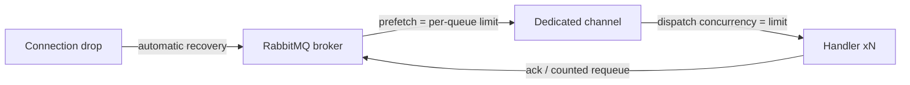

# Lyo.MessageQueue.RabbitMq

Concrete `IMqService` (`RabbitMqService`) using `RabbitMQ.Client`, also surfaced as `IRabbitMqService`
when you need RabbitMQ-specific knobs (exchanges) that are not part of the shared abstraction.

## Features

- `RabbitMqOptions` singleton (registered via an explicit `Action<RabbitMqOptions>` or bound from configuration. Default section name: `RabbitMqOptions.SectionName = "RabbitMqOptions"`.
- `IConnectionFactory` singleton built from those options with:
- Host / virtual host / port / credentials from options.
- `ClientProvidedName` set to `MachineName - ApplicationName (EnvironmentName)` so the connection is identifiable in the RabbitMQ management UI.
- `ClientProperties` populated from the `connectionProperties` dictionary you pass to the extension (rich connection metadata — container id, build sha, etc.).
- `RabbitMqService` registered as a singleton, exposed under all three types: itself, `IRabbitMqService`, and `IMqService`.

## Examples

### Register services

```csharp
services.SetupRabbitMqServiceFromConfiguration(
    builder.Configuration,
    connectionProperties: new Dictionary<string, object?> { ["build_sha"] = buildSha });
// or
services.SetupRabbitMqService(
    connectionProperties: [],
    options =>
    {
        options.Host = "rabbit.internal";
        options.Port = 5672;
        options.VirtualHost = "/";
        options.AdminUrl = "http://rabbit.internal:15672";
        options.Username = "...";
        options.Password = "...";
    });
```

## Registration

- `RabbitMqOptions` singleton (registered via an explicit `Action<RabbitMqOptions>` or bound from configuration. Default section name: `RabbitMqOptions.SectionName = "RabbitMqOptions"`.
- `IConnectionFactory` singleton built from those options with:
- Host / virtual host / port / credentials from options.
- `ClientProvidedName` set to `MachineName - ApplicationName (EnvironmentName)` so the connection is identifiable in the RabbitMQ management UI.
- `ClientProperties` populated from the `connectionProperties` dictionary you pass to the extension (rich connection metadata — container id, build sha, etc.).
- `RabbitMqService` registered as a singleton, exposed under all three types: itself, `IRabbitMqService`, and `IMqService`.

## `RabbitMqOptions`

| Property | Type | Default | Purpose |
| ------------------------- | ------------------------------------ | -------------------- | ----------------------------------------------------------------------------------------------------------------------------------------------------------------------------------------------------------------------- |
| `Host` | `string` | — required | AMQP host name. |
| `Port` | `int` | `5672` | AMQP port. |
| `VirtualHost` | `string` | `/` | RabbitMQ vhost. |
| `Username` / `Password` | `string` | — required | AMQP and Management API credentials. |
| `AdminUrl` | `string` | — **required** | Base URL of the RabbitMQ Management HTTP API (e.g. `http://host:15672`). Used to construct `HttpClient.BaseAddress = "{AdminUrl}/api/"`; `ClearQueue`, `PeekQueueMessages`, and the queue-statistics APIs call into it. |
| `EnableMetrics` | `bool` | `false` | When `false`, the injected `IMetrics` is replaced with `NullMetrics.Instance`. |
| `ProcessingLimit` | `int` | `0` | Global maximum concurrent messages per queue. `0` means no limit. Enforced as broker prefetch + channel dispatch concurrency + in-process semaphore (see below). |
| `QueueProcessingLimits` | `Dictionary<string, int>?` | `null` | Per-queue overrides of `ProcessingLimit` (queue name → limit). Example: `{ "job.run.cs": 1, "job.run.reports": 10 }`. |
| `PersistentMessages` | `bool` | `true` | Publish with delivery mode 2 so messages survive broker restarts on durable queues. |
| `PublisherConfirms` | `bool` | `false` | Confirm mode on the publish channel: `SendToQueue`/`SendToExchange` return `true` only after broker confirmation and `false` on nack (metric `mq.publish.unconfirmed`). Adds a round-trip per publish. |
| `AutomaticRecovery` | `bool` | `true` | RabbitMQ client automatic connection + topology recovery (restores channels and consumers after a network drop). |
| `NetworkRecoveryInterval` | `TimeSpan` | `5s` | Delay between automatic recovery attempts. |
| `ConnectRetryCount` | `int` | `3` | Extra connect attempts inside `ConnectAsync` for startup races (broker not accepting connections yet). `0` fails on the first error. |
| `ConnectRetryDelay` | `TimeSpan` | `2s` | Delay between connect attempts. |
| `DefinedQueues` | `IReadOnlyList<string>?` | `null` | Queues to declare on `ConnectAsync`. |
| `ExceptionHandling` | `MessageProcessingExceptionHandling` | `RequeueOnException` | Strategy applied when a subscribed handler throws. `ThrowAndRemoveFromQueue` acks the message and rethrows the exception (routed to the client's callback exception handler). |

## Per-queue concurrency

`SubscribeToQueue` resolves the queue's limit (`QueueProcessingLimits[queue]`, falling back to
`ProcessingLimit`; `0` = unlimited) and enforces it at three levels:

1. **Broker prefetch** — `BasicQosAsync(0, limit, false)` on the dedicated subscription channel, so the
   broker only delivers `limit` unacked messages to this consumer. Real backpressure: excess messages stay
   on the server and are available to other consumers.
2. **Channel dispatch concurrency** — the subscription channel is created with
   `consumerDispatchConcurrency = limit`, so the client actually runs up to `limit` handler invocations in
   parallel (the RabbitMQ.Client 7.x default is 1, i.e. strictly sequential).
3. **In-process semaphore** — a `SemaphoreSlim(limit)` guards handler execution as a final in-process
   guarantee.

```json
"RabbitMqOptions": {
  "ProcessingLimit": 5,
  "QueueProcessingLimits": { "job.run.cs": 1, "job.run.reports": 10 }
}
```



## Connection recovery

With `AutomaticRecovery` on (the default), the RabbitMQ client transparently reconnects after a network drop, re-opens channels, re-declares topology, and restores consumers. The service keeps its consumer bookkeeping across the drop and logs/metrics the transition (`mq.connection.lost` → `mq.connection.recovered`). With recovery disabled, a lost connection clears all consumers — the process must reconnect and resubscribe itself. `DisconnectAsync` no longer poisons the instance: connect → disconnect → connect on the same `RabbitMqService` works; disposal (`DisposeAsync`) is final.

## Delayed messages

`SendToQueueDelayed(queueName, data, delay)` (on `IRabbitMqService`, also exposed through the
`IDelayedMqService` capability interface in `Lyo.MessageQueue`) delivers a message after a delay with no
broker plugin: the message is published to a companion wait queue `{queue}.wait` declared with
`x-dead-letter-exchange: ""` / `x-dead-letter-routing-key: {queue}` and a per-message TTL equal to the
delay. When the TTL fires, the broker dead-letters the message onto the real queue. Wait-queue
declarations are cached per service instance. `QueueWorkerBase` uses this automatically for retry backoff
when its `RequeueDelay` is set (see the [Lyo.MessageQueue README](../Lyo.MessageQueue/README.md)).

> Note: TTL expiry is FIFO per wait queue — a long-delay message queued ahead of a short-delay one delays
> the latter. For the retry-backoff use case (delays in the same order of magnitude) this is fine.

## Broker-level DLQ auto-wiring

`CreateQueueWithDlq(queueName, durable, dlqName, arguments, ct)` declares `{queue}.dlq` (durable) and the main queue with `x-dead-letter-exchange: ""` / `x-dead-letter-routing-key: {queue}.dlq`. This catches broker-side rejections the application never sees: nack without requeue, per-queue TTL expiry, and queue overflow. It complements (does not replace) `QueueWorkerBase`'s application-level DLQ routing. > **Caveat:** RabbitMQ cannot change arguments on an existing queue. Declaring over an existing queue with > different arguments fails with `PRECONDITION_FAILED`; the helper logs a clear error telling you to delete > and recreate the queue.

## Queue statistics

`GetQueueInfoAsync(queueName, ct)` and `GetAllQueuesInfoAsync(ct)` (on `IRabbitMqService`) query the Management API (`GET /api/queues/{vhost}[/{name}]`) and return the shared `MessageQueueInfo` record — message counts, ready/unacked, consumer count, state, plus publish/deliver rates in `AdditionalProperties` when the broker reports them. The `RabbitMqWorkbench` Blazor component surfaces these in its **Stats** tab. Statistics update on the management emission interval (~5s), so counts can lag slightly behind broker state.

## Capabilities mapping

| Abstract call | RabbitMQ behaviour |
| -------------------------------------------------------------------------- | ------------------------------------------------------------------------------------------------------------------------------------------------------------------------------------------------------------------------------------------------------------------------------ |
| `CreateQueue` | Declares queues with durability / exclusivity / auto-delete flags plus a broker `arguments` dictionary. |
| `DeleteQueue` | Deletes a queue, optionally guarded by `ifUnused` / `ifEmpty`. |
| `ClearQueue` | Purges first via the Management API (`DELETE /api/queues/{vhost}/{name}/contents`), falling back to `QueuePurgeAsync` on the publish channel. |
| `BindQueueToExchange` | Binds queue ↔ exchange with a routing key. |
| `SendToQueue` / `SendToExchange` | Publish on the shared publish channel with `BasicProperties` (persistence per `PersistentMessages`, generated `MessageId`, UTC timestamp); awaits broker confirmation when `PublisherConfirms` is on. |
| `SubscribeToQueue` | Opens a dedicated channel per subscriber (prefetch + dispatch concurrency from the per-queue limit), declares the queue, creates an `AsyncEventingBasicConsumer`, and bridges `ack/nack/requeue` to the `Func<byte[], Task<bool>>` contract (`true` → requeue, `false` → ack). |
| `PeekQueueMessages` | Non-destructive read via the Management API (`POST /api/queues/{vhost}/{name}/get` with `ackmode=ack_requeue_true`). |
| `CreateExchange` / `DeleteExchange` (RabbitMQ only, on `IRabbitMqService`) | Direct exchange declaration / deletion. |
| `SendToQueueDelayed` (RabbitMQ only) | Delayed delivery via TTL + dead-letter wait queues (see below). |
| `CreateQueueWithDlq` (RabbitMQ only) | Declares `{queue}.dlq` and wires the main queue's dead-letter arguments (see below). |
| `GetQueueInfoAsync` / `GetAllQueuesInfoAsync` (RabbitMQ only) | Live queue statistics via the Management API (see below). |

Because Rabbit features evolve quickly (streams, quorum queues), anything advanced tends to funnel through
`CreateQueue`’s `arguments` bag; inspect `RabbitMqService` for the defaults you rely on before upgrading
`RabbitMQ.Client`.

## Hosted services and workers

Pair with `QueueWorkerBase` from [`Lyo.MessageQueue`](../Lyo.MessageQueue/README.md): workers deserialize JSON payloads, reuse the envelope helpers, integrate DLQ / `maxRequeueCount`, and drain gracefully on `IHostedService` shutdown. The publish helper `IMqService.SendToQueueWithEnvelopeAsync` is the recommended way to publish typed payloads to a queue consumed by such a worker. Schedulers (`Lyo.Job.Scheduler`) commonly publish triggers here while separate worker processes consume.

## Blazor tooling

[`Lyo.MessageQueue.RabbitMq.Web.Components`](../Lyo.MessageQueue.RabbitMq.Web.Components/README.md) layers a UI on top of the same service registrations for internal dashboards.

## Testing

`Lyo.MessageQueue.RabbitMq.Tests` runs the service against a real broker using the `RabbitMqTestContainer` helper from [`Lyo.Testing.Containers`](../../../Core/Lyo.Testing.Containers/README.md) (management-enabled image, Docker required): connect/disconnect/reconnect, queue lifecycle + peek, publish→subscribe roundtrips, requeue/ack semantics, per-queue concurrency enforcement, publisher confirms, delayed delivery, DLQ auto-wiring, and queue statistics.

## See also

- [`Lyo.MessageQueue`](../Lyo.MessageQueue/README.md) — the underlying contract, envelopes, and worker base.
- [`Lyo.Result`](../../../Core/Result/Lyo.Result/README.md) — worker results and the `Metadata["requeue"]` pattern.
- [`Lyo.Metrics`](../../../Core/Metrics/Lyo.Metrics/README.md) — counters and timers emitted by the service and `QueueWorkerBase`.
- [`Lyo.Testing.Containers`](../../../Core/Lyo.Testing.Containers/README.md) — RabbitMQ testcontainer + fixture for integration tests.

## Dependencies

Generated from `ProjectReference` / `PackageReference` (same model as `docs/Lyo.ProjectGraph.html`).

- `Lyo.Exceptions` — (direct, lyo)
- `Lyo.MessageQueue` — (direct, lyo)
- `Lyo.Metrics` — (direct, lyo)
- `Microsoft.Extensions.Configuration.Binder` `10.0.5` — (direct, microsoft)
- `RabbitMQ.Client` `7.2.1` — (direct, third-party)
- `System.Text.Json` `10.0.5` — (direct, microsoft, netstandard2.0)
- `Lyo.Common` — (transitive, lyo)
- `Lyo.Health` — (transitive, lyo)
- `Lyo.Result` — (transitive, lyo)
- `Microsoft.Extensions.DependencyInjection.Abstractions` `10.0.5` — (transitive, microsoft)
- `Microsoft.Extensions.Hosting.Abstractions` `10.0.5` — (transitive, microsoft)
- `Microsoft.Extensions.Logging.Abstractions` `10.0.5` — (transitive, microsoft)
- `Microsoft.Extensions.Options.ConfigurationExtensions` `10.0.5` — (transitive, microsoft)
- `System.Memory` `4.6.3` — (transitive, microsoft, netstandard2.0)