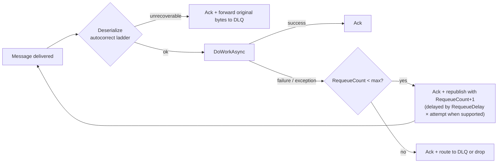

# Lyo.MessageQueue

`IMqService` defines the queue and exchange contract. Schedulers, workers, and gateways compile against one interface and swap RabbitMQ or later brokers behind `Lyo.MessageQueue.*` implementations.

Implements `Lyo.Health.IHealth` so dashboards can ping broker connectivity alongside DB/cache checks.

## `IMqService`

- `ConnectAsync` / `DisconnectAsync` open and close a session.
- `IsConnected` is a synchronous snapshot used as a guard.
- `CreateQueue` / `CreateExchange` declare topology. Brokers treat matching re-declares as no-ops.

## Message envelopes (`QueueMessageEnvelope<T>`)

`QueueMessageEnvelope<T>` holds `Payload`, `RequeueCount`, `MessageId`, `EnqueuedAt`, `TraceId`, and
`Version` alongside the payload. The internal `QueueWorkerHelpers.DeserializeMessage<T>` detects JSON
shaped like `{ Payload, RequeueCount, … }` vs raw DTO JSON so you can:

- Attach `RequeueCount` / identifiers / timestamps without wrapping every caller manually.
- Migrate legacy producers that still emit bare JSON objects. The first requeue from a legacy message
  is wrapped in an envelope by `QueueWorkerBase` so subsequent requeues count correctly.

`MessageProcessingExceptionHandling` (`IgnoreAndRemoveFromQueue`, `ThrowAndRemoveFromQueue`,
`RequeueOnException`) is the shared enum implementations expose for tuning how thrown exceptions in
message handlers map onto ack/nack/requeue.

## `QueueWorkerBase`

- Implements `IHostedService` + `IDisposable` + `IHealth`. `StartAsync` connects when needed and calls `SubscribeToQueue`. `StopAsync` cancels, then waits up to `DrainTimeoutMs` (default `30_000` ms) for in-flight messages, then returns.
- Parses messages with the envelope-aware `DeserializeMessage` helper.
- Executes your abstract `DoWorkAsync(TRequest, CancellationToken) → Task<TResult>`.
- Applies requeue heuristics: an optional `Metadata["requeue"]` bool on the result overrides the default `!IsSuccess` requeue rule.
- Supports `maxRequeueCount` + optional DLQ publish (`dlqName`); when the count is exceeded, original message bytes go to the DLQ if one is configured; otherwise the message is dropped at Error level.
- Optional retry backoff through the public `RequeueDelay` property: when set and the transport implements `IDelayedMqService`, each counted requeue is republished with a broker-side delay of `RequeueDelay × attempt` (linear backoff), so a failing message cannot burn through its retry budget in milliseconds. Transports without delay support republish immediately.

## Retry path for envelopes

Each failure path acks the original delivery and republishes a counted copy. A bad message or a
repeatedly-throwing `DoWorkAsync` cannot loop forever on broker redelivery:

## `QueueWorkerOptions`

Shared defaults come from DI registration paths (for example `AddJobWorker` / `AddJobWorkerFromConfiguration`,
section name `"QueueWorkerOptions"`). The `QueueWorkerBase` constructor signature is unchanged:

| Property | Type | Default | Purpose |
| ------------------------ | ----------- | ------- | ----------------------------------------------------------------------------------------------------------------- |
| `DefaultMaxRequeueCount` | `int?` | `5` | Requeue cap applied when a worker doesn't pass an explicit `maxRequeueCount`. `null` means unlimited retries. |
| `RequeueDelay` | `TimeSpan?` | `2s` | Base retry delay (linear backoff by attempt). Needs an `IDelayedMqService` transport; `null`/zero means no delay. |

- Tracks `InFlightCount`, publishes a `queue-worker:{QueueName}` health probe via `CheckHealthAsync`, and
  emits metrics via the injected `IMetrics`:
    - `queue.worker.message.processing.duration` (timer; tag `queue`)
    - `queue.worker.messages.received` / `processed` / `requeued` / `deserialization.failed` / `dropped.max_requeue` / `dlq`
    - `queue.worker.started` / `start.failed` / `stopped`
    - `queue.worker.running` (gauge; `1` while running, `0` after stop)
    - Error records on `queue.worker.message.processing.error` and `queue.worker.message.deserialization.error`

Lyo job and email workers use this hosted-consumer path.

## Health and diagnostics data

- `MqServiceHealth`. `Queues` and `Connections` collections.
- `MessageQueueInfo(Name, State?, Type?, Messages, MessagesReady, MessagesUnacknowledged, Consumers, AdditionalProperties)`. Snapshot of one queue. AMQP declare flags (`durable`, `exclusive`, `auto_delete`) and `x-*` arguments are RabbitMQ-only and sit in `AdditionalProperties`.
- `MessageExchangeInfo(Name, Type?, Durable, AutoDelete, Internal, AdditionalProperties)`. Per-exchange snapshot.
- `ConnectionInfo(User, UserProvidedName?, State, VHost)`. Snapshot of a connection.
- `QueuePeekMessage(Payload, PayloadEncoding?, Exchange?, RoutingKey?, MessageCount?, Redelivered)`. Returned by `PeekQueueMessages`.

## Operations

- Treat `byte[]` as opaque on the interface. Sign and compress at the app layer when payloads leave a trust zone.
- **Idempotency.** Requeue storms show up when handlers throw. Keep side effects idempotent or persist processing tokens.
- **Health.** Implementors should make `IHealth` report broker reachability. Do not report healthy while `IsConnected()` is false unless you want a lazy connect.

## Implementations and UI

| Package | Role |
| --------------------------------------------------------------------- | --------------------------------------------------------------- |
| [`Lyo.MessageQueue.RabbitMq`](../Lyo.MessageQueue.RabbitMq/README.md) | `RabbitMQ.Client` driver plus DI helpers. |
| `Lyo.MessageQueue.Web.Components` | Blazor UI for inspecting and managing queues in internal tools. |
| `Lyo.MessageQueue.RabbitMq.Web.Components` | Rabbit-specific components and registration. |

## Related

- [`Lyo.Job.Scheduler`](../../../Apps/Job/Lyo.Job.Scheduler/README.md). Often paired with queues for fan-out triggers.
- [`Lyo.Health`](../../../Core/Health/Lyo.Health/README.md). Shared health reporting.

## Dependencies

Generated from `ProjectReference` / `PackageReference` (same model as `docs/Lyo.ProjectGraph.html`).

- `Lyo.Common.Json` (direct, lyo)
- `Lyo.Exceptions` (direct, lyo)
- `Lyo.Health` (direct, lyo)
- `Lyo.Metrics` (direct, lyo)
- `Lyo.Result` (direct, lyo)
- `Microsoft.Extensions.Hosting.Abstractions` `10.0.5` (direct, microsoft)
- `Lyo.Common.Core` (transitive, lyo)
- `Microsoft.Bcl.AsyncInterfaces` `10.0.5` (transitive, microsoft, netstandard2.0)
- `System.Memory` `4.6.3` (transitive, microsoft, netstandard2.0)
- `System.Text.Json` `10.0.5` (transitive, microsoft, netstandard2.0)