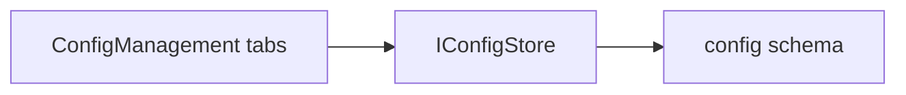

# Lyo.Config.Web.Components

Blazor / MudBlazor dashboard for [`Lyo.Config`](../Lyo.Config/README.md). Add `ConfigManagement` to a host page for definitions, resolved per-entity values, and binding revision revert.

Components take `IConfigStore` as a parameter. There is no `AddXxx` DI registration. The host registers the store (typically `AddPostgresConfigStoreFromConfiguration`) and passes it in.

Lists are in-memory `MudTable`s over `IConfigStore` results. This package does not call Config.Api or `QueryConcrete`.

Targets interactive Blazor on `net10.0`.

## Examples

### How a host wires this up

```razor
@inject IConfigStore Store

<ConfigManagement Store="Store" InitialSubjectEntityType="App" InitialSubjectEntityId="gateway:local" />
```

### Architecture



## Top-level entry point

```razor
@using Lyo.Config.Web.Components

<ConfigManagement Store="Store" />
```

| Parameter | Notes |
| -------------------------- | --------------------------------------------------------------------------- |
| `Store` | Required `IConfigStore`. Hosts inject the store and pass it in. |
| `InitialSubjectEntityType` | Toolbar prefill. Defaults to `App` (`AppConfigEntity.AppEntityType`). |
| `InitialSubjectEntityId` | Toolbar prefill for the entity instance (string; app routes use `kind:id`). |

`ConfigManagement` owns subject entity type/id (Apply to load) and renders tabbed `MudTabs`: Definitions, Resolved, Revisions. `GetDefinitionsAsync` requires an entity type; bindings and `LoadConfigAsync` also need an id. There is no list-all-definitions API.

## Component catalog

| Component | Role |
| ---------------------- | --------------------------------------------------------------------------------------------------------------------------------------------------------------------------------------------------------------------------------------- |
| `ConfigManagement` | Toolbar + tabbed dashboard shell. |
| `ConfigDefinitionGrid` | Mud table of definitions for the current entity type; create/edit/delete. |
| `ConfigDefinitionView` | `LyoDialog` + `LyoForm` editor. Optional default via `ConfigValueEditor`. Calls `Validate()` before save. Delete of a definition cascades bindings and revisions. |
| `ConfigResolvedView` | `LoadConfigAsync` merge for type+id. Source chips: Binding / Default / Missing. Edit or clear a binding; History jumps to Revisions. If required keys are missing, shows the store error and a fallback list from definitions+bindings. |
| `ConfigBindingView` | Binding editor. Key, entity, and value type are locked to the definition. `tenantId` is always null. |
| `ConfigValueEditor` | `TypeName` plus `JsonEditor` on `ConfigValue.Json` (`ConfigJsonSerializerOptions.Default`, indented in the editor). |
| `ConfigRevisionList` | Newest-first revisions for a selected binding. Revert copies that snapshot and appends a new revision. |
| `ConfigColorHelper` | Chip colors for required/optional and Binding/Default/Missing. Rendering goes through `LyoChip`. |

## Store calls

- `SaveDefinitionAsync` / `SaveBindingAsync(..., tenantId: null)`.
- `DeleteDefinitionAsync` — confirm in UI; PostgreSQL cascades bindings and revisions.
- `DeleteBindingAsync` — `InvalidOperationException` when `IsRequired` and there is no default is shown as a snackbar.
- `LoadConfigAsync` — required-missing is shown as a warning; fallback rows still let you edit bindings.
- `GetBindingRevisionsAsync` / `RevertBindingToRevisionAsync` — revert is auditable (new revision appended).

## Shared UI

Reuse `LyoDialog` / `LyoDialogPresets`, `LyoForm` / `LyoFormInput`, `LyoIdField`, `LyoChip` / `LyoChips`, `LyoTimestamp`, `LyoTruncatedText`, and `JsonEditor`. Status chips go in `TitleChips`, not `TitleContent`. Do not use `LyoDataGrid` / `LyoDataGridProjected` (those require `QueryConcrete`).

## See also

- [`Lyo.Config`](../Lyo.Config/README.md). `IConfigStore`, records, `AppConfigEntity`.
- [`Lyo.Config.Postgres`](../Lyo.Config.Postgres/README.md). `AddPostgresConfigStoreFromConfiguration`.
- [`Lyo.TestGateway`](../../../Tools/Lyo.TestGateway/README.md). `/config` workbench with in-process Postgres and a sample seed.

## Dependencies

Generated from `ProjectReference` / `PackageReference` (same model as `docs/Lyo.ProjectGraph.html`).

- `Lyo.Config` (direct, lyo)
- `Lyo.Web.Components` (direct, lyo)
- `MudBlazor` `9.3` (direct, third-party)
- `Lyo.Api.Client` (transitive, lyo)
- `Lyo.Api.Models` (transitive, lyo)
- `Lyo.Cache` (transitive, lyo)
- `Lyo.Common` (transitive, lyo)
- `Lyo.Compression` (transitive, lyo)
- `Lyo.DataTable.Models` (transitive, lyo)
- `Lyo.DateAndTime` (transitive, lyo)
- `Lyo.Diagnostic` (transitive, lyo)
- `Lyo.Encryption` (transitive, lyo)
- `Lyo.EntityReference.Models` (transitive, lyo)
- `Lyo.Exceptions` (transitive, lyo)
- `Lyo.Hashing` (transitive, lyo)
- `Lyo.Health` (transitive, lyo)
- `Lyo.IO.Temp` (transitive, lyo)
- `Lyo.KeyStore` (transitive, lyo)
- `Lyo.Metrics` (transitive, lyo)
- `Lyo.PackageMetadata` (transitive, lyo)
- `Lyo.Query` (transitive, lyo)
- `Lyo.Query.Models` (transitive, lyo)
- `Lyo.Result` (transitive, lyo)
- `Lyo.Streams` (transitive, lyo)
- `Lyo.Validation` (transitive, lyo)
- `Blazored.LocalStorage` `4.5.0` (transitive, third-party)
- `BouncyCastle.Cryptography` `2.6.2` (transitive, third-party, netstandard2.0)
- `EasyCompressor` `2.1.0` (transitive, third-party)
- `Konscious.Security.Cryptography.Argon2` `1.3.1` (transitive, third-party)
- `Microsoft.Bcl.AsyncInterfaces` `10.0.5` (transitive, microsoft, netstandard2.0)
- `Microsoft.Extensions.Caching.Memory` `10.0.5` (transitive, microsoft)
- `Microsoft.Extensions.Configuration.Binder` `10.0.5` (transitive, microsoft)
- `Microsoft.Extensions.DependencyInjection` `10.0.5` (transitive, microsoft)
- `Microsoft.Extensions.DependencyInjection.Abstractions` `10.0.5` (transitive, microsoft, net10.0, netstandard2.0)
- `Microsoft.Extensions.Hosting.Abstractions` `10.0.5` (transitive, microsoft)
- `Microsoft.Extensions.Http` `10.0.5` (transitive, microsoft)
- `Microsoft.Extensions.Logging.Abstractions` `10.0.5` (transitive, microsoft)
- `Microsoft.Extensions.Options.ConfigurationExtensions` `10.0.5` (transitive, microsoft)
- `System.Buffers` `4.6.1` (transitive, microsoft, netstandard2.0)
- `System.ComponentModel.Annotations` `5.0.0` (transitive, microsoft)
- `System.IO.Hashing` `10.0.5` (transitive, microsoft, net10.0)
- `System.Memory` `4.6.3` (transitive, microsoft, netstandard2.0)
- `System.Text.Json` `10.0.5` (transitive, microsoft, netstandard2.0)
- `System.Threading.Tasks.Extensions` `4.6.3` (transitive, microsoft, netstandard2.0)