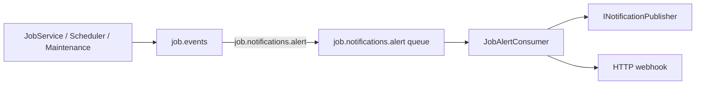

# Lyo.Job.Alerts

Hosted **`JobAlertConsumer`** that subscribes to the `job.notifications.alert` routing key on the `job.events` exchange, deserializes **`JobAlertEvent`** payloads, and dispatches
them through **`INotificationPublisher`** (in-process handlers) and/or an optional **HTTP webhook**.

Alert producers include `JobService` (SLA breaches), `JobScheduler` (failures, circuit breaker), and `JobMaintenanceService` (dead jobs, SLA scans) via
`IJobEventPublisher.PublishAlertAsync`.

## Registration

```csharp
services.AddJobAlerts(configuration);

// Or inline options:
services.AddJobAlerts(o => {
    o.AlertWebhookUrl = "https://hooks.example.com/job-alerts";
});
```

Requires `IMqService` to be registered and connected. `INotificationPublisher` is optional — when absent, only the webhook path runs (if configured).

## Configuration (`JobAlertsOptions.SectionName` = `"JobAlerts"`)

| Property          | Default | Notes                                               |
|-------------------|---------|-----------------------------------------------------|
| `AlertWebhookUrl` | `null`  | When set, each alert is POSTed as JSON to this URL. |

Per-definition `AlertWebhookUrl` on `JobDefinition` is persisted for custom integrations but is **not** read by `JobAlertConsumer` — only `JobAlertsOptions.AlertWebhookUrl` (or
`INotificationPublisher` handlers) dispatch alerts from this package.

```json
{
  "JobAlerts": {
    "AlertWebhookUrl": "https://hooks.example.com/job-alerts"
  }
}
```

## Alert types (`JobAlertType`)

| Type                    | Typical source                                             |
|-------------------------|------------------------------------------------------------|
| `Failure`               | Scheduler after consecutive failures (`AlertOnFailure`)    |
| `CircuitBreakerTripped` | Scheduler disables definition                              |
| `DeadJob`               | Maintenance timeout (no heartbeat)                         |
| `SlaBreach`             | `JobService` start/finish SLA checks; maintenance SLA scan |

## `JobAlertEvent` payload

```csharp
public sealed record JobAlertEvent(
    Guid DefinitionId,
    Guid? RunId,
    JobAlertType AlertType,
    string Message,
    DateTime Timestamp) : INotification;
```

Implement `INotificationHandler<JobAlertEvent>` (or your app's notification pipeline) when using `INotificationPublisher`.

## Flow



Transient dispatch failures requeue the message (`HandleMessageAsync` returns `true`).

## Metrics

Alert emission is counted indirectly via downstream systems. Related job metrics:

- `job.scheduler.circuit_breaker.tripped`
- `job.sla.breach` (`Constants.Metrics.Sla.Breach`)
- `job.maintenance.dead_jobs.failed`

## Dependencies

*(Synchronized from `Lyo.Job.Alerts.csproj`.)*

**Target framework:** `net10.0`

### NuGet packages

| Package                                                | Version |
|--------------------------------------------------------|---------|
| `Microsoft.Extensions.Hosting.Abstractions`            | `[10,)` |
| `Microsoft.Extensions.Http`                            | `[10,)` |
| `Microsoft.Extensions.Options.ConfigurationExtensions` | `[10,)` |

### Project references

- [`Lyo.Job.Models`](../Lyo.Job.Models/README.md)
- [`Lyo.MessageQueue`](../../../Communication/MessageQueue/Lyo.MessageQueue/README.md)
- [`Lyo.Notification`](../../../Core/Notification/Lyo.Notification/README.md)

### Related packages

- [`Lyo.Job.Postgres`](../Lyo.Job.Postgres/README.md) — publishes alerts via `MqJobEventPublisher`
- [`Lyo.Job.SignalR`](../Lyo.Job.SignalR/README.md) — also listens for alert routing key on the dashboard
