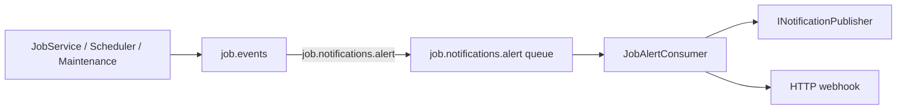

# Lyo.Job.Alerts

Hosted **`JobAlertConsumer`** that subscribes to the `job.notifications.alert` routing key on the `job.events` exchange, deserializes **`JobAlertEvent`** payloads, and dispatches
them through **`INotificationPublisher`** (in-process handlers) and/or an optional **HTTP webhook**.

Alert producers include `JobService` (SLA breaches), `JobScheduler` (failures, circuit breaker), and `JobMaintenanceService` (dead jobs, SLA scans) via
`IJobEventPublisher.PublishAlertAsync`.

## Examples

### Register services

```csharp
services.AddJobAlerts(configuration);

// Or inline options:
services.AddJobAlerts(o => {
    o.AlertWebhookUrl = "https://hooks.example.com/job-alerts";
});
```

### Configuration (`JobAlertsOptions.SectionName` = `"JobAlerts"`)

```json
{
  "JobAlerts": {
    "AlertWebhookUrl": "https://hooks.example.com/job-alerts"
  }
}
```

## Registration

Requires `IMqService` to be registered and connected. `INotificationPublisher` is optional — when absent, only the webhook path runs (if configured).

## Configuration (`JobAlertsOptions.SectionName` = `"JobAlerts"`)

| Property | Default | Notes |
| ----------------- | ------- | --------------------------------------------------- |
| `AlertWebhookUrl` | `null` | When set, each alert is POSTed as JSON to this URL. |

Per-definition `AlertWebhookUrl` on `JobDefinition` is persisted for custom integrations but is **not** read by `JobAlertConsumer` — only `JobAlertsOptions.AlertWebhookUrl` (or
`INotificationPublisher` handlers) dispatch alerts from this package.

## Alert types (`JobAlertType`)

| Type | Typical source |
| ----------------------- | ---------------------------------------------------------- |
| `Failure` | Scheduler after consecutive failures (`AlertOnFailure`) |
| `CircuitBreakerTripped` | Scheduler disables definition |
| `DeadJob` | Maintenance timeout (no heartbeat) |
| `SlaBreach` | `JobService` start/finish SLA checks; maintenance SLA scan |

## `JobAlertEvent` payload

```csharp
public sealed record JobAlertEvent(
    Guid DefinitionId,
    Guid? RunId,
    JobAlertType AlertType,
    string Message,
    DateTime Timestamp) : INotification;
```

Implement `INotificationHandler<JobAlertEvent>` (or your app's notification pipeline) when using `INotificationPublisher`.

## Flow



Transient dispatch failures requeue the message (`HandleMessageAsync` returns `true`).

## Metrics

- `job.scheduler.circuit_breaker.tripped`
- `job.sla.breach` (`Constants.Metrics.Sla.Breach`)
- `job.maintenance.dead_jobs.failed`

## Dependencies

Generated from `ProjectReference` / `PackageReference` (same model as `docs/Lyo.ProjectGraph.html`).

- `Lyo.Job.Models` — (direct, lyo)
- `Lyo.MessageQueue` — (direct, lyo)
- `Lyo.Notification` — (direct, lyo)
- `Microsoft.Extensions.Hosting.Abstractions` `10.0.5` — (direct, microsoft)
- `Microsoft.Extensions.Http` `10.0.5` — (direct, microsoft)
- `Microsoft.Extensions.Options.ConfigurationExtensions` `10.0.5` — (direct, microsoft)
- `Lyo.Api.Models` — (transitive, lyo)
- `Lyo.Common` — (transitive, lyo)
- `Lyo.DateAndTime` — (transitive, lyo)
- `Lyo.Exceptions` — (transitive, lyo)
- `Lyo.Health` — (transitive, lyo)
- `Lyo.Metrics` — (transitive, lyo)
- `Lyo.Query.Models` — (transitive, lyo)
- `Lyo.Result` — (transitive, lyo)
- `Lyo.Schedule.Models` — (transitive, lyo)
- `Microsoft.Extensions.DependencyInjection` `10.0.5` — (transitive, microsoft)
- `Microsoft.Extensions.DependencyInjection.Abstractions` `10.0.5` — (transitive, microsoft)
- `Microsoft.Extensions.Logging.Abstractions` `10.0.5` — (transitive, microsoft)
- `System.Diagnostics.DiagnosticSource` `10.0.5` — (transitive, microsoft, netstandard2.0)
- `System.Memory` `4.6.3` — (transitive, microsoft, netstandard2.0)
- `System.Text.Json` `10.0.5` — (transitive, microsoft, netstandard2.0)