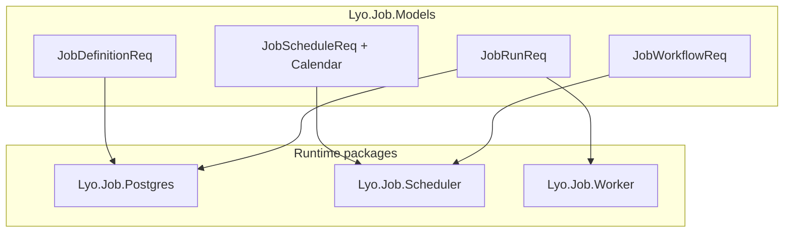

# Lyo.Job.Models

Shared DTOs, builders, enums, metrics constants, distributed-tracing helpers, and message-queue contracts for the Lyo job-management subsystem. Consumed by `Lyo.Job.Postgres` (the
API host), `Lyo.Job.Scheduler`, `Lyo.Job.Worker`, `Lyo.Job.Alerts`, `Lyo.Job.SignalR`, and any Blazor / client code that talks to the job service.

Multi-targets `netstandard2.0` and `net10.0` so the same DTOs flow through legacy callers and modern .NET hosts.

This package is a **contract library** — it has no `AddXxx` DI registration. Hosts reference it for DTOs, builders, metrics constants, and `IJobEventPublisher`; wire persistence
via [`Lyo.Job.Postgres`](../Lyo.Job.Postgres/README.md), scheduling via [`Lyo.Job.Scheduler`](../Lyo.Job.Scheduler/README.md), and workers via [
`Lyo.Job.Worker`](../Lyo.Job.Worker/README.md).

## Examples

### Retry backoff (`JobRetryBackoff`)

```csharp
// Linear: baseSeconds × attempt
// Exponential: baseSeconds × 2^(attempt-1) with ±25% jitter
var delay = JobRetryBackoff.ComputeBackoffSeconds(
    baseSeconds: 60, attempt: 3, JobRetryBackoffType.Exponential);
```

### Builders (`Builders/`)

```csharp
var definition = JobDefinitionBuilder
    .New("Nightly Sync", "Pulls everything from the upstream API")
    .ForCSharpWorker()
    .SetType("Import")
    .AddJobParameter("BatchSize", JobParameterType.Int, 500)
    .Build();

var run = JobRunBuilder
    .New(definition.Id, "scheduler")
    .AddParameter("BatchSize", 1000)
    .Build();
```

## Production hardening model

Definitions, schedules, and runs carry the knobs that power priority dispatch, retention, misfire handling, exponential backoff, idempotency, rate limiting, SLA tracking, alerting,
blackout calendars, batch fan-out, workflows, encryption markers, and audit correlation:

| Concern | Where it lives |
| --------------------- | ------------------------------------------------------------------------------------------------------------------------------------------------------------------------------------------------------------------------------------------------------- |
| Priority (0–9) | `JobDefinitionReq.Priority`, `JobRunReq.Priority` |
| Retention | `JobDefinitionReq.RetentionDays` (per-definition override; host default in `JobMaintenanceOptions`) |
| Misfire | `JobScheduleReq.MisfirePolicy` (`Skip` / `RunOnce`); scheduler defaults in `JobSchedulerOptions` |
| Exponential backoff | `JobDefinitionReq.RetryBackoffType` + `JobRetryBackoff.ComputeBackoffSeconds` |
| Idempotency | `JobRunReq.IdempotencyKey` (unique per definition) |
| Rate limiting | `JobDefinitionReq.MaxRunsPerHour` |
| SLA | `ExpectedDurationMinutes`, `MustStartByMinutes`; run flag `JobRunRes.SlaBreached` |
| Alerting | `AlertOnFailure`, `AlertAfterConsecutiveFailures`, `AlertWebhookUrl`; `JobAlertType` |
| Blackout calendars | `JobBlackoutCalendarReq`, `JobBlackoutWindowReq`, `JobDefinitionReq.JobBlackoutCalendarId` / `CreateBlackoutCalendar` (definition default for all schedules), `JobScheduleReq.JobBlackoutCalendarId` / `CreateBlackoutCalendar` (per-schedule override) |
| Batch jobs | `ParentJobRunId`, `BatchIndex`, `BatchTotal`; `JobCreateChildRunsReq` |
| Workflows | `JobWorkflowReq`, `JobWorkflowStepReq`, `JobWorkflowRunReq`, … |
| Encryption | `JobParameterReq.EncryptedValue`, `IJobParameterEncryptionService` |
| Audit | `JobDefinitionRes.DefinitionVersion`, `JobRunRes.DefinitionAuditVersion` |
| Tracing | `JobRunReq.TraceId`, `JobTracing` (`ActivitySource` name `Lyo.Job`) |
| Worker registry | `JobWorkerInstanceReq` / `JobWorkerInstanceRes` |
| Progress | `JobRunRes.ProgressPercent`, `ProgressMessage` |
| Parallel restrictions | `JobParallelRestrictionReq` — blocks schedule when related definitions are Queued/Running |
| Dry run | `JobRunReq.DryRun`, `JobRunBuilder.AsDryRun()` — validate without persisting or publishing |
| Dispatch suppression | `JobRunReq.SuppressDispatch` — persist the run as `Queued` without the immediate MQ publish (caller owns dispatch: scheduler delayed retries, workflow step ordering); a future `ScheduledSlotUtc` suppresses implicitly |
| Delayed dispatch | `JobRunReq.ScheduledSlotUtc` — slot idempotency for scheduled runs, and the due time for delayed retries picked up by maintenance redispatch |
| Parameter validation | `JobParameterReq.Required`, `ValidationRegex`, `MinLength`, `MaxLength`, `AllowedValues` — enforced in `JobService` |

## Production hardening model — `JobDefinitionReq` defaults

| Property | Default |
| ----------------------------------------------------------------------------------------------------------------------------------------------------------------------------------------------------------------------------------------------------------------------- | ---------------------- |
| `Enabled` | `true` |
| `RetryBackoffType` | `Linear` |
| `AlertOnFailure` | `false` |
| `MaxRetryCount`, `RetryBackoffSeconds`, `TimeoutMinutes`, `MaxConcurrentRuns`, `CircuitBreakerThreshold`, `CircuitBreakerResetMinutes`, `Priority`, `RetentionDays`, `MaxRunsPerHour`, `ExpectedDurationMinutes`, `MustStartByMinutes`, `AlertAfterConsecutiveFailures` | `0` (disabled / unset) |



## Requests and responses

Located under `Request/` and `Response/`. Each lifecycle entity has a request DTO for create/update and a response DTO for reads:

| Entity | Request | Response |
| -------------------- | --------------------------- | ------------------------------------------------ |
| Job definition | `JobDefinitionReq` | `JobDefinitionRes` |
| Parameter | `JobParameterReq` | `JobParameterRes` |
| Schedule | `JobScheduleReq` | `JobScheduleRes` |
| Schedule parameter | `JobScheduleParameterReq` | `JobScheduleParameterRes` |
| Trigger | `JobTriggerReq` | `JobTriggerRes` |
| Trigger parameter | `JobTriggerParameterReq` | `JobTriggerParameterRes` |
| Parallel restriction | `JobParallelRestrictionReq` | `JobParallelRestrictionRes` |
| Calendar | `JobBlackoutCalendarReq` | `JobBlackoutCalendarRes`, `JobBlackoutWindowRes` |
| Workflow | `JobWorkflowReq` | `JobWorkflowRes`, `JobWorkflowStepRes` |
| Workflow run | `JobWorkflowRunReq` | `JobWorkflowRunRes`, `JobWorkflowRunStepRes` |
| Worker instance | `JobWorkerInstanceReq` | `JobWorkerInstanceRes` |
| Run | `JobRunReq` | `JobRunRes` |
| Run parameter | `JobRunParameterReq` | `JobRunParameterRes` |
| Run result | `JobRunResultReq` | `JobRunResultRes` |
| Run log | `JobRunLogReq` | `JobRunLogRes` |
| Batch children | `JobCreateChildRunsReq` | _(list of `JobRunRes`)_ |
| File upload | _(N/A)_ | `JobFileUploadRes` |
| Definition stats | _(N/A)_ | `JobDefinitionStatsRes`, `SpJobStatistic` |

`JobInfo` bundles a `JobDefinitionRes` with its last / last successful / last failed runs for dashboards.

`JobRunRes` exposes `GetParameterValueAs<T>`, `GetResultValueAs<T>`, `GetParameterDictionary`, and `GetResultDictionary` for typed access to parameter and result bags. These, and
the list-level accessors in `JobRunParameterExtensions` (`GetInt`, `GetLong`, `GetDecimal`, `GetBool`, `GetGuid`, `GetDateTime`, `GetEnum<T>`, `GetRegex`, `GetAs<T>`), delegate to
`Lyo.Common.Conversion.TypeConversion`: key lookups are case-insensitive, booleans parse leniently (`1/0`, `y/n`, `yes/no`, `t/f`, `on/off`), and `GetAs<T>` deserializes
JSON-typed parameter values into complex types. `GetDateTime` keeps round-trip (`"O"`) parsing so UTC timestamps preserve their kind, and passing a `format` to `GetAs<T>` uses the
format-aware `ToScalar<T>` path.

## Builders (`Builders/`)

Fluent factories for assembling request DTOs without dropping into raw initializers.

- **`JobDefinitionBuilder`** — `New(name)`, `SetDescription`, `SetType`, `ForCSharpWorker` / `ForPythonWorker`, `AsImportInCSharp`, schedule/parameter/trigger/restriction helpers,
  email-parameter helpers. `WithBlackoutCalendar` / `AddBlackoutWindow` set a definition-level default cascaded to every schedule (by id or inline). `Build()` returns
  `JobDefinitionReq`.
- **`JobScheduleBuilder`** — `EveryDay`, `Weekdays`, `SetMonths`, `SetDays`, `SetTimes`, `SetInterval`, cron helpers, `WithMisfirePolicy`, `WithBlackoutCalendar`,
  `AddBlackoutWindow`, `Build()` → `JobScheduleReq`.
- **`JobBlackoutCalendarBuilder`** — `AddBlackoutWindow(...)` with `JobBlackoutPolicy` (`Skip` / `Defer`); `AddBlackoutHoliday(HolidayInfo, ...)` / `AddBlackoutHolidays(...)` /
  `AddFederalHolidayBlackouts()` expand `Lyo.DateAndTime.HolidayInfo` records into concrete dated windows at build time. `Build()` → `JobBlackoutCalendarReq`.
- **`JobScheduleBuilder.WithBlackoutCalendar`** — per-schedule override: link by `Guid`, or inline create via `Action<JobBlackoutCalendarBuilder>`.
- **`JobWorkflowBuilder`** — ordered steps with `DependsOnStepIds` and `JobWorkflowFailurePolicy`. `Build()` → `JobWorkflowReq`.
- **`JobTriggerBuilder`**, **`JobRunBuilder`**, **`JobRunResultBuilder`** — as before; `JobRunBuilder` supports `AddEncryptedParameter`.

## Enums

| Enum | Values / purpose |
| ---------------------------------------------- | --------------------------------------------------------------------- |
| `JobState` | `Unknown`, `Queued`, `Running`, `Finished`, `Cancelled`, `Cancelling` |
| `JobRunResult` | `Success`, `Failure`, `Timeout`, `Cancelled`, … |
| `JobParameterType` | `String`, `Int`, `Json`, … |
| `JobLogLevel` | Log severity for `JobRunLogReq` |
| `JobMisfirePolicy` | `Skip`, `RunOnce` — missed schedule slots |
| `JobRetryBackoffType` | `Linear`, `Exponential` (with jitter via `JobRetryBackoff`) |
| `JobBlackoutPolicy` | `Skip`, `Defer` — calendar windows |
| `JobAlertType` | `Failure`, `CircuitBreakerTripped`, `DeadJob`, `SlaBreach` |
| `JobWorkerInstanceState` | `Running`, `Stopped` |
| `JobWorkflowFailurePolicy` | `Stop`, `Continue` |
| `JobWorkflowRunState` / `JobWorkflowStepState` | Workflow execution states |

## Distributed tracing (`JobTracing`)

`ActivitySource` name: **`Lyo.Job`**. Helpers: `StartCreateRun`, `StartRun`, `FinishRun`, `StartWorkerExecution` (links to queue envelope `TraceId`), `TryParseParentContext`. Register the source in your host OpenTelemetry / `ActivityListener` pipeline so spans from `Lyo.Job.Postgres`, `Lyo.Job.Worker`, and the scheduler correlate.

## Event publisher (`Events/IJobEventPublisher`)

- `PublishRunCreatedAsync(runId, workerType, priority = 0)` — priority honored when the broker queue supports `x-max-priority`.
- `PublishRunStartedAsync`, `PublishRunFinishedAsync`, `PublishRunCancelledAsync`, `PublishDefinitionUpdatedAsync`.
- **`PublishAlertAsync(definitionId, runId, alertType, message)`** — routes to `job.notifications.alert`.
- Subscribers: definition updates, run completions, run cancellations. `SubscribeToRunCancellationsAsync` must broadcast to **every** subscribed instance (implementations use per-instance exclusive queues, `job.run.{workerType}.cancel.{instanceId}`) — a shared competing-consumer queue would silently lose cancellations for scaled-out worker types.

## Metrics (`Constants.Metrics`)

Recorded via `IMetrics` when registered in hosting packages:

## Metrics (`Constants.Metrics`) — `job.scheduler.*`

| Metric | Description |
| --------------------------------------- | --------------------------------- |
| `job.scheduler.definitions.loaded` | Definitions loaded on refresh |
| `job.scheduler.refresh.duration` | Definition refresh timer |
| `job.scheduler.refresh.error` | Refresh failures |
| `job.scheduler.check.duration` | Schedule check timer |
| `job.scheduler.check.error` | Schedule check failures |
| `job.scheduler.runs.created` | Runs created by scheduler |
| `job.scheduler.runs.create.failed` | Run creation failures |
| `job.scheduler.slot.conflicts` | Idempotent slot conflicts (23505) |
| `job.scheduler.triggers.fired` | Trigger-driven runs |
| `job.scheduler.retries.scheduled` | Automatic retry runs |
| `job.scheduler.circuit_breaker.tripped` | Definitions auto-disabled |
| `job.scheduler.misfires.caught_up` | Misfire catch-up runs created |
| `job.scheduler.misfires.skipped` | Missed slots skipped |

## Metrics (`Constants.Metrics`) — `job.service.*`

| Metric | Description |
| ----------------------------------- | ------------------------------------------------------------ |
| `job.service.run.created` | Runs inserted |
| `job.service.run.create.rejected` | Rejected (concurrency, rate limit, validation) |
| `job.service.run.dispatch.deferred` | Runs created with suppressed/deferred dispatch |
| `job.service.run.started` | Transitions to Running |
| `job.service.run.start.rejected` | Started CAS guard rejections (duplicate delivery, cancelled) |
| `job.service.run.requeued` | Running → Queued shutdown hand-backs |
| `job.service.run.finished` | Transitions to Finished |
| `job.service.run.cancelled` | Cancellation requested |
| `job.service.run.rerun` | Manual reruns |
| `job.service.run.duration` | Run wall-clock duration |
| `job.service.run.queue_latency` | Queued → started latency |

## Metrics (`Constants.Metrics`) — `job.worker.*`

| Metric | Description |
| ------------------------------------------------ | ----------------------------------------------- |
| `job.worker.run.executed` | Worker executions (tag `outcome`) |
| `job.worker.run.duration` | Execute phase duration |
| `job.worker.heartbeat.sent` / `heartbeat.failed` | Run heartbeat PATCHes |
| `job.worker.cancellation.honored` | Runs cancelled mid-flight |
| `job.worker.progress.reported` | Progress PATCHes |
| `job.worker.start.rejected` | Started rejected by CAS guard (message dropped) |
| `job.worker.shutdown.requeued` | Runs handed back on graceful shutdown |
| `job.worker.late_finish.dropped` | Finish reports rejected as terminal |

Workers also inherit `queue.worker.*` metrics from `QueueWorkerBase`.

## Metrics (`Constants.Metrics`) — `job.maintenance.*`

| Metric | Description |
| ----------------------------------------- | ------------------------------ |
| `job.maintenance.tick.duration` | Maintenance loop timer |
| `job.maintenance.tick.error` | Tick failures |
| `job.maintenance.dead_jobs.failed` | Dead runs timed out |
| `job.maintenance.circuit_breakers.reset` | Auto re-enabled definitions |
| `job.maintenance.runs.purged` | Retention purge count |
| `job.maintenance.runs.redispatched` | Stuck queued runs re-published |
| `job.maintenance.worker_instances.pruned` | Stale registry rows removed |

## Metrics (`Constants.Metrics`) — `job.sla.*`

| Metric | Description |
| ---------------- | --------------------- |
| `job.sla.breach` | SLA breaches detected |

## Constants

`Constants.Mq` — topology including `JobAlertRoutingKey` (`job.notifications.alert`). `Constants.Rest.Job` — CRUD routes plus lifecycle endpoints (`RunStarted`, `RunFinished`, `RunRequeue`, `RunHeartbeat`, `RunChildren`, `DefinitionsLatestRuns`, `WorkerInstances`, `BlackoutCalendars`, `Workflows`, …).

## Parameter encryption (`Security/IJobParameterEncryptionService`)

Interface implemented by `Lyo.Job.Postgres.JobParameterEncryptionService`. API responses mask encrypted parameters (`***`); the worker-trusted `Started` endpoint decrypts values server-side so executing workers receive real values (workers with the service registered can also decrypt any remaining `EncryptedValue` locally).

## Extensions

- `JobScheduleExtensions.ToScheduleDefinition(...)` — converts schedule DTOs to `Lyo.Schedule.Models.ScheduleDefinition`.
- `JobRunParameterExtensions` — typed getters on parameter/result lists.

## Dependencies

Generated from `ProjectReference` / `PackageReference` (same model as `docs/Lyo.ProjectGraph.html`).

- `Lyo.Api.Models` — (direct, lyo)
- `Lyo.DateAndTime` — (direct, lyo)
- `Lyo.Exceptions` — (direct, lyo)
- `Lyo.Schedule.Models` — (direct, lyo)
- `System.Diagnostics.DiagnosticSource` `10.0.5` — (direct, microsoft, netstandard2.0)
- `Lyo.Common` — (transitive, lyo)
- `Lyo.Query.Models` — (transitive, lyo)
- `Microsoft.Extensions.Logging.Abstractions` `10.0.5` — (transitive, microsoft)
- `System.Memory` `4.6.3` — (transitive, microsoft, netstandard2.0)
- `System.Text.Json` `10.0.5` — (transitive, microsoft, netstandard2.0)