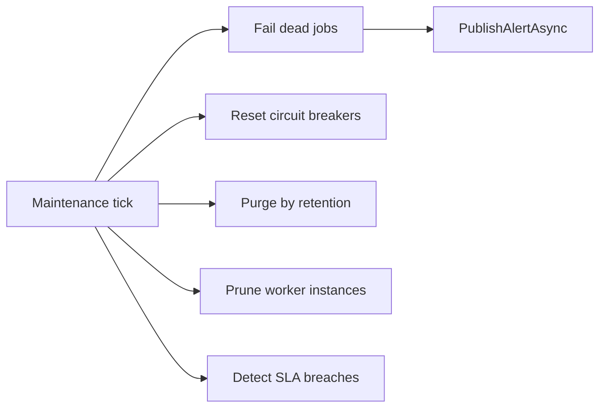

# Lyo.Job.Postgres

PostgreSQL persistence and minimal-API host for the Lyo job-management subsystem. Wraps EF Core, the Lyo CRUD/QueryConcrete stack, Mapster, optional parameter encryption, audit recording, and `IJobEventPublisher` so a host can drop in a complete job service: definitions, parameters, schedules, triggers, calendars, workflows, worker registry, runs, batch children, run parameters, run results, run logs, and stats.

## Drop-and-play registration

`AddPostgresJobManagement` registers the `JobContext` factory, optional auto-migrations, the Lyo CRUD services, `JobService`, and a default no-op `IJobEventPublisher` (`NullJobEventPublisher`). Replace the publisher with `AddMqJobEventPublisher()` once you have an `IMqService` available.

```csharp
services.AddLyoQueryServices();
services.AddFusionCache(...);            // or AddLocalCache(...)
services.AddMapster(cfg => cfg.Apply(Extensions.ConfigureJobMappings));

services.AddPostgresJobManagement(o => {
    o.ConnectionString = connectionString;
    o.EnableAutoMigrations = true;
});

// Optional: encrypt sensitive parameter values at rest
services.AddJobParameterEncryption(keyName: "job-parameters");

// After IMqService is registered (e.g. AddRabbitMq):
services.AddMqJobEventPublisher();

// Dead-job watchdog, circuit-breaker reset, retention purge, SLA checks, worker pruning:
services.AddJobMaintenanceService(o => {
    o.DefaultRetentionDays = 90;
    o.PurgeBatchSize = 500;
    o.WorkerInstanceStaleMinutes = 5;
});

// Or bind maintenance from configuration (section JobMaintenance):
services.AddJobMaintenanceServiceFromConfiguration(configuration);

var app = builder.Build();
app.BuildJobGroup();
```

When `IAuditRecorder` is registered, CRUD hooks record `JobDefinition.*`, `JobRun.*`, and related entity events via `JobAuditHelper`.

## Configuration

### `PostgresJobOptions` (`PostgresJobOptions.SectionName` = `"PostgresJob"`)

| Property               | Default | Notes                                                           |
|------------------------|---------|-----------------------------------------------------------------|
| `ConnectionString`     | `""`    | Npgsql connection string. Required.                             |
| `EnableAutoMigrations` | `false` | When `true`, `Lyo.Postgres` runs pending migrations on startup. |

`Schema` is fixed to `job`. EF migrations history lives in `job.__EFMigrationsHistory`.

### `JobMaintenanceOptions` (`JobMaintenanceOptions.SectionName` = `"JobMaintenance"`)

| Property                    | Default | Notes                                                                 |
|-----------------------------|---------|-----------------------------------------------------------------------|
| `CheckIntervalSeconds`      | `30`    | Tick cadence for all maintenance tasks.                               |
| `DefaultRetentionDays`      | `0`     | Global retention for finished runs; `0` = keep forever.               |
| `PurgeBatchSize`            | `500`   | Max runs deleted per tick.                                            |
| `WorkerInstanceStaleMinutes`| `5`     | Prune worker registry rows without recent heartbeat.                  |

Per-definition `RetentionDays` overrides the global default when &gt; 0.

## DI extension methods

| Method                                                        | Purpose                                                                              |
|---------------------------------------------------------------|--------------------------------------------------------------------------------------|
| `AddJobDbContext(connectionString)`                           | Scoped `JobContext` (legacy).                                                        |
| `AddJobDbContextFactory(...)` / `FromConfiguration(...)`      | `IDbContextFactory<JobContext>` + migrations.                                        |
| `AddPostgresJobManagement(...)` / `FromConfiguration(...)`    | Full job service: factory + CRUD + `JobService` + `NullJobEventPublisher`.           |
| `AddJobMaintenanceService(...)` / `FromConfiguration(...)`    | `JobMaintenanceService` hosted background service.                                   |
| `AddMqJobEventPublisher()`                                    | `MqJobEventPublisher` + `JobEventPublisherStartupService` (calls `SetupAsync` on host start). |
| `AddJobParameterEncryption(keyName)`                          | `JobParameterEncryptionService` + `IJobParameterEncryptionService`.                  |

## Production hardening in `JobService`

| Feature | Behavior |
|---------|----------|
| **Priority** | Run creation inherits `JobDefinition.Priority`; MQ publish passes priority to `x-max-priority` queues. |
| **Idempotency** | When `JobRunReq.IdempotencyKey` is set, returns the existing run instead of inserting a duplicate (`ix_job_run_idempotency_key_unique`). |
| **Rate limiting** | Rejects create when hourly run count ≥ `MaxRunsPerHour` (metric `job.service.run.create.rejected`). |
| **Concurrency** | Enforces `MaxConcurrentRuns` (Queued + Running). |
| **SLA** | On start: breaches `MustStartByMinutes` → `SlaBreached=true` + alert. On finish: breaches `ExpectedDurationMinutes` → same. |
| **Audit** | Stamps `DefinitionAuditVersion` from `JobDefinition.DefinitionVersion` on each new run; definition updates bump version. |
| **Tracing** | `JobTracing.StartCreateRun` / `StartRun` / `FinishRun` spans around lifecycle transitions. |
| **Alerting** | Publishes `PublishAlertAsync` for SLA breaches; scheduler/maintenance publish failure/dead-job alerts. |
| **Batch jobs** | `POST Job/Run/{parentId}/Children` creates fan-out child runs; scheduler aggregates parent progress when children finish. |
| **Encryption** | Parameter create/update encrypts via `IJobParameterEncryptionService`; API masks encrypted values. |
| **Dry run** | When `JobRunReq.DryRun == true`, validates parameters and returns a synthetic `JobRunRes` without DB insert or MQ publish. |
| **Parameter validation** | `ValidateRunParametersAsync` enforces definition schema: required, regex, min/max length, pipe-delimited `AllowedValues`. |
| **Race-safe concurrency** | `pg_advisory_xact_lock` per definition serializes create + `MaxConcurrentRuns` / rate-limit checks inside a transaction. |

Slot idempotency (`JobScheduleId` + `ScheduledSlotUtc` unique index) remains the multi-scheduler guard for scheduled runs.

## Metrics (`job.service.*`, `job.maintenance.*`, `job.sla.*`)

### `job.service.*`

| Metric | When recorded |
|--------|---------------|
| `job.service.run.created` | Successful insert |
| `job.service.run.create.rejected` | Validation, concurrency, rate limit (tag `reason`: `invalid_parameters`, `mq_disconnected`, `definition_not_found`, `max_runs_per_hour`, `max_concurrent_runs`, `duplicate_slot`) |
| `job.service.run.started` | `StartedJobRun` |
| `job.service.run.finished` | `FinishedJobRun` |
| `job.service.run.cancelled` | `CancelJobRun` |
| `job.service.run.rerun` | `RerunJob` |
| `job.service.run.duration` | Finished run wall time |
| `job.service.run.queue_latency` | Created → started |

### `job.maintenance.*`

| Metric | When recorded |
|--------|---------------|
| `job.maintenance.tick.duration` | Each maintenance loop |
| `job.maintenance.tick.error` | Tick exception |
| `job.maintenance.dead_jobs.failed` | Heartbeat timeout → Finished/Timeout |
| `job.maintenance.circuit_breakers.reset` | Cooldown elapsed → re-enabled |
| `job.maintenance.runs.purged` | Retention batch delete |
| `job.maintenance.worker_instances.pruned` | Stale registry cleanup |

### `job.sla.*`

| Metric | When recorded |
|--------|---------------|
| `job.sla.breach` | Queued past `MustStartByMinutes` or running past `ExpectedDurationMinutes` |

## `JobMaintenanceService`

`BackgroundService` (`IHealth`: `job-maintenance`) ticking every `CheckIntervalSeconds`:

1. **Dead jobs** — `Running`/`Cancelling` runs past `TimeoutMinutes` → `Finished`/`Timeout` + optional `DeadJob` alert.
2. **Circuit breaker reset** — re-enables definitions after `CircuitBreakerResetMinutes`.
3. **Retention purge** — deletes finished runs older than effective retention in `PurgeBatchSize` batches.
4. **Worker pruning** — removes stale `JobWorkerInstance` rows.
5. **SLA breach scan** — marks `SlaBreached` and increments `job.sla.breach` for overdue queued/running jobs. Alerts for SLA breaches are published by `JobService` on start/finish transitions, not by this background scan.



## Endpoint matrix (`BuildJobGroup`)

Tag `"Job"`. CRUD + export on definitions; runs expose Query/Get/Delete/DeleteBulk + export.

| Route prefix | Entity | Notes |
|--------------|--------|-------|
| `Job/Definition` | `JobDefinition` | Version bump + audit on update |
| `Job/Definition/Parameter` | `JobParameter` | Encryption on write |
| `Job/Schedule` | `JobSchedule` | Misfire policy, calendar link, cron |
| `Job/Triggers` | `JobTrigger` | |
| `Job/BlackoutCalendar`, `Job/BlackoutCalendar/Window` | Blackout calendars | |
| `Job/Workflow`, `Job/Workflow/Step`, `Job/Workflow/Run`, … | Workflows | |
| `Job/WorkerInstance` | Worker registry | Created by workers |
| `Job/Run` | `JobRun` | Progress, SLA, idempotency fields |
| `Job/Run/{id}/Children` | Batch fan-out | `JobCreateChildRunsReq` |
| `GET Job/Definition/{id}/Stats` | Stats projection | Rolling window aggregates |

Lifecycle routes (`RunStarted`, `RunFinished`, `RunHeartbeat`, `RunLog`, …) are mapped alongside CRUD for scheduler/worker hosts.

## Event publishers (`Events/`)

- **`NullJobEventPublisher`** — default; `IsConnected() == false`.
- **`MqJobEventPublisher`** — creates queues/exchange bindings; publishes run events with optional priority; routes alerts to `job.notifications.alert`.

## Design-time migrations

Set `JOB_CONNECTION_STRING` and run:

```bash
export JOB_CONNECTION_STRING="Host=localhost;Database=postgres;Username=postgres;Password=password"
dotnet ef migrations add YourMigrationName --project Lyo.Job.Postgres
```

## Dependencies

*(Synchronized from `Lyo.Job.Postgres.csproj`.)*

**Target framework:** `net10.0`

### NuGet packages

| Package                                     | Version |
|---------------------------------------------|---------|
| `Mapster`                                   | `[10,)` |
| `Microsoft.EntityFrameworkCore.Design`      | `[10,)` |
| `Microsoft.Extensions.Configuration.Binder` | `[10,)` |

### Project references

- [`Lyo.Api`](../../Api/Lyo.Api/README.md)
- [`Lyo.Api.Export`](../../Api/Lyo.Api.Export/README.md)
- [`Lyo.Audit`](../../../Core/Audit/Lyo.Audit/README.md)
- [`Lyo.Common`](../../../Core/Common/Lyo.Common/README.md)
- [`Lyo.Encryption`](../../../Security/Encryption/Lyo.Encryption/README.md)
- [`Lyo.Exceptions`](../../../Core/Lyo.Exceptions/README.md)
- [`Lyo.Job.Models`](../Lyo.Job.Models/README.md)
- [`Lyo.MessageQueue`](../../../Communication/MessageQueue/Lyo.MessageQueue/README.md)
- [`Lyo.Postgres`](../../../Data/Postgres/Lyo.Postgres/README.md)
- [`Lyo.Scheduler`](../../../Core/Scheduler/Lyo.Scheduler/README.md)

### Related / optional packages

- [`Lyo.Job.Alerts`](../Lyo.Job.Alerts/README.md) — consume alert routing key
- [`Lyo.Job.SignalR`](../Lyo.Job.SignalR/README.md) — live dashboard
- [`Lyo.Api.Export.Csv`](../../Api/Lyo.Api.Export.Csv/README.md), [`Lyo.Api.Export.Xlsx`](../../Api/Lyo.Api.Export.Xlsx/README.md) — export add-ons
