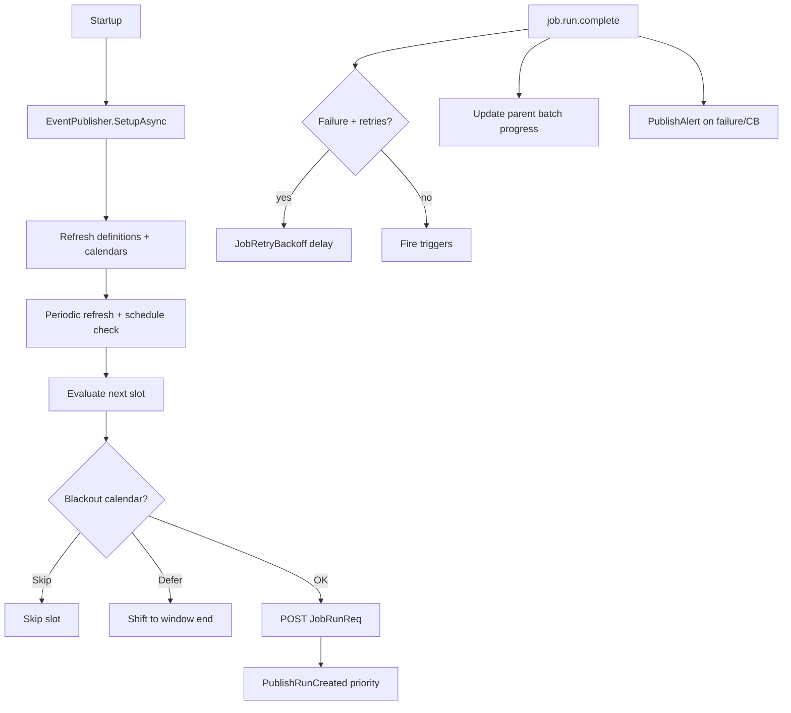

# Lyo.Job.Scheduler

Hosted `JobScheduler` that polls the Job API for enabled definitions, evaluates schedules (with misfire catch-up, blackout calendars, and per-schedule time zones), creates job runs via `IApiClient`, listens to `IJobEventPublisher` for definition updates and run completions, fires triggers, schedules retries with linear or **exponential backoff**, aggregates batch parent progress, trips/resets per-definition circuit breakers, and publishes failure/circuit-breaker alerts.

Optional **`JobWorkflowEngine`** advances multi-step workflow runs when constituent job runs finish.

Designed for multi-instance deployment: run creation uses the `(JobScheduleId, ScheduledSlotUtc)` unique constraint to keep duplicate slot creations idempotent.

## Registration

```csharp
// IMqService (RabbitMQ) + Job.Client publisher — not Lyo.Job.Postgres
services.AddJobClient(sp => sp.GetRequiredService<IApiClient>());
services.AddMqJobEventPublisherFromConfiguration(configuration);
// or: services.AddMqJobEventPublisher();

services.AddJobScheduler(new JobSchedulerOptions {
    ApiBaseUrl = "https://api.example.com",
    TimeZone = TimeZoneInfo.FindSystemTimeZoneById("America/New_York"),
    DefinitionRefreshIntervalSeconds = 30,
    ScheduleCheckIntervalSeconds = 10,
    EnableMisfireCatchUp = true,
    MisfireLookbackMinutes = 1440,
    CreatedBy = "Scheduler",
});

// Or bind from the "JobScheduler" configuration section:
services.AddJobScheduler();

// Optional workflow orchestration (section JobWorkflowEngine):
services.AddJobWorkflowEngine(new JobWorkflowEngineOptions {
    ApiBaseUrl = "https://api.example.com",
    CreatedBy = "WorkflowEngine",
});
// services.AddJobWorkflowEngine();
```

Requires `IApiClient`, `IFormatterService`, and `IJobEventPublisher`. For scheduler/worker hosts register the non-EF publisher via `Lyo.Job.Client.AddMqJobEventPublisher()` / `AddMqJobEventPublisherFromConfiguration()` (`IMqService` + optional `IJobClient`). Do **not** use `Lyo.Job.Postgres.AddMqJobEventPublisher*` — that path pulls EF. `IMetrics` and `IMqService` are optional for the scheduler itself (MQ is required for the publisher).

## Configuration

### `JobSchedulerOptions` (`JobSchedulerOptions.SectionName` = `"JobScheduler"`)

| Property                           | Type            | Default       | Notes                                                       |
|------------------------------------|-----------------|---------------|-------------------------------------------------------------|
| `ApiBaseUrl`                       | `string`        | _required_    | Base URL of the Job API.                                    |
| `TimeZone`                         | `TimeZoneInfo?` | `null` (UTC)  | Default zone when a schedule has no `TimeZoneId`.           |
| `DefinitionRefreshIntervalSeconds` | `int`           | `30`          | Definition + calendar refresh cadence.                      |
| `ScheduleCheckIntervalSeconds`     | `int`           | `10`          | Schedule evaluation cadence.                                |
| `CreatedBy`                        | `string`        | `"Scheduler"` | Stamped on scheduler-created runs.                          |
| `EnableMisfireCatchUp`             | `bool`          | `true`        | Global default; per-schedule `MisfirePolicy` can override.  |
| `MisfireLookbackMinutes`           | `int`           | `1440`        | Max age of missed slots eligible for `RunOnce` catch-up.    |

`TimeZone` binds from configuration using IANA / Windows identifiers (e.g. `"America/New_York"`, `"UTC"`).

### `JobWorkflowEngineOptions` (`JobWorkflowEngineOptions.SectionName` = `"JobWorkflowEngine"`)

| Property     | Default           | Notes                          |
|--------------|-------------------|--------------------------------|
| `ApiBaseUrl` | _required_        | Job API base URL.              |
| `CreatedBy`  | `"WorkflowEngine"`| Stamped on workflow-run steps. |

## Metrics (`job.scheduler.*`)

| Metric | Description |
|--------|-------------|
| `job.scheduler.definitions.loaded` | Count after refresh |
| `job.scheduler.refresh.duration` | Refresh timer |
| `job.scheduler.refresh.error` | Refresh failures |
| `job.scheduler.check.duration` | Schedule check timer |
| `job.scheduler.check.error` | Check failures |
| `job.scheduler.runs.created` | Runs created |
| `job.scheduler.runs.create.failed` | API create failures |
| `job.scheduler.slot.conflicts` | Benign duplicate-slot conflicts |
| `job.scheduler.triggers.fired` | Trigger-driven runs |
| `job.scheduler.retries.scheduled` | Post-failure retry runs |
| `job.scheduler.circuit_breaker.tripped` | Definitions disabled |
| `job.scheduler.misfires.caught_up` | Misfire `RunOnce` runs |
| `job.scheduler.misfires.skipped` | Missed slots skipped |

## Runtime flow



1. **Startup** — `SetupAsync`, subscribe to definition-change and run-completion queues, initial refresh + misfire pass, start periodic timers.
2. **Definition refresh** — loads enabled definitions with schedules, triggers, parallel restrictions; caches last run snapshots as `JobInfo`.
3. **Calendar refresh** — loads `JobBlackoutCalendar` + windows for blackout evaluation (`JobBlackoutCalendarEvaluator`: `Skip` or `Defer`).
4. **Schedule check** — skips when a run is already `Queued`/`Running`; respects parallel restrictions; applies misfire policy; creates runs with `ScheduledSlotUtc` for idempotency.
5. **Misfire catch-up** — when `EnableMisfireCatchUp` and schedule `MisfirePolicy == RunOnce`, creates one run for the most recent missed slot within lookback.
6. **Run completion** — updates cached last-run pointers; circuit breaker on consecutive failures; retries via `JobRetryBackoff.ComputeBackoffSeconds` (`Linear` or `Exponential`); batch parent progress; failure alerts when `AlertOnFailure` and `AlertAfterConsecutiveFailures` threshold is met.
7. **Triggers** — when `AllowTriggers`, matching trigger definitions spawn new runs.
8. **Definition updates** — per-definition cache refresh; disabled definitions removed.

### Parallel restrictions

When a definition has `JobParallelRestriction` rows, `CheckSchedulesAsync` skips creating a run if any restricted definition (same or cross-definition link) already has a `Queued` or `Running` run. This complements per-definition `MaxConcurrentRuns` enforced in `JobService`.

## `IJobScheduler` surface

```csharp
public interface IJobScheduler
{
    bool IsRunning { get; }
    Task RefreshDefinitionsAsync(CancellationToken ct = default);
    Task CheckSchedulesAsync(CancellationToken ct = default);
}
```

`JobScheduler` implements `Lyo.Health.IHealth` (`HealthCheckName = "job-scheduler"`) with `is_running`, `loaded_job_count`, `last_definitions_refresh_utc`, and `last_schedule_check_utc`.

## Dependencies

*(Synchronized from `Lyo.Job.Scheduler.csproj`.)*

**Target framework:** `net10.0`

### NuGet packages

| Package                                                | Version |
|--------------------------------------------------------|---------|
| `Microsoft.Extensions.Hosting.Abstractions`            | `[10,)` |
| `Microsoft.Extensions.Options.ConfigurationExtensions` | `[10,)` |

### Project references

- [`Lyo.Api.Client`](../../Api/Lyo.Api.Client/README.md)
- [`Lyo.Api.Models`](../../Api/Lyo.Api.Models/README.md)
- [`Lyo.Formatter`](../../../Data/Formatter/Lyo.Formatter/README.md)
- [`Lyo.Health`](../../../Core/Health/Lyo.Health/README.md)
- [`Lyo.Job.Models`](../Lyo.Job.Models/README.md)
- [`Lyo.MessageQueue`](../../../Communication/MessageQueue/Lyo.MessageQueue/README.md)
- [`Lyo.Metrics`](../../../Core/Metrics/Lyo.Metrics/README.md)
- [`Lyo.Query.Models`](../../../Data/Query/Lyo.Query.Models/README.md)
- [`Lyo.Scheduler`](../../../Core/Scheduler/Lyo.Scheduler/README.md)
