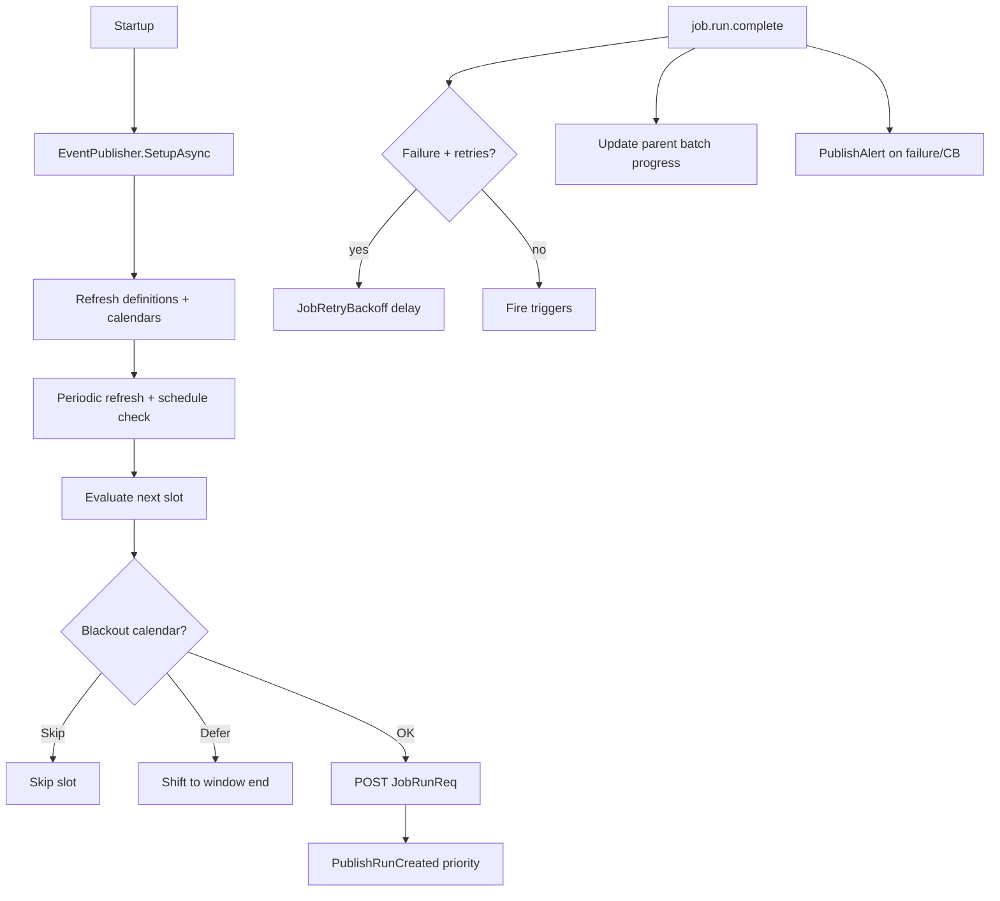

# Lyo.Job.Scheduler

Hosted `JobScheduler` that polls the Job API for enabled definitions, evaluates schedules (with misfire catch-up, blackout calendars, and per-schedule time zones), creates job runs via `IApiClient`, listens to `IJobEventPublisher` for definition updates and run completions, fires triggers, schedules retries with linear or **exponential backoff**, aggregates batch parent progress, trips/resets per-definition circuit breakers, and publishes failure/circuit-breaker alerts.

Optional **`JobWorkflowEngine`** advances multi-step workflow runs when constituent job runs finish. Step runs are created with dispatch suppressed and only published after the run is linked to its workflow run step, so a fast worker cannot finish a step run before the engine knows which step it belongs to. `JobScheduler` completion-message failures on `job.run.complete` use a bounded counted requeue (max 3, like `QueueWorkerBase`) instead of requeueing forever, so a poison message cannot loop indefinitely. `JobWorkflowEngine` uses the same pattern (max 5).

Designed for multi-instance deployment: run creation uses the `(JobScheduleId, ScheduledSlotUtc)` unique constraint to keep duplicate slot creations idempotent.

## Examples

### Register services

```csharp
// IMqService (RabbitMQ) + Job.Client publisher — not Lyo.Job.Postgres
services.AddJobClient(sp => sp.GetRequiredService<IApiClient>());
services.AddMqJobEventPublisherFromConfiguration(configuration);
// or: services.AddMqJobEventPublisher();

services.AddJobScheduler(new JobSchedulerOptions {
    ApiBaseUrl = "https://api.example.com",
    TimeZone = TimeZoneInfo.FindSystemTimeZoneById("America/New_York"),
    DefinitionRefreshIntervalSeconds = 30,
    ScheduleCheckIntervalSeconds = 10,
    EnableMisfireCatchUp = true,
    MisfireLookbackMinutes = 1440,
    CreatedBy = "Scheduler",
});

// Or bind from the "JobScheduler" configuration section:
services.AddJobScheduler();

// Optional workflow orchestration (section JobWorkflowEngine):
services.AddJobWorkflowEngine(new JobWorkflowEngineOptions {
    ApiBaseUrl = "https://api.example.com",
    CreatedBy = "WorkflowEngine",
});
// services.AddJobWorkflowEngine();
```

### `IJobScheduler` surface

```csharp
public interface IJobScheduler
{
    bool IsRunning { get; }
    Task RefreshDefinitionsAsync(CancellationToken ct = default);
    Task CheckSchedulesAsync(CancellationToken ct = default);
}
```

## Registration

Requires `IApiClient`, `IFormatterService`, and `IJobEventPublisher`. For scheduler/worker hosts register the non-EF publisher via `Lyo.Job.Client.AddMqJobEventPublisher()` / `AddMqJobEventPublisherFromConfiguration()` (`IMqService` + optional `IJobClient`). Do **not** use `Lyo.Job.Postgres.AddMqJobEventPublisher*` — that path pulls EF. `IMetrics` and `IMqService` are optional for the scheduler itself (MQ is required for the publisher).

## `JobSchedulerOptions` (`JobSchedulerOptions.SectionName` = `"JobScheduler"`)

| Property | Type | Default | Notes |
| ---------------------------------- | --------------- | ------------- | ---------------------------------------------------------- |
| `ApiBaseUrl` | `string` | _required_ | Base URL of the Job API. |
| `TimeZone` | `TimeZoneInfo?` | `null` (UTC) | Default zone when a schedule has no `TimeZoneId`. |
| `DefinitionRefreshIntervalSeconds` | `int` | `30` | Definition + calendar refresh cadence. |
| `ScheduleCheckIntervalSeconds` | `int` | `10` | Schedule evaluation cadence. |
| `CreatedBy` | `string` | `"Scheduler"` | Stamped on scheduler-created runs. |
| `EnableMisfireCatchUp` | `bool` | `true` | Global default; per-schedule `MisfirePolicy` can override. |
| `MisfireLookbackMinutes` | `int` | `1440` | Max age of missed slots eligible for `RunOnce` catch-up. |

`TimeZone` binds from configuration using IANA / Windows identifiers (e.g. `"America/New_York"`, `"UTC"`).

## `JobWorkflowEngineOptions` (`JobWorkflowEngineOptions.SectionName` = `"JobWorkflowEngine"`)

| Property | Default | Notes |
| ------------ | ------------------ | ------------------------------ |
| `ApiBaseUrl` | _required_ | Job API base URL. |
| `CreatedBy` | `"WorkflowEngine"` | Stamped on workflow-run steps. |

## Metrics (`job.scheduler.*`)

| Metric | Description |
| --------------------------------------- | ------------------------------- |
| `job.scheduler.definitions.loaded` | Count after refresh |
| `job.scheduler.refresh.duration` | Refresh timer |
| `job.scheduler.refresh.error` | Refresh failures |
| `job.scheduler.check.duration` | Schedule check timer |
| `job.scheduler.check.error` | Check failures |
| `job.scheduler.runs.created` | Runs created |
| `job.scheduler.runs.create.failed` | API create failures |
| `job.scheduler.slot.conflicts` | Benign duplicate-slot conflicts |
| `job.scheduler.triggers.fired` | Trigger-driven runs |
| `job.scheduler.retries.scheduled` | Post-failure retry runs |
| `job.scheduler.circuit_breaker.tripped` | Definitions disabled |
| `job.scheduler.misfires.caught_up` | Misfire `RunOnce` runs |
| `job.scheduler.misfires.skipped` | Missed slots skipped |

## Runtime flow



1. **Startup** — `SetupAsync`, subscribe to definition-change and run-completion queues, initial refresh + misfire pass, start periodic timers.
2. **Definition refresh** — loads enabled definitions with schedules, triggers, parallel restrictions; fetches last-run snapshots in one batch via
   `POST Job/Definition/LatestRuns` (falls back to per-definition queries when the endpoint is unavailable); caches them as `JobInfo`.
3. **Calendar refresh** — loads `JobBlackoutCalendar` + windows for blackout evaluation (`JobBlackoutCalendarEvaluator`: `Skip` or `Defer`).
4. **Schedule check** — skips when a run is already `Queued`/`Running`; respects parallel restrictions; applies misfire policy; creates runs with `ScheduledSlotUtc` for
   idempotency.
5. **Misfire catch-up** — when `EnableMisfireCatchUp` and schedule `MisfirePolicy == RunOnce`, creates one run for the most recent missed slot within lookback.
6. **Run completion** — updates cached last-run pointers; circuit breaker on consecutive failures; retries via `JobRetryBackoff.ComputeBackoffSeconds` (`Linear` or `Exponential`);
   batch parent progress; failure alerts when `AlertOnFailure` and `AlertAfterConsecutiveFailures` threshold is met. Timeouts (`JobRunResult.Timeout`, published by the maintenance
   dead-job scan) count as failures for retry and circuit-breaker purposes.
7. **Triggers** — when `AllowTriggers`, matching trigger definitions spawn new runs.
8. **Definition updates** — per-definition cache refresh; disabled definitions removed; a 404 evicts the definition from the cache (deleted definitions stop producing doomed runs).

## Runtime flow — Retry backoff mechanics

A failed run with retries remaining produces exactly **one** dispatch after the computed delay. The retry run is always created immediately (as `Queued`), and one of three dispatch
paths applies:

- **Delayed MQ available** (`IMqService is IDelayedMqService`): the create sets `SuppressDispatch = true` and the scheduler publishes a delayed `QueueMessageEnvelope` to the worker
  queue; the envelope is the sole dispatch.
- **No delayed MQ**: the create sets `ScheduledSlotUtc` to the due time, which suppresses the immediate publish; the maintenance service's stuck-queued recovery dispatches the run
  once the slot comes due.
- **No backoff** (`backoffSeconds == 0`): the API's immediate publish dispatches as usual.

If a delayed envelope is lost (broker restart, scheduler crash), the stuck-queued recovery also re-publishes it once the run has sat untouched past the threshold — the run is never
silently stranded. Retry creation carries an idempotency key (`retry:{failedRunId}:{attempt}`), so duplicate completion deliveries or two scheduler instances processing the same
completion cannot create duplicate retries. Trigger firing is deduplicated the same way (`trigger:{triggerId}:{completedRunId}`).

## Runtime flow — Multi-instance completion semantics

`job.run.complete` is a competing-consumer queue: each completion is processed by exactly one scheduler instance. Correctness across instances relies on idempotency keys (retries, triggers) and the `(JobScheduleId, ScheduledSlotUtc)` unique constraint (scheduled slots), not on instance affinity. Completion processing takes the definition lock before mutating the in-memory `JobInfo` cache, so concurrent refreshes cannot interleave with circuit-breaker counter updates. A 404 from `GET Job/Run/{id}` is acked (run not found). Other processing failures (including HTTP 500) are retried with a counted envelope up to 3 times, then dropped — never nack-requeued forever.

## Runtime flow — Parallel restrictions

When a definition has `JobParallelRestriction` rows, `CheckSchedulesAsync` skips creating a run if any restricted definition (same or cross-definition link) already has a `Queued` or `Running` run. This complements per-definition `MaxConcurrentRuns` enforced in `JobService`.

## `IJobScheduler` surface

`JobScheduler` implements `Lyo.Health.IHealth` (`HealthCheckName = "job-scheduler"`) with `is_running`, `loaded_job_count`, `last_definitions_refresh_utc`, and
`last_schedule_check_utc`.

## Dependencies

Generated from `ProjectReference` / `PackageReference` (same model as `docs/Lyo.ProjectGraph.html`).

- `Lyo.Api.Client` — (direct, lyo)
- `Lyo.Api.Models` — (direct, lyo)
- `Lyo.Formatter` — (direct, lyo)
- `Lyo.Health` — (direct, lyo)
- `Lyo.Job.Models` — (direct, lyo)
- `Lyo.MessageQueue` — (direct, lyo)
- `Lyo.Metrics` — (direct, lyo)
- `Lyo.Query.Models` — (direct, lyo)
- `Lyo.Scheduler` — (direct, lyo)
- `Microsoft.Extensions.Hosting.Abstractions` `10.0.5` — (direct, microsoft)
- `Microsoft.Extensions.Options.ConfigurationExtensions` `10.0.5` — (direct, microsoft)
- `Lyo.Common` — (transitive, lyo)
- `Lyo.DateAndTime` — (transitive, lyo)
- `Lyo.Diagnostic` — (transitive, lyo)
- `Lyo.Exceptions` — (transitive, lyo)
- `Lyo.Hashing` — (transitive, lyo)
- `Lyo.PackageMetadata` — (transitive, lyo)
- `Lyo.Result` — (transitive, lyo)
- `Lyo.Schedule.Models` — (transitive, lyo)
- `Microsoft.Extensions.DependencyInjection.Abstractions` `10.0.5` — (transitive, microsoft)
- `Microsoft.Extensions.Http` `10.0.5` — (transitive, microsoft)
- `Microsoft.Extensions.Logging.Abstractions` `10.0.5` — (transitive, microsoft)
- `SmartFormat.NET` `3.6.1` — (transitive, third-party)
- `System.Diagnostics.DiagnosticSource` `10.0.5` — (transitive, microsoft, netstandard2.0)
- `System.IO.Hashing` `10.0.5` — (transitive, microsoft, net10.0)
- `System.Memory` `4.6.3` — (transitive, microsoft, netstandard2.0)
- `System.Text.Json` `10.0.5` — (transitive, microsoft, netstandard2.0)
- `System.Threading.Tasks.Extensions` `4.6.3` — (transitive, microsoft)