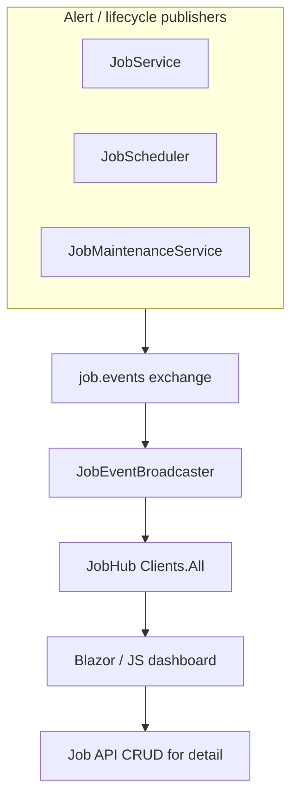

# Lyo.Job.SignalR

SignalR **live job dashboard** for the Lyo job stack. `JobEventBroadcaster` subscribes to lifecycle and alert routing keys on the `job.events` exchange and pushes **`JobHubEvent`** records to all connected **`JobHub`** clients — enabling Blazor or JavaScript dashboards to refresh without polling.

## Examples

### Register services

```csharp
services.AddJobSignalR();

var app = builder.Build();
app.MapJobHub(); // default path: /hubs/job
app.MapJobHub("/jobs/live"); // custom path
```

### Client usage

```javascript
const connection = new signalR.HubConnectionBuilder()
    .withUrl("/hubs/job")
    .build();

connection.on("JobEvent", (evt) => {
    // evt.eventType: run.created | run.started | run.finished | run.cancelled | alert | definition.updated
    // evt.runId, evt.definitionId, evt.timestampUtc, evt.message
});

await connection.start();
```

## Registration

Requires `IMqService` (same broker as `AddMqJobEventPublisher`). Register before `MapJobHub`.

## Client usage

Connect to the hub and listen for **`JobEvent`**: `JobHub.Ping()` returns `"pong"` for connectivity checks.

## Broadcast events

`JobEventBroadcaster` binds per-routing-key queues under `job.signalr.dashboard.*`:

| Routing key | `JobHubEvent.EventType` | Payload |
| -------------------------------------- | ----------------------- | --------------- |
| `job.notifications.run.created` | `run.created` | Run id (Guid) |
| `job.notifications.run.started` | `run.started` | Run id |
| `job.notifications.run.finished` | `run.finished` | Run id |
| `job.notifications.run.cancelled` | `run.cancelled` | Run id |
| `job.notifications.alert` | `alert` | Alert JSON body |
| `job.notifications.definition.updated` | `definition.updated` | Definition id |

`JobHubEvent.WorkerType` is reserved for future filtering; the broadcaster currently passes `null`. Alert events carry the raw JSON alert body in `Message` when the routing-key
payload is not a run Guid.

## Architecture



Pair with [`Lyo.Job.Web.Components`](../Lyo.Job.Web.Components/README.md) for the CRUD shell; use SignalR to invalidate or patch grids when events arrive.

## Configuration

This package has no dedicated options type — it uses the host's SignalR and MQ configuration. Ensure CORS and WebSocket policies allow dashboard clients to reach the mapped hub path.

## Metrics

The broadcaster does not emit dedicated metrics. Monitor underlying job metrics (`job.service.*`, `job.scheduler.*`, `job.sla.breach`) and MQ health via `IMqService` / `IHealth`.

## Dependencies

Generated from `ProjectReference` / `PackageReference` (same model as `docs/Lyo.ProjectGraph.html`).

- `Lyo.Job.Models` — (direct, lyo)
- `Lyo.MessageQueue` — (direct, lyo)
- `Microsoft.Extensions.Hosting.Abstractions` `10.0.5` — (direct, microsoft)
- `Microsoft.Extensions.Options.ConfigurationExtensions` `10.0.5` — (direct, microsoft)
- `Lyo.Api.Models` — (transitive, lyo)
- `Lyo.Common` — (transitive, lyo)
- `Lyo.DateAndTime` — (transitive, lyo)
- `Lyo.Exceptions` — (transitive, lyo)
- `Lyo.Health` — (transitive, lyo)
- `Lyo.Metrics` — (transitive, lyo)
- `Lyo.Query.Models` — (transitive, lyo)
- `Lyo.Result` — (transitive, lyo)
- `Lyo.Schedule.Models` — (transitive, lyo)
- `Microsoft.Extensions.DependencyInjection.Abstractions` `10.0.5` — (transitive, microsoft)
- `Microsoft.Extensions.Logging.Abstractions` `10.0.5` — (transitive, microsoft)
- `System.Diagnostics.DiagnosticSource` `10.0.5` — (transitive, microsoft, netstandard2.0)
- `System.Memory` `4.6.3` — (transitive, microsoft, netstandard2.0)
- `System.Text.Json` `10.0.5` — (transitive, microsoft, netstandard2.0)