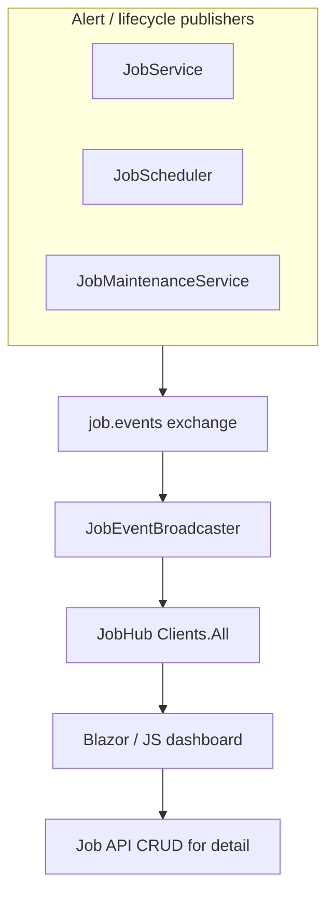

# Lyo.Job.SignalR

SignalR **live job dashboard** for the Lyo job stack. `JobEventBroadcaster` subscribes to lifecycle and alert routing keys on the `job.events` exchange and pushes **`JobHubEvent`**
records to all connected **`JobHub`** clients — enabling Blazor or JavaScript dashboards to refresh without polling.

## Registration

```csharp
services.AddJobSignalR();

var app = builder.Build();
app.MapJobHub();           // default path: /hubs/job
app.MapJobHub("/jobs/live"); // custom path
```

Requires `IMqService` (same broker as `AddMqJobEventPublisher`). Register before `MapJobHub`.

## Client usage

Connect to the hub and listen for **`JobEvent`**:

```javascript
const connection = new signalR.HubConnectionBuilder()
    .withUrl("/hubs/job")
    .build();

connection.on("JobEvent", (evt) => {
    // evt.eventType: run.created | run.started | run.finished | run.cancelled | alert | definition.updated
    // evt.runId, evt.definitionId, evt.timestampUtc, evt.message
});

await connection.start();
```

`JobHub.Ping()` returns `"pong"` for connectivity checks.

## Broadcast events

`JobEventBroadcaster` binds per-routing-key queues under `job.signalr.dashboard.*`:

| Routing key                            | `JobHubEvent.EventType` | Payload         |
|----------------------------------------|-------------------------|-----------------|
| `job.notifications.run.created`        | `run.created`           | Run id (Guid)   |
| `job.notifications.run.started`        | `run.started`           | Run id          |
| `job.notifications.run.finished`       | `run.finished`          | Run id          |
| `job.notifications.run.cancelled`      | `run.cancelled`         | Run id          |
| `job.notifications.alert`              | `alert`                 | Alert JSON body |
| `job.notifications.definition.updated` | `definition.updated`    | Definition id   |

`JobHubEvent.WorkerType` is reserved for future filtering; the broadcaster currently passes `null`. Alert events carry the raw JSON alert body in `Message` when the routing-key
payload is not a run Guid.

## Architecture



Pair with [`Lyo.Job.Web.Components`](../Lyo.Job.Web.Components/README.md) for the CRUD shell; use SignalR to invalidate or patch grids when events arrive.

## Configuration

This package has no dedicated options type — it uses the host's SignalR and MQ configuration. Ensure CORS and WebSocket policies allow dashboard clients to reach the mapped hub
path.

## Metrics

The broadcaster does not emit dedicated metrics. Monitor underlying job metrics (`job.service.*`, `job.scheduler.*`, `job.sla.breach`) and MQ health via `IMqService` / `IHealth`.

## Dependencies

*(Synchronized from `Lyo.Job.SignalR.csproj`.)*

**Target framework:** `net10.0`

### Framework references

- `Microsoft.AspNetCore.App`

### NuGet packages

| Package                                                | Version |
|--------------------------------------------------------|---------|
| `Microsoft.Extensions.Hosting.Abstractions`            | `[10,)` |
| `Microsoft.Extensions.Options.ConfigurationExtensions` | `[10,)` |

### Project references

- [`Lyo.Job.Models`](../Lyo.Job.Models/README.md)
- [`Lyo.MessageQueue`](../../../Communication/MessageQueue/Lyo.MessageQueue/README.md)

### Related packages

- [`Lyo.Job.Web.Components`](../Lyo.Job.Web.Components/README.md) — MudBlazor management UI
- [`Lyo.Job.Alerts`](../Lyo.Job.Alerts/README.md) — webhook/notification dispatch for the same alert routing key
