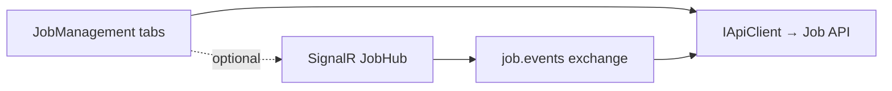

# Lyo.Job.Web.Components

Blazor / MudBlazor dashboard for the Lyo job-management stack. Drop `JobManagement` into a host page for Statistics, Definitions, Schedules, Runs (with **progress** and **SLA
breach** indicators), **worker registry**, and **workflow** views — all using an injected `IApiClient` and configurable base route prefix.

Pair with [`Lyo.Job.SignalR`](../Lyo.Job.SignalR/README.md) for a live-updating dashboard that receives `JobEvent` broadcasts without polling.

All components target server-side or interactive Blazor in `net10.0` and pull in MudBlazor `>= 9.3`.

This package is a **Razor component library** — it has no `AddXxx` DI registration. The host must already register `IApiClient` (and optionally [
`Lyo.Job.SignalR`](../Lyo.Job.SignalR/README.md) for live updates).

## Top-level entry point

```razor
@using Lyo.Job.Web.Components

<JobManagement BaseRoute="Job" StatisticsRoute="api/job-stats/recent" />
```

| Parameter         | Notes                                                                                          |
|-------------------|------------------------------------------------------------------------------------------------|
| `BaseRoute`       | Route prefix for job endpoints. Required. Defaults to `"Job"`.                                 |
| `StatisticsRoute` | Optional URL returning `SpJobStatistic` rows. When omitted, the stats tab shows an info alert. |

`JobManagement` renders tabbed `MudTabs`: Statistics, Definitions, Schedules, Runs, Workers, Workflows.

## Live dashboard (SignalR)

For real-time run/alert/definition updates, register SignalR in the host and subscribe from your page:

```csharp
// Program.cs
services.AddJobSignalR();
var app = builder.Build();
app.MapJobHub(); // default /hubs/job
```

```javascript
// Client-side (example)
connection.on("JobEvent", (evt) => { /* refresh grids or patch rows */ });
```

See [`Lyo.Job.SignalR`](../Lyo.Job.SignalR/README.md) for event types (`run.created`, `run.finished`, `alert`, …).

## Component catalog

| Component               | Role                                                                               |
|-------------------------|------------------------------------------------------------------------------------|
| `JobManagement`         | Tabbed dashboard shell.                                                            |
| `JobStats`              | Aggregated `SpJobStatistic` success rates and counts.                              |
| `JobDefinitionGrid`     | CRUD grid for definitions.                                                         |
| `JobDefinitionView`     | Editor: parameters, schedules, triggers.                                           |
| `JobScheduleGrid`       | Standalone schedule CRUD (misfire, calendar, cron fields via API).                 |
| `JobParameterView`      | Definition parameter grid (including encrypted markers).                           |
| `JobScheduleView`       | Inline schedule editor on definition view.                                         |
| `JobTriggerView`        | Trigger relationships between definitions.                                         |
| `JobRunGrid`            | Runs with state pills, **progress bar** column, drill-down.                        |
| `JobRunDetailView`      | Parameters, results, logs, **progress**, **SLA breach** chip, alert flags, re-run. |
| `JobWorkerInstanceGrid` | Live worker registry (type, machine, PID, in-flight, heartbeat).                   |
| `JobWorkflowView`       | Workflow picker + ordered step diagram.                                            |
| `RunJobDialog`          | Ad-hoc run with parameter overrides.                                               |

Every grid / view accepts `IApiClient` and route parameters so components can be hosted independently of the full shell.

## Production hardening in the UI

| Feature                        | Where surfaced                                                                          |
|--------------------------------|-----------------------------------------------------------------------------------------|
| Progress                       | `JobRunGrid` progress column; `JobRunDetailView` linear bar + message                   |
| SLA                            | `JobRunDetailView` breach indicator when `SlaBreached == true`                          |
| Alerting                       | Definition/run alert flags in detail view                                               |
| Worker registry                | **Workers** tab (`JobWorkerInstanceGrid`)                                               |
| Workflows                      | **Workflows** tab (`JobWorkflowView`)                                                   |
| Schedules / blackout calendars | **Schedules** tab — misfire policy, linked `JobBlackoutCalendarId`, cron fields via API |
| Dry run                        | `RunJobDialog` can pass `DryRun` for validate-only runs (no worker dispatch)            |

## `JobColorHelper`

Static helper for consistent visual treatment of job state, result, and log level.

| Member                                       | Returns / behavior                                                     |
|----------------------------------------------|------------------------------------------------------------------------|
| `ForState(JobState)`                         | MudBlazor `Color` mapping.                                             |
| `ForResult(JobRunResult?)`                   | Success / warning / error colors.                                      |
| `ForLogLevel(JobLogLevel)`                   | Trace/Debug→Default, Info→Info, Warning→Warning, Error/Critical→Error. |
| `StateIcon` / `ResultIcon`                   | Material icon names.                                                   |
| `FormatDuration` / `FormatDurationFromDates` | Human-readable durations.                                              |
| `GetEnumDescription<T>(T value)`             | `[Description]` attribute or field name.                               |

## Architecture



## Dependencies

*(Synchronized from `Lyo.Job.Web.Components.csproj`.)*

**Target framework:** `net10.0` (Razor SDK)

### Framework references

- `Microsoft.AspNetCore.App`

### NuGet packages

| Package     | Version  |
|-------------|----------|
| `MudBlazor` | `[9.3,)` |

### Project references

- [`Lyo.Api.Client`](../../Api/Lyo.Api.Client/README.md)
- [`Lyo.Job.Models`](../Lyo.Job.Models/README.md)
- [`Lyo.Scheduler`](../../../Core/Scheduler/Lyo.Scheduler/README.md)
- [`Lyo.Web.Components`](../../Web/Lyo.Web.Components/README.md)
- [`Lyo.Web.Components.Export`](../../Web/Lyo.Web.Components.Export/README.md)
- [`Lyo.Web.Components.Export.Csv`](../../Web/Lyo.Web.Components.Export.Csv/README.md)
- [`Lyo.Web.Components.Export.Xlsx`](../../Web/Lyo.Web.Components.Export.Xlsx/README.md)

### Related packages

- [`Lyo.Job.SignalR`](../Lyo.Job.SignalR/README.md) — optional live updates
