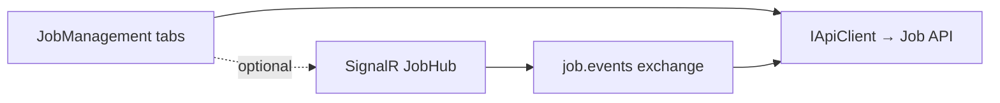

# Lyo.Job.Web.Components

Blazor / MudBlazor dashboard for the Lyo job-management stack. Drop `JobManagement` into a host page for Statistics, Definitions, Schedules, Runs (with **progress** and **SLA breach** indicators), **worker registry**, and **workflow** views — all using an injected `IApiClient` and configurable base route prefix.

Pair with [`Lyo.Job.SignalR`](../Lyo.Job.SignalR/README.md) for a live-updating dashboard that receives `JobEvent` broadcasts without polling.

All components target server-side or interactive Blazor in `net10.0` and pull in MudBlazor `>= 9.3`.

This package is a **Razor component library** — it has no `AddXxx` DI registration. The host must already register `IApiClient` (and optionally [ `Lyo.Job.SignalR`](../Lyo.Job.SignalR/README.md) for live updates).

## Examples

### Architecture



### Live dashboard (SignalR)

```csharp
// Program.cs
services.AddJobSignalR();
var app = builder.Build();
app.MapJobHub(); // default /hubs/job
```

## Top-level entry point

```razor
@using Lyo.Job.Web.Components

<JobManagement BaseRoute="Job" StatisticsRoute="api/job-stats/recent" />
```

| Parameter | Notes |
| ----------------- | ---------------------------------------------------------------------------------------------- |
| `BaseRoute` | Route prefix for job endpoints. Required. Defaults to `"Job"`. |
| `StatisticsRoute` | Optional URL returning `SpJobStatistic` rows. When omitted, the stats tab shows an info alert. |

`JobManagement` renders tabbed `MudTabs`: Statistics, Definitions, Schedules, Runs, Workers, Workflows.

## Live dashboard (SignalR)

For real-time run/alert/definition updates, register SignalR in the host and subscribe from your page:

```javascript
// Client-side (example)
connection.on("JobEvent", (evt) => { /* refresh grids or patch rows */ });
```

See [`Lyo.Job.SignalR`](../Lyo.Job.SignalR/README.md) for event types (`run.created`, `run.finished`, `alert`, …).

## Component catalog

| Component | Role |
| ----------------------- | ----------------------------------------------------------------------------------------------------------- |
| `JobManagement` | Tabbed dashboard shell. |
| `JobStats` | Aggregated `SpJobStatistic` success rates and counts. |
| `JobDefinitionGrid` | CRUD grid for definitions. |
| `JobDefinitionView` | Editor: parameters, schedules, triggers. |
| `JobScheduleGrid` | Standalone schedule CRUD (misfire, calendar, cron fields via API). |
| `JobParameterView` | Definition parameter grid (including encrypted markers, AllowedValues, and Options editor). |
| `JobScheduleView` | Inline schedule editor on definition view. |
| `JobTriggerView` | Trigger relationships between definitions. |
| `JobRunGrid` | Runs with state pills, **progress bar** column, drill-down. |
| `JobRunDetailView` | Parameters, results, logs, **progress**, **SLA breach** chip, alert flags, re-run. |
| `JobWorkerInstanceGrid` | Live worker registry (type, machine, PID, in-flight, heartbeat). |
| `JobWorkflowView` | Workflow picker + ordered step diagram. |
| `RunJobDialog` | Ad-hoc run with parameter overrides; Options / AllowedValues render as MudSelect with live sibling binding. |

Every grid / view accepts `IApiClient` and route parameters so components can be hosted independently of the full shell.

## Production hardening in the UI

| Feature | Where surfaced |
| ------------------------------ | --------------------------------------------------------------------------------------- |
| Progress | `JobRunGrid` progress column; `JobRunDetailView` linear bar + message |
| SLA | `JobRunDetailView` breach indicator when `SlaBreached == true` |
| Alerting | Definition/run alert flags in detail view |
| Worker registry | **Workers** tab (`JobWorkerInstanceGrid`) |
| Workflows | **Workflows** tab (`JobWorkflowView`) |
| Schedules / blackout calendars | **Schedules** tab — misfire policy, linked `JobBlackoutCalendarId`, cron fields via API |
| Dry run | `RunJobDialog` can pass `DryRun` for validate-only runs (no worker dispatch) |

## `JobColorHelper`

Static helper for consistent visual treatment of job state, result, and log level.

| Member | Returns / behavior |
| -------------------------------------------- | ---------------------------------------------------------------------- |
| `ForState(JobState)` | MudBlazor `Color` mapping. |
| `ForResult(JobRunResult?)` | Success / warning / error colors. |
| `ForLogLevel(JobLogLevel)` | Trace/Debug→Default, Info→Info, Warning→Warning, Error/Critical→Error. |
| `StateIcon` / `ResultIcon` | Material icon names. |
| `FormatDuration` / `FormatDurationFromDates` | Human-readable durations. |
| `GetEnumDescription<T>(T value)` | `[Description]` attribute or field name. |

## Dependencies

Generated from `ProjectReference` / `PackageReference` (same model as `docs/Lyo.ProjectGraph.html`).

- `Lyo.Api.Client` — (direct, lyo)
- `Lyo.Job.Models` — (direct, lyo)
- `Lyo.Scheduler` — (direct, lyo)
- `Lyo.Web.Components` — (direct, lyo)
- `Lyo.Web.Components.Export` — (direct, lyo)
- `Lyo.Web.Components.Export.Csv` — (direct, lyo)
- `Lyo.Web.Components.Export.Xlsx` — (direct, lyo)
- `MudBlazor` `9.3` — (direct, third-party)
- `Lyo.Api.Models` — (transitive, lyo)
- `Lyo.Common` — (transitive, lyo)
- `Lyo.DataTable.Models` — (transitive, lyo)
- `Lyo.DateAndTime` — (transitive, lyo)
- `Lyo.Diagnostic` — (transitive, lyo)
- `Lyo.Encryption` — (transitive, lyo)
- `Lyo.Exceptions` — (transitive, lyo)
- `Lyo.Hashing` — (transitive, lyo)
- `Lyo.IO.Temp` — (transitive, lyo)
- `Lyo.KeyStore` — (transitive, lyo)
- `Lyo.Metrics` — (transitive, lyo)
- `Lyo.PackageMetadata` — (transitive, lyo)
- `Lyo.Query.Models` — (transitive, lyo)
- `Lyo.Result` — (transitive, lyo)
- `Lyo.Schedule.Models` — (transitive, lyo)
- `Lyo.Streams` — (transitive, lyo)
- `Lyo.Validation` — (transitive, lyo)
- `Blazored.LocalStorage` `4.5.0` — (transitive, third-party)
- `BouncyCastle.Cryptography` `2.6.2` — (transitive, third-party, netstandard2.0)
- `Konscious.Security.Cryptography.Argon2` `1.3.1` — (transitive, third-party)
- `Microsoft.Bcl.AsyncInterfaces` `10.0.5` — (transitive, microsoft, netstandard2.0)
- `Microsoft.Extensions.Configuration.Binder` `10.0.5` — (transitive, microsoft)
- `Microsoft.Extensions.DependencyInjection.Abstractions` `10.0.5` — (transitive, microsoft, net10.0, netstandard2.0)
- `Microsoft.Extensions.Hosting.Abstractions` `10.0.5` — (transitive, microsoft)
- `Microsoft.Extensions.Http` `10.0.5` — (transitive, microsoft)
- `Microsoft.Extensions.Logging.Abstractions` `10.0.5` — (transitive, microsoft)
- `Microsoft.Extensions.Options.ConfigurationExtensions` `10.0.5` — (transitive, microsoft)
- `System.Buffers` `4.6.1` — (transitive, microsoft, netstandard2.0)
- `System.ComponentModel.Annotations` `5.0.0` — (transitive, microsoft)
- `System.Diagnostics.DiagnosticSource` `10.0.5` — (transitive, microsoft, netstandard2.0)
- `System.IO.Hashing` `10.0.5` — (transitive, microsoft, net10.0)
- `System.Memory` `4.6.3` — (transitive, microsoft, netstandard2.0)
- `System.Text.Json` `10.0.5` — (transitive, microsoft, netstandard2.0)
- `System.Threading.Tasks.Extensions` `4.6.3` — (transitive, microsoft, netstandard2.0)