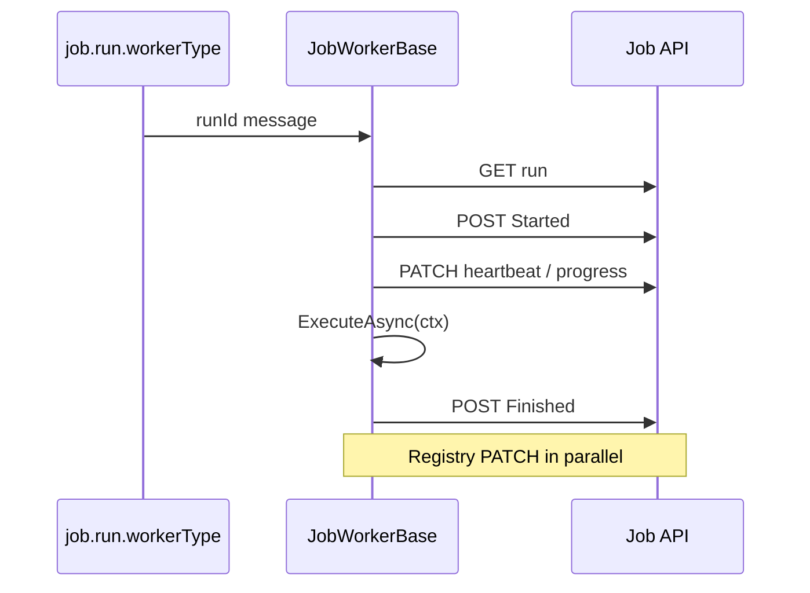

# Lyo.Job.Worker

Worker SDK for the Lyo job system. Subclass `JobWorkerBase` and implement `ExecuteAsync(IJobWorkerContext)`. The base class consumes the priority-enabled worker-type queue (`job.run.{workerType}` with `x-max-priority=10`), drives the run lifecycle (fetch, start, heartbeat, progress, finish), registers in the worker registry, decrypts encrypted parameters, supports batch child runs, subscribes to cancellation messages, links distributed traces from queue envelopes, and reports results back to the Job API.

`JobWorkerBase` extends `Lyo.MessageQueue.QueueWorkerBase<Guid, Result<Unit>>`, inheriting ack / requeue / DLQ semantics and `queue.worker.*` metrics.

## Examples

### Register services

```csharp
// IMqService (RabbitMQ) + Job.Client publisher — not Lyo.Job.Postgres
services.AddMqJobEventPublisher(); // Lyo.Job.Client — IMqService + Job.Client, not Postgres/Scheduler

services.AddJobWorker<MyImportWorker>(
    workerType: "csharp",
    apiBaseUrl: "https://api.example.com",
    maxRequeueCount: 5,
    dlqName: "job.run.csharp.dlq");

// Bind QueueWorkerOptions (section QueueWorkerOptions) for DefaultMaxRequeueCount / RequeueDelay:
services.AddJobWorkerFromConfiguration<MyImportWorker>(
    configuration, workerType: "csharp", apiBaseUrl: "https://api.example.com");
```

### Example worker

```csharp
public sealed class MyImportWorker : JobWorkerBase
{
    public MyImportWorker(
        IMqService mq, IApiClient api, IJobEventPublisher events,
        string workerType, string apiBaseUrl,
        ILogger<MyImportWorker>? logger = null, IMetrics? metrics = null,
        int? maxRequeueCount = null, string? dlqName = null,
        IJobParameterEncryptionService? parameterEncryption = null)
        : base(mq, api, events, workerType, apiBaseUrl, logger, metrics,
               maxRequeueCount, dlqName, parameterEncryption) { }

    protected override async Task ExecuteAsync(IJobWorkerContext ctx)
    {
        await ctx.ReportProgressAsync(10, "Starting import");
        var batch = ctx.Run.JobRunParameters.GetInt("BatchSize") ?? 100;
        ctx.Results.AddCreateCount(batch);
        await ctx.ReportProgressAsync(100, "Complete");
    }
}
```

## Registration

Requires `IMqService`, `IJobClient` (registered automatically via `AddJobWorker` when `IApiClient` and `apiBaseUrl` are available), and `IJobEventPublisher`. Register the publisher with `Lyo.Job.Client.AddMqJobEventPublisher()` / `AddMqJobEventPublisherFromConfiguration()` (`IMqService` + Job.Client). Do **not** use `Lyo.Job.Postgres.AddMqJobEventPublisher*` on worker hosts, and do **not** reference `Lyo.Job.Scheduler` just for the publisher. Optional: `IJobParameterEncryptionService` (`AddJobParameterEncryption`), `ILogger<TWorker>`, `IMetrics`. When `maxRequeueCount` or `dlqName` are omitted, defaults derive from `QueueWorkerOptions` or `job.run.{workerType}.dlq`.

## Configuration (`QueueWorkerOptions.SectionName` = `"QueueWorkerOptions"`)

Shared with `Lyo.MessageQueue.QueueWorkerBase` (see [`Lyo.MessageQueue`](../../../Communication/MessageQueue/Lyo.MessageQueue/README.md)):

| Property | Default | Purpose |
| ------------------------ | ------- | ------------------------------------------------- |
| `DefaultMaxRequeueCount` | `5` | Cap before DLQ routing |
| `RequeueDelay` | `2s` | Linear retry delay (requires `IDelayedMqService`) |

## Metrics (`job.worker.*`)

| Metric | Description |
| --------------------------------- | -------------------------------------------------------------------------------------------------------------- |
| `job.worker.run.executed` | Execute completed (tag `outcome`) |
| `job.worker.run.duration` | Execute phase wall time |
| `job.worker.heartbeat.sent` | Run heartbeat PATCH success |
| `job.worker.heartbeat.failed` | Run heartbeat PATCH failure |
| `job.worker.cancellation.honored` | Run cancelled via MQ signal |
| `job.worker.progress.reported` | `ReportProgressAsync` calls |
| `job.worker.start.rejected` | `Started` rejected by the API CAS guard (duplicate delivery / cancelled run). Message dropped, not requeued |
| `job.worker.shutdown.requeued` | Run handed back to `Queued` during graceful host shutdown |
| `job.worker.late_finish.dropped` | `Finished` report rejected as terminal (run already finalized, e.g. timed out by maintenance). Dropped cleanly |

Also emits inherited `queue.worker.*` metrics from the message-queue worker base.

## Worker features

| Feature | Implementation |
| ------------------- | ------------------------------------------------------------------------------------------------------------------------------------------------------------------------------------------------------------------------------------------------------------------------------------------------------------------ |
| **Priority queues** | Worker declares `x-max-priority=10`; run priority from definition / `JobRunReq`. |
| **Worker registry** | `POST Job/WorkerInstance` on start (soft-fail if the Job API is down) with system info (CPU, memory, OS/runtime) and queue subscriptions; periodic PATCH with `InFlightCount` plus live working-set/GC; re-register on missing id / heartbeat `404`; `Stopped` on shutdown. Host extras via `GetWorkerMetadata()`. |
| **Progress** | Heartbeat PATCH includes `ProgressPercent` / `ProgressMessage`; `ctx.ReportProgressAsync(percent, message)`. |
| **Batch jobs** | `ctx.CreateChildRunsAsync(JobCreateChildRunsReq)` → `POST Job/Run/{parentId}/Children`. |
| **Encryption** | Decrypts `EncryptedValue` parameters when `IJobParameterEncryptionService` is registered. |
| **Tracing** | `JobTracing.StartWorkerExecution` links to envelope `TraceId`. |
| **Cancellation** | Per-run CTS + `SubscribeToRunCancellationsAsync`. |
| **Dry run** | Not applicable. Dry-run requests are validated and returned by `JobService` without MQ publish, so workers never receive them. |

Override `HeartbeatInterval` (default 30 s) in a subclass to tune heartbeat/progress PATCH cadence for long-running jobs.

## Cancellation topology

Cancellations are broadcast, not competed for: each worker instance binds its **own exclusive auto-delete queue** (`job.run.{workerType}.cancel.{instanceId}`) to the `job.events` exchange on the `job.notifications.run.cancelled` routing key. Every instance of a scaled-out worker type therefore sees every cancel message; instances not executing that run simply ignore it. (A single shared cancel queue would deliver each cancel to only one competing consumer and silently lose cancellations for scaled-out workers.) The queues are auto-deleted when the instance disconnects.

## Shutdown and rejection

- **Graceful host shutdown**. a run interrupted by host shutdown (not by a user cancel) is handed back via `POST Job/Run/{id}/Requeue`, which CAS-transitions it `Running -> Queued` for redelivery on restart instead of terminally cancelling it. If the requeue fails (API down, or the run is `Cancelling` because a user cancel is pending), the run is left for the maintenance dead-job watchdog.
- **`Started` rejected (400)**. the API's CAS guard rejects starts for non-`Queued` runs (duplicate dispatch delivery, run cancelled while queued). The worker drops the message without requeueing. Retrying can never succeed.
- **`Finished` rejected (400)**. the run was already finalized (e.g. timed out by maintenance while the worker was still executing). The worker logs and drops the report as terminal instead of churning it through requeue/DLQ. Transient finish failures (network, 5xx) are retried before giving up.

## Worker lifecycle



1. **Fetch**. `GET Job/Run/{id}` with full includes.
2. **Start**. `POST Job/Run/{id}/Started`; decrypt parameters.
3. **Heartbeat loop**. PATCH `LastHeartbeatUtc` + progress fields every `HeartbeatInterval` (default 30 s).
4. `ExecuteAsync(ctx)`. Subclass work; use `ctx.ReportProgressAsync`, `ctx.CreateChildRunsAsync`, `ctx.CancellationToken`.
5. **Finish**. `POST Job/Run/{id}/Finished` with `JobWorkerResultBuilder` results.

`StartAsync` also registers the worker instance and subscribes to cancellation messages for this `WorkerType`. Registry registration is best-effort: a failed
`POST Job/WorkerInstance` (for example when the Job API is unreachable) does not stop the worker from consuming jobs. Unregistered workers retry registration on every
`HeartbeatInterval` until the Job API accepts the request; a later heartbeat `404` also triggers re-registration.

## `IJobWorkerContext`

| Member | Purpose |
| ---------------------------------------- | ------------------------- |
| `Run` | Fully loaded `JobRunRes` |
| `Logger` | Scoped structured logger |
| `CancellationToken` | Host shutdown + MQ cancel |
| `Results` | `JobWorkerResultBuilder` |
| `ReportProgressAsync(percent, message?)` | Immediate progress PATCH |
| `CreateChildRunsAsync(request)` | Batch fan-out child runs |

## `JobWorkerResultBuilder`

Fluent builder for finish results. `Build()` appends the `Result` key. Helpers: `SetOutcome`, `Fail`, `Cancel`, counter helpers, `AddError`, `AddFailedItem`, `AddApiCallTime`.

## Dependencies

Generated from `ProjectReference` / `PackageReference` (same model as `docs/Lyo.ProjectGraph.html`).

- `Lyo.Api.Client` (direct, lyo)
- `Lyo.Api.Models` (direct, lyo)
- `Lyo.Common` (direct, lyo)
- `Lyo.Job.Client` (direct, lyo)
- `Lyo.Job.Models` (direct, lyo)
- `Lyo.MessageQueue` (direct, lyo)
- `Lyo.Query.Models` (direct, lyo)
- `Microsoft.Extensions.Logging.Abstractions` `10.0.5` (direct, microsoft)
- `Lyo.DateAndTime` (transitive, lyo)
- `Lyo.Diagnostic` (transitive, lyo)
- `Lyo.Exceptions` (transitive, lyo)
- `Lyo.Hashing` (transitive, lyo)
- `Lyo.Health` (transitive, lyo)
- `Lyo.Metrics` (transitive, lyo)
- `Lyo.PackageMetadata` (transitive, lyo)
- `Lyo.Result` (transitive, lyo)
- `Lyo.Schedule.Models` (transitive, lyo)
- `Microsoft.Extensions.DependencyInjection` `10.0.5` (transitive, microsoft)
- `Microsoft.Extensions.DependencyInjection.Abstractions` `10.0.5` (transitive, microsoft)
- `Microsoft.Extensions.Hosting.Abstractions` `10.0.5` (transitive, microsoft)
- `Microsoft.Extensions.Http` `10.0.5` (transitive, microsoft)
- `Microsoft.Extensions.Options.ConfigurationExtensions` `10.0.5` (transitive, microsoft)
- `System.Diagnostics.DiagnosticSource` `10.0.5` (transitive, microsoft, netstandard2.0)
- `System.IO.Hashing` `10.0.5` (transitive, microsoft, net10.0)
- `System.Memory` `4.6.3` (transitive, microsoft, netstandard2.0)
- `System.Text.Json` `10.0.5` (transitive, microsoft, netstandard2.0)
- `System.Threading.Tasks.Extensions` `4.6.3` (transitive, microsoft)