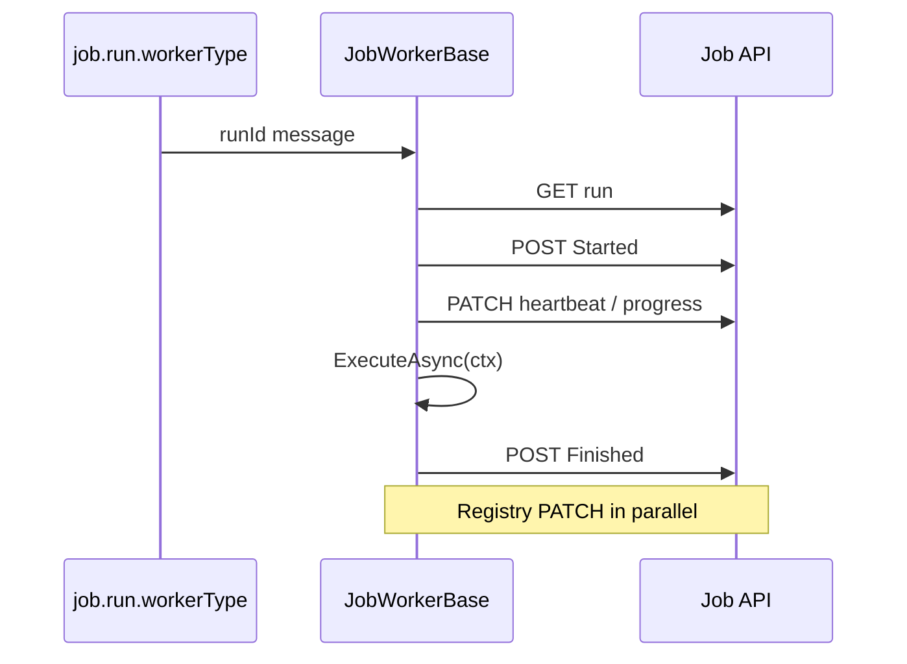

# Lyo.Job.Worker

Worker SDK for the Lyo job system. Subclass `JobWorkerBase` and implement a single `ExecuteAsync(IJobWorkerContext)` method — the base class consumes the priority-enabled worker-type queue (`job.run.{workerType}` with `x-max-priority=10`), drives the full run lifecycle (fetch, start, heartbeat, progress, finish), registers in the **worker registry**, decrypts encrypted parameters, supports **batch child runs**, subscribes to cancellation messages, links **distributed traces** from queue envelopes, and reports results back to the Job API.

`JobWorkerBase` extends `Lyo.MessageQueue.QueueWorkerBase<Guid, Result<Unit>>`, inheriting ack / requeue / DLQ semantics and `queue.worker.*` metrics.

## Registration

```csharp
// IMqService (RabbitMQ) + Job.Client publisher — not Lyo.Job.Postgres
services.AddMqJobEventPublisher(); // Lyo.Job.Client — IMqService + Job.Client, not Postgres/Scheduler

services.AddJobWorker<MyImportWorker>(
    workerType: "csharp",
    apiBaseUrl: "https://api.example.com",
    maxRequeueCount: 5,
    dlqName: "job.run.csharp.dlq");

// Bind QueueWorkerOptions (section QueueWorkerOptions) for DefaultMaxRequeueCount / RequeueDelay:
services.AddJobWorkerFromConfiguration<MyImportWorker>(
    configuration, workerType: "csharp", apiBaseUrl: "https://api.example.com");
```

Requires `IMqService`, `IJobClient` (registered automatically via `AddJobWorker` when `IApiClient` and `apiBaseUrl` are available), and `IJobEventPublisher`. Register the publisher with `Lyo.Job.Client.AddMqJobEventPublisher()` / `AddMqJobEventPublisherFromConfiguration()` (`IMqService` + Job.Client) — do **not** use `Lyo.Job.Postgres.AddMqJobEventPublisher*` on worker hosts, and do **not** reference `Lyo.Job.Scheduler` just for the publisher. Optional: `IJobParameterEncryptionService` (`AddJobParameterEncryption`), `ILogger<TWorker>`, `IMetrics`.

When `maxRequeueCount` or `dlqName` are omitted, defaults derive from `QueueWorkerOptions` or `job.run.{workerType}.dlq`.

## Configuration (`QueueWorkerOptions.SectionName` = `"QueueWorkerOptions"`)

Shared with `Lyo.MessageQueue.QueueWorkerBase` (see [`Lyo.MessageQueue`](../../../Communication/MessageQueue/Lyo.MessageQueue/README.md)):

| Property                 | Default | Purpose                                      |
|--------------------------|---------|----------------------------------------------|
| `DefaultMaxRequeueCount` | `5`     | Cap before DLQ routing                       |
| `RequeueDelay`           | `2s`    | Linear retry delay (requires `IDelayedMqService`) |

## Metrics (`job.worker.*`)

| Metric | Description |
|--------|-------------|
| `job.worker.run.executed` | Execute completed (tag `outcome`) |
| `job.worker.run.duration` | Execute phase wall time |
| `job.worker.heartbeat.sent` | Run heartbeat PATCH success |
| `job.worker.heartbeat.failed` | Run heartbeat PATCH failure |
| `job.worker.cancellation.honored` | Run cancelled via MQ signal |
| `job.worker.progress.reported` | `ReportProgressAsync` calls |

Also emits inherited `queue.worker.*` metrics from the message-queue worker base.

## Production features

| Feature | Implementation |
|---------|----------------|
| **Priority queues** | Worker declares `x-max-priority=10`; run priority from definition / `JobRunReq`. |
| **Worker registry** | `POST Job/WorkerInstance` on start (soft-fail if the Job API is down); periodic PATCH with `InFlightCount`; re-register on missing id / heartbeat `404`; `Stopped` on shutdown. |
| **Progress** | Heartbeat PATCH includes `ProgressPercent` / `ProgressMessage`; `ctx.ReportProgressAsync(percent, message)`. |
| **Batch jobs** | `ctx.CreateChildRunsAsync(JobCreateChildRunsReq)` → `POST Job/Run/{parentId}/Children`. |
| **Encryption** | Decrypts `EncryptedValue` parameters when `IJobParameterEncryptionService` is registered. |
| **Tracing** | `JobTracing.StartWorkerExecution` links to envelope `TraceId`. |
| **Cancellation** | Per-run CTS + `SubscribeToRunCancellationsAsync`. |
| **Dry run** | Not applicable — dry-run requests are validated and returned by `JobService` without MQ publish, so workers never receive them. |

Override `HeartbeatInterval` (default 30 s) in a subclass to tune heartbeat/progress PATCH cadence for long-running jobs.

## Worker lifecycle



1. **Fetch** — `GET Job/Run/{id}` with full includes.
2. **Start** — `POST Job/Run/{id}/Started`; decrypt parameters.
3. **Heartbeat loop** — PATCH `LastHeartbeatUtc` + progress fields every `HeartbeatInterval` (default 30 s).
4. **`ExecuteAsync(ctx)`** — subclass work; use `ctx.ReportProgressAsync`, `ctx.CreateChildRunsAsync`, `ctx.CancellationToken`.
5. **Finish** — `POST Job/Run/{id}/Finished` with `JobWorkerResultBuilder` results.

`StartAsync` also registers the worker instance and subscribes to cancellation messages for this `WorkerType`. Registry registration is best-effort: a failed `POST Job/WorkerInstance` (for example when the Job API is unreachable) does not stop the worker from consuming jobs. Unregistered workers retry registration on every `HeartbeatInterval` until the Job API accepts the request; a later heartbeat `404` also triggers re-registration.

## Example worker

```csharp
public sealed class MyImportWorker : JobWorkerBase
{
    public MyImportWorker(
        IMqService mq, IApiClient api, IJobEventPublisher events,
        string workerType, string apiBaseUrl,
        ILogger<MyImportWorker>? logger = null, IMetrics? metrics = null,
        int? maxRequeueCount = null, string? dlqName = null,
        IJobParameterEncryptionService? parameterEncryption = null)
        : base(mq, api, events, workerType, apiBaseUrl, logger, metrics,
               maxRequeueCount, dlqName, parameterEncryption) { }

    protected override async Task ExecuteAsync(IJobWorkerContext ctx)
    {
        await ctx.ReportProgressAsync(10, "Starting import");
        var batch = ctx.Run.JobRunParameters.GetInt("BatchSize") ?? 100;
        ctx.Results.AddCreateCount(batch);
        await ctx.ReportProgressAsync(100, "Complete");
    }
}
```

## `IJobWorkerContext`

| Member | Purpose |
|--------|---------|
| `Run` | Fully loaded `JobRunRes` |
| `Logger` | Scoped structured logger |
| `CancellationToken` | Host shutdown + MQ cancel |
| `Results` | `JobWorkerResultBuilder` |
| `ReportProgressAsync(percent, message?)` | Immediate progress PATCH |
| `CreateChildRunsAsync(request)` | Batch fan-out child runs |

## `JobWorkerResultBuilder`

Fluent builder for finish results. `Build()` appends the `Result` key. Helpers: `SetOutcome`, `Fail`, `Cancel`, counter helpers, `AddError`, `AddFailedItem`, `AddApiCallTime`.

## Dependencies

*(Synchronized from `Lyo.Job.Worker.csproj`.)*

**Target framework:** `net10.0`

### NuGet packages

| Package                                     | Version |
|---------------------------------------------|---------|
| `Microsoft.Extensions.Logging.Abstractions` | `[10,)` |

### Project references

- [`Lyo.Api.Client`](../../Api/Lyo.Api.Client/README.md)
- [`Lyo.Job.Models`](../Lyo.Job.Models/README.md)
- [`Lyo.MessageQueue`](../../../Communication/MessageQueue/Lyo.MessageQueue/README.md)
