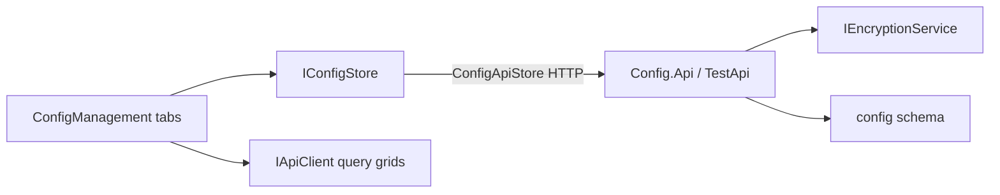

# Lyo.Config.Web.Components

Blazor / MudBlazor dashboard for [`Lyo.Config`](../Lyo.Config/README.md). Add `ConfigManagement` to a host page for definitions, resolved per-entity values, **definition history**, and **value history**.

Components take `IConfigStore` as a parameter for writes and an `IApiClient` for reads: the grids are `LyoDataGridProjected` over Config.Api / TestApi query routes. There is no `AddXxx` DI registration and **no `IEncryptionService`** in this package. The client sends plaintext plus `IsEncrypted`. The API encrypts at rest.

Targets interactive Blazor on `net10.0`.

## Examples

### How a host wires this up

```razor
@inject IConfigStore Store
@inject IApiClient ApiClient

<ConfigManagement Store="Store" ApiClient="ApiClient" InitialSubjectEntityType="App" InitialSubjectEntityId="gateway:local" />
```

### Architecture



## Top-level entry point

```razor
@using Lyo.Config.Web.Components

<ConfigManagement Store="Store" />
```

| Parameter | Notes |
| -------------------------- | ---------------------------------------------------------------------------------------------------------------------------------------------------------------------------------------- |
| `Store` | Required `IConfigStore`. Hosts inject the store and pass it in. |
| `ApiClient` | Required `IApiClient`. The definitions tab uses `LyoDataGridProjected` on `Config/Definition` (search/filter/sort/export). Bulk delete still calls `IConfigStore.DeleteDefinitionAsync`. |
| `InitialSubjectEntityType` | Toolbar prefill. Defaults to `App` (`AppConfigEntity.AppEntityType`). |
| `InitialSubjectEntityId` | Toolbar prefill for the entity instance (string; app routes use `kind:id`). |

`ConfigManagement` owns subject entity type/id (Apply to load) and renders tabbed `MudTabs`: Definitions, Resolved, Definition history, Value history. `GetDefinitionsAsync` requires an entity type. Bindings and `LoadConfigAsync` also need an id. There is no list-all-definitions API.

## Component catalog

| Component | Role |
| ------------------------------ | -------------------------------------------------------------------------------------------------------------------------------------------------------------------------------------------------------------------------------------------------------------------- |
| `ConfigManagement` | Toolbar + tabbed dashboard shell. |
| `ConfigDefinitionGrid` | `LyoDataGridProjected` over the definition query route (filter Key / ForValueType / IsRequired / IsEncrypted, export, store-backed bulk delete). History opens definition history. Required / Encrypted / Has default chips. |
| `ConfigDefinitionView` | `LyoDialogPresets.Medium` + `LyoForm`. Type dropdown from `LyoTypeInfo.All` plus Custom FullName (Enum also asks for the concrete FullName). Encrypted switch (flag only). Optional default via `ConfigValueEditor`. Compact definition history with revert. |
| `ConfigResolvedView` | `LoadConfigAsync` merge for type+id. Source chips: Overridden / Using default / Missing. Edit binding, reset to default, clear binding. History jumps to Value history when a binding exists. |
| `ConfigBindingView` | Medium binding editor. Encrypted inherits from the definition (client still only sends plaintext). Compact value history with revert. |
| `ConfigValueEditor` | Typed Mud inputs from `LyoTypeValueInput` (`LyoTypeInfo.EditorKind`). `JsonEditor<JsonNode>` for JSON documents, binary, and custom types. Chip input for collections. Password-style input when Encrypted. No type-name field (the definition owns `ForValueType`). |
| `ConfigDefinitionRevisionList` | Newest-first metadata revisions for a selected definition. Revert copies that snapshot and appends a new revision. |
| `ConfigRevisionList` | Newest-first value revisions for a selected binding. Revert copies that snapshot and appends a new revision. Empty until the first binding save. |
| `ConfigColorHelper` | Chip colors for required/optional and Binding/Default/Missing. Rendering goes through `LyoChip`. |

## Store calls

- `SaveDefinitionAsync` / `SaveBindingAsync(..., tenantId: null)`.
- `DeleteDefinitionAsync` — confirm in UI. PostgreSQL cascades bindings and revisions.
- `DeleteBindingAsync` — `InvalidOperationException` when `IsRequired` and there is no default is shown as a snackbar.
- `LoadConfigAsync` — required-missing is shown as a warning. Fallback rows still let you edit bindings.
- `GetDefinitionRevisionsAsync` / `RevertDefinitionToRevisionAsync` — definition history.
- `GetBindingRevisionsAsync` / `RevertBindingToRevisionAsync` — value history. Revert is auditable (new revision appended).

## Shared UI

Reuse `LyoDialog` / `LyoDialogPresets.Medium`, `LyoForm` / `LyoFormInput`, `LyoIdField`, `LyoChip` / `LyoChips`, `LyoTimestamp`, `LyoTruncatedText`, and `JsonEditor`. Status chips go in `TitleChips`, not `TitleContent`. Pass `IApiClient` for `LyoDataGridProjected` on definition query routes. Do not register `IEncryptionService` in this package.

## See also

- [`Lyo.Config`](../Lyo.Config/README.md). `IConfigStore`, records, `AppConfigEntity`.
- [`Lyo.Config.Postgres`](../Lyo.Config.Postgres/README.md). `AddPostgresConfigStoreFromConfiguration`.
- [`Lyo.TestGateway`](../../../Tools/Lyo.TestGateway/README.md). `/config` workbench via `ConfigApiStore` over TestApi (API encrypts).

## Dependencies

Generated from `ProjectReference` / `PackageReference` (same model as `docs/Lyo.ProjectGraph.html`).

- `Lyo.Api.Client` (direct, lyo)
- `Lyo.Common.Metadata` (direct, lyo)
- `Lyo.Config` (direct, lyo)
- `Lyo.Http.Client` (direct, lyo)
- `Lyo.Web.Components` (direct, lyo)
- `Lyo.Web.Components.Export` (direct, lyo)
- `Lyo.Web.Components.Export.Csv` (direct, lyo)
- `Lyo.Web.Components.Export.Xlsx` (direct, lyo)
- `MudBlazor` `9.3` (direct, third-party)
- `Lyo.Api.Models` (transitive, lyo)
- `Lyo.Common.Core` (transitive, lyo)
- `Lyo.Common.Json` (transitive, lyo)
- `Lyo.DataTable.Models` (transitive, lyo)
- `Lyo.DateAndTime` (transitive, lyo)
- `Lyo.Diagnostic` (transitive, lyo)
- `Lyo.Encryption` (transitive, lyo)
- `Lyo.EntityReference.Models` (transitive, lyo)
- `Lyo.Exceptions` (transitive, lyo)
- `Lyo.Hashing` (transitive, lyo)
- `Lyo.IO.FileSystem` (transitive, lyo)
- `Lyo.IO.Temp` (transitive, lyo)
- `Lyo.KeyStore` (transitive, lyo)
- `Lyo.Metrics` (transitive, lyo)
- `Lyo.PackageMetadata` (transitive, lyo)
- `Lyo.Parameters` (transitive, lyo)
- `Lyo.Query.Evaluation` (transitive, lyo)
- `Lyo.Query.Models` (transitive, lyo)
- `Lyo.Result` (transitive, lyo)
- `Lyo.Streams` (transitive, lyo)
- `Lyo.Validation` (transitive, lyo)
- `Lyo.Validation.Models` (transitive, lyo)
- `Lyo.Web.Primitives` (transitive, lyo)
- `AngleSharp` `1.5.0` (transitive, third-party)
- `Blazored.LocalStorage` `4.5.0` (transitive, third-party)
- `BouncyCastle.Cryptography` `2.6.2` (transitive, third-party, netstandard2.0)
- `Konscious.Security.Cryptography.Argon2` `1.3.1` (transitive, third-party)
- `Microsoft.Bcl.AsyncInterfaces` `10.0.5` (transitive, microsoft, netstandard2.0)
- `Microsoft.Extensions.Configuration.Binder` `10.0.5` (transitive, microsoft)
- `Microsoft.Extensions.DependencyInjection.Abstractions` `10.0.5` (transitive, microsoft, net10.0, netstandard2.0)
- `Microsoft.Extensions.Hosting.Abstractions` `10.0.5` (transitive, microsoft)
- `Microsoft.Extensions.Http` `10.0.5` (transitive, microsoft)
- `Microsoft.Extensions.Logging.Abstractions` `10.0.5` (transitive, microsoft)
- `System.Buffers` `4.6.1` (transitive, microsoft, netstandard2.0)
- `System.ComponentModel.Annotations` `5.0.0` (transitive, microsoft)
- `System.IO.Hashing` `10.0.5` (transitive, microsoft, net10.0)
- `System.Memory` `4.6.3` (transitive, microsoft, netstandard2.0)
- `System.Text.Json` `10.0.5` (transitive, microsoft, netstandard2.0)
- `System.Threading.RateLimiting` `10.0.5` (transitive, microsoft)
- `System.Threading.Tasks.Extensions` `4.6.3` (transitive, microsoft, netstandard2.0)