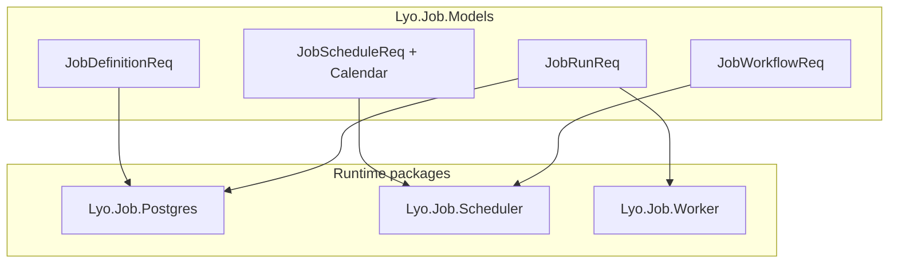

# Lyo.Job.Models

Shared DTOs, builders, enums, metrics constants, distributed-tracing helpers, and message-queue contracts for Lyo job management. Consumed by `Lyo.Job.Postgres` (the API host), `Lyo.Job.Scheduler`, `Lyo.Job.Worker`, `Lyo.Job.Alerts`, and any Blazor / client code that talks to the job service.

Multi-targets `netstandard2.0` and `net10.0` so the same DTOs flow through legacy callers and modern .NET hosts.

This package is a contract library. It has no `AddXxx` DI registration. Hosts reference it for DTOs, builders, metrics constants, and `IJobEventPublisher`. Wire persistence via [`Lyo.Job.Postgres`](../Lyo.Job.Postgres/README.md), scheduling via [`Lyo.Job.Scheduler`](../Lyo.Job.Scheduler/README.md), and workers via [`Lyo.Job.Worker`](../Lyo.Job.Worker/README.md).

## Examples

### Retry backoff (`JobRetryBackoff`)

```csharp
// Linear: baseSeconds × attempt
// Exponential: baseSeconds × 2^(attempt-1) with ±25% jitter
var delay = JobRetryBackoff.ComputeBackoffSeconds(
    baseSeconds: 60, attempt: 3, JobRetryBackoffType.Exponential);
```

### Builders (`Builders/`)

```csharp
using Lyo.Common.Metadata.Records;

var definition = JobDefinitionBuilder
    .New("Nightly Sync", "Pulls everything from the upstream API")
    .ForCSharpWorker()
    .SetType("Import")
    .AddJobParameter("BatchSize", LyoTypeInfo.Int, 500)
    .Build();

var run = JobRunBuilder
    .New(definition.Id, "scheduler")
    .AddParameter("BatchSize", 1000)
    .Build();
```

## Hardening model

Priority dispatch, retention, misfire handling, exponential backoff, idempotency, rate limiting, SLA tracking, alerting,
blackout calendars, batch fan-out, workflows, encryption markers, and audit correlation are all driven by knobs on definitions, schedules, and runs:

| Concern | Where it lives |
| --------------------- | -------------------------------------------------------------------------------------------------------------------------------------------------------------------------------------------------------------------------------------------------------------------------------------------------------------------------------------------------------------- |
| Priority (0 to 9) | `JobDefinitionReq.Priority`, `JobRunReq.Priority` |
| Retention | `JobDefinitionReq.RetentionDays` (per-definition override; host default in `JobMaintenanceOptions`) |
| Misfire | `JobScheduleReq.MisfirePolicy` (`Skip` / `RunOnce`); scheduler defaults in `JobSchedulerOptions` |
| Exponential backoff | `JobDefinitionReq.RetryBackoffType` + `JobRetryBackoff.ComputeBackoffSeconds` |
| Idempotency | `JobRunReq.IdempotencyKey` (unique per definition); `(JobScheduleId, ScheduledSlotUtc)` for scheduled runs |
| Rate limiting | `JobDefinitionReq.MaxRunsPerHour` |
| SLA | `ExpectedDurationMinutes`, `MustStartByMinutes`; run flag `JobRunRes.SlaBreached` |
| Alerting | `AlertOnFailure`, `AlertAfterConsecutiveFailures`, `AlertWebhookUrl`; `JobAlertType` |
| Blackout calendars | `JobBlackoutCalendarReq`, `JobBlackoutWindowReq` (weekdays, dated range, calendar month/day-of-month, or `HolidaySlug`), `JobBlackoutCalendarEvaluator`, `JobDefinitionReq.JobBlackoutCalendarId` / `CreateBlackoutCalendar` (definition default for all schedules), `JobScheduleReq.JobBlackoutCalendarId` / `CreateBlackoutCalendar` (per-schedule override) |
| Batch jobs | `ParentJobRunId`, `BatchIndex`, `BatchTotal`; `JobCreateChildRunsReq` |
| Workflows | `JobWorkflowReq`, `JobWorkflowStepReq`, `JobWorkflowRunReq`, … |
| Encryption | `JobParameterReq.EncryptedValue`, `IJobParameterEncryptionService` |
| Audit | `JobDefinitionRes.DefinitionVersion`, `JobRunRes.DefinitionAuditVersion` |
| Tracing | `JobRunReq.TraceId`, `JobTracing` (`ActivitySource` name `Lyo.Job`) |
| Worker registry | `JobWorkerInstanceReq` / `JobWorkerInstanceRes` (`Metadata` bag; built-in keys in `Constants.WorkerMetadata`) |
| Progress | `JobRunRes.ProgressPercent`, `ProgressMessage` |
| Parallel restrictions | **`JobParallelRestrictionReq`.** blocks schedule when related definitions are Queued/Running |
| Dry run | `JobRunReq.DryRun`, `JobRunBuilder.AsDryRun()`. Validate without persisting or publishing |
| Dispatch suppression | **`JobRunReq.SuppressDispatch`.** persist the run as `Queued` without the immediate MQ publish (caller owns dispatch: scheduler delayed retries, workflow step ordering); a future `ScheduledSlotUtc` suppresses implicitly |
| Delayed dispatch | **`JobRunReq.ScheduledSlotUtc`.** slot idempotency for scheduled runs (duplicate create returns the existing run), and the due time for delayed retries picked up by maintenance redispatch |
| Parameter validation | `JobParameterReq.Required`, `ValidationRegex`, `MinLength`, `MaxLength`, `AllowedValues`. Enforced in `JobService` |
| Parameter options | `JobParameterReq.Options`. JSON picker source (static items or root `QueryReq`); `Value` remains the default/selected scalar |
| Parameter defaults | `JobParameterReq.DefaultKind` + `DefaultTemplate`. `Literal` (default) takes the default from `Value`; `Expression` renders `DefaultTemplate` when the caller supplies no value, so `Type` keeps describing the value — a `System.DateTime` parameter can default to `{DateTime.UtcNow.AddDays(-1):yyyy-MM-dd}`. Resolved in `JobService` and `JobScheduler` |

## `JobDefinitionReq` defaults

| Property | Default |
| ----------------------------------------------------------------------------------------------------------------------------------------------------------------------------------------------------------------------------------------------------------------------- | ---------------------- |
| `Enabled` | `true` |
| `RetryBackoffType` | `Linear` |
| `AlertOnFailure` | `false` |
| `MaxRetryCount`, `RetryBackoffSeconds`, `TimeoutMinutes`, `MaxConcurrentRuns`, `CircuitBreakerThreshold`, `CircuitBreakerResetMinutes`, `Priority`, `RetentionDays`, `MaxRunsPerHour`, `ExpectedDurationMinutes`, `MustStartByMinutes`, `AlertAfterConsecutiveFailures` | `0` (disabled / unset) |



## Requests and responses

Under `Request/` and `Response/`. Every lifecycle entity has a create/update request DTO and a read response DTO:

| Entity | Request | Response |
| -------------------- | --------------------------- | -------------------------------------------------------------------------------- |
| Job definition | `JobDefinitionReq` | `JobDefinitionRes` |
| Parameter | `JobParameterReq` | `JobParameterRes` |
| Schedule | `JobScheduleReq` | `JobScheduleRes` |
| Schedule parameter | `JobScheduleParameterReq` | `JobScheduleParameterRes` |
| Trigger | `JobTriggerReq` | `JobTriggerRes` |
| Trigger parameter | `JobTriggerParameterReq` | `JobTriggerParameterRes` |
| Parallel restriction | `JobParallelRestrictionReq` | `JobParallelRestrictionRes` |
| Calendar | `JobBlackoutCalendarReq` | `JobBlackoutCalendarRes`, `JobBlackoutWindowRes` |
| Workflow | `JobWorkflowReq` | `JobWorkflowRes`, `JobWorkflowStepRes` |
| Workflow run | `JobWorkflowRunReq` | `JobWorkflowRunRes`, `JobWorkflowRunStepRes` |
| Worker instance | `JobWorkerInstanceReq` | `JobWorkerInstanceRes` |
| Run | `JobRunReq` | `JobRunRes` |
| Run parameter | `JobRunParameterReq` | `JobRunParameterRes` |
| Run result | `JobRunResultReq` | `JobRunResultRes` |
| Run log | `JobRunLogReq` | `JobRunLogRes` |
| Batch children | `JobCreateChildRunsReq` | _(list of `JobRunRes`)_ |
| File upload | _(N/A)_ | `JobFileUploadRes` |
| Definition stats | _(N/A)_ | `JobDefinitionStatsRes` (incl. `RunningCount` / `QueuedCount`), `SpJobStatistic` |
| Queued-run resync | _(N/A)_ | `JobRunResyncRes` |

Dashboards get `JobInfo`, which wraps a `JobDefinitionRes` together with last / last successful / last failed runs.

Typed access to parameter and result bags on `JobRunRes` is `GetParameterValueAs<T>`, `GetResultValueAs<T>`, `GetParameterDictionary`, and `GetResultDictionary`. Those, plus
the list-level accessors in `Lyo.Parameters.LyoKeyedValueExtensions` (`GetInt`, `GetLong`, `GetDecimal`, `GetBool`, `GetGuid`, `GetDateTime`, `GetEnum<T>`, `GetRegex`, `GetAs<T>`), go through
`Lyo.Common.Core.Conversion.TypeConversion`: lookups ignore key case, booleans parse leniently (`1/0`, `y/n`, `yes/no`, `t/f`, `on/off`), and `GetAs<T>` deserializes
JSON-typed parameter values into complex types. `GetDateTime` keeps round-trip (`"O"`) parsing so UTC timestamps preserve their kind, and a `format` passed to `GetAs<T>` uses the
format-aware `ToScalar<T>` path.

## Builders (`Builders/`)

Request DTOs can be assembled with fluent factories instead of raw initializers.

- `JobDefinitionBuilder`. `New(name)`, `SetDescription`, `SetType`, `ForPythonWorker` / `ForCSharpWorker`, `AsImportInCSharp`, helpers for schedule/parameter/trigger/restriction,
 and email parameters. `AddBlackoutWindow` / `WithBlackoutCalendar` set a definition-level default cascaded to every schedule (by id or inline). `Build()` returns
 `JobDefinitionReq`.
- `JobScheduleBuilder`. `Weekdays`, `EveryDay`, `SetMonths`, `SetDays`, `SetTimes`, `SetInterval`, cron helpers, `WithMisfirePolicy`, `WithBlackoutCalendar`,
 `AddBlackoutWindow`, `Build()` → `JobScheduleReq`.
- `JobBlackoutCalendarBuilder`. `AddBlackoutWindow(...)` with `JobBlackoutPolicy` (`Defer` / `Skip`); `AddBlackoutHoliday(HolidayInfo, ...)` / `AddBlackoutHolidays(...)` /
 `AddFederalHolidayBlackouts()` store one window per holiday (`HolidaySlug`); `AddBlackoutCalendarDays(...)` stores month flags plus days of month. `JobBlackoutCalendarEvaluator.AdjustSlotForBlackout` matches those rules at runtime. `Build()` → `JobBlackoutCalendarReq`.
- **`JobScheduleBuilder.WithBlackoutCalendar`.** Override on one schedule: link by `Guid`, or create inline via `Action<JobBlackoutCalendarBuilder>`.
- **`JobWorkflowBuilder`.** Ordered steps with `DependsOnStepIds` and `JobWorkflowFailurePolicy`. `Build()` → `JobWorkflowReq`.
- `JobRunResultBuilder`, `JobRunBuilder`, `JobTriggerBuilder`. As before; `JobRunBuilder` supports `AddEncryptedParameter`.

## Enums

| Enum | Values / purpose |
| ---------------------------------------------- | ----------------------------------------------------------------------------------------------------------------- |
| `JobState` | `Unknown`, `Queued`, `Running`, `Finished`, `Cancelled`, `Cancelling` |
| `JobRunResult` | `Success`, `Failure`, `Timeout`, `Cancelled`, … |
| `LyoTypeInfo` (via `Lyo.Common.Core`) | Parameter/result `Type` is CLR `FullName`; values are JSON. Legacy enum names (`Int`, `String`, …) still resolve. |
| `JobLogLevel` | Log severity for `JobRunLogReq` |
| `JobMisfirePolicy` | `Skip`, `RunOnce`. Missed schedule slots |
| `JobRetryBackoffType` | `Linear`, `Exponential` (with jitter via `JobRetryBackoff`) |
| `JobBlackoutPolicy` | `Skip`, `Defer`. Calendar windows |
| `JobAlertType` | `Failure`, `CircuitBreakerTripped`, `DeadJob`, `SlaBreach` |
| `JobWorkerInstanceState` | `Running`, `Stopped` |
| `JobWorkflowFailurePolicy` | `Stop`, `Continue` |
| `JobWorkflowRunState` / `JobWorkflowStepState` | Workflow execution states |

## Distributed tracing (`JobTracing`)

The `ActivitySource` is named `Lyo.Job`. Helpers: `StartCreateRun`, `StartRun`, `FinishRun`, `StartWorkerExecution` (links to queue envelope `TraceId`), `TryParseParentContext`. Register the source in the host OpenTelemetry / `ActivityListener` pipeline so spans from `Lyo.Job.Postgres`, `Lyo.Job.Worker`, and the scheduler correlate.

## Event publisher (`Events/IJobEventPublisher`)

- **`PublishRunCreatedAsync(runId, workerType, priority = 0)`.** priority honored when the broker queue supports `x-max-priority`.
- `PublishRunStartedAsync`, `PublishRunFinishedAsync`, `PublishRunCancelledAsync`, `PublishDefinitionUpdatedAsync`.
- **`PublishAlertAsync(definitionId, runId, alertType, message)`.** routes to `job.notifications.alert`.
- Subscribers: definition updates, run completions, run cancellations. `SubscribeToRunCancellationsAsync` must broadcast to **every** subscribed instance (implementations use per-instance exclusive queues, `job.run.{workerType}.cancel.{instanceId}`). A shared competing-consumer queue would silently lose cancellations for scaled-out worker types. Workers may pass `instanceSuffix` so the exclusive cancel queue name is known for instance metadata.

## Worker instance metadata (`Constants.WorkerMetadata`)

`JobWorkerInstanceReq.Metadata` is a string bag. Built-in keys are filled by `JobWorkerBase` on register and heartbeat; host extras from `GetWorkerMetadata()` merge last.

| Keys | Kind | Source |
| ------------------------------------------------------------------------------- | ------ | -------------------------------------------------------- |
| `os`, `osPlatform`, `osVersion`, `framework`, `runtimeIdentifier`, `clrVersion` | System | OS / runtime |
| `processorCount`, `cpuModel`, `processArchitecture`, `osArchitecture` | System | CPU |
| `totalPhysicalMemoryBytes`, `workingSetBytes`, `gcHeapBytes` | System | Memory. Working set and GC heap refresh on heartbeat |
| `queue`, `cancelQueue`, `waitQueue`, `dlq`, `subscriptions` | Worker | Queues this instance consumes (plus wait/DLQ companions) |
| `maxRequeueCount`, `heartbeatInterval`, `requeueDelay` | Worker | Worker SDK settings |

## Metrics (`Constants.Metrics`)

When hosting packages register `IMetrics`, these are recorded:

## Metrics (`Constants.Metrics`). `job.scheduler.*`

| Metric | Description |
| --------------------------------------- | --------------------------------- |
| `job.scheduler.definitions.loaded` | Definitions loaded on refresh |
| `job.scheduler.refresh.duration` | Definition refresh timer |
| `job.scheduler.refresh.error` | Refresh failures |
| `job.scheduler.check.duration` | Schedule check timer |
| `job.scheduler.check.error` | Schedule check failures |
| `job.scheduler.runs.created` | Runs created by scheduler |
| `job.scheduler.runs.create.failed` | Run creation failures |
| `job.scheduler.slot.conflicts` | Idempotent slot conflicts (23505) |
| `job.scheduler.triggers.fired` | Trigger-driven runs |
| `job.scheduler.retries.scheduled` | Automatic retry runs |
| `job.scheduler.circuit_breaker.tripped` | Definitions auto-disabled |
| `job.scheduler.misfires.caught_up` | Misfire catch-up runs created |
| `job.scheduler.misfires.skipped` | Missed slots skipped |

## Metrics (`Constants.Metrics`). `job.service.*`

| Metric | Description |
| ----------------------------------- | ------------------------------------------------------------ |
| `job.service.run.created` | Runs inserted |
| `job.service.run.create.rejected` | Rejected (concurrency, rate limit, validation) |
| `job.service.run.dispatch.deferred` | Runs created with suppressed/deferred dispatch |
| `job.service.run.started` | Transitions to Running |
| `job.service.run.start.rejected` | Started CAS guard rejections (duplicate delivery, cancelled) |
| `job.service.run.requeued` | Running → Queued shutdown hand-backs |
| `job.service.run.finished` | Transitions to Finished |
| `job.service.run.cancelled` | Cancellation requested |
| `job.service.run.rerun` | Manual reruns |
| `job.service.run.resynced` | Queued runs republished by `POST Job/Run/Resync` |
| `job.service.run.duration` | Run wall-clock duration |
| `job.service.run.queue_latency` | Queued → started latency |

## Metrics (`Constants.Metrics`). `job.worker.*`

| Metric | Description |
| ------------------------------------------------ | ----------------------------------------------- |
| `job.worker.run.executed` | Worker executions (tag `outcome`) |
| `job.worker.run.duration` | Execute phase duration |
| `job.worker.heartbeat.sent` / `heartbeat.failed` | Run heartbeat PATCHes |
| `job.worker.cancellation.honored` | Runs cancelled mid-flight |
| `job.worker.progress.reported` | Progress PATCHes |
| `job.worker.start.rejected` | Started rejected by CAS guard (message dropped) |
| `job.worker.shutdown.requeued` | Runs handed back on graceful shutdown |
| `job.worker.late_finish.dropped` | Finish reports rejected as terminal |

`queue.worker.*` metrics from `QueueWorkerBase` are inherited by workers as well.

## Metrics (`Constants.Metrics`). `job.maintenance.*`

| Metric | Description |
| ----------------------------------------- | ------------------------------ |
| `job.maintenance.tick.duration` | Maintenance loop timer |
| `job.maintenance.tick.error` | Tick failures |
| `job.maintenance.dead_jobs.failed` | Dead runs timed out |
| `job.maintenance.circuit_breakers.reset` | Auto re-enabled definitions |
| `job.maintenance.runs.purged` | Retention purge count |
| `job.maintenance.runs.redispatched` | Stuck queued runs re-published |
| `job.maintenance.worker_instances.pruned` | Stale registry rows removed |

## Metrics (`Constants.Metrics`). `job.sla.*`

| Metric | Description |
| ---------------- | --------------------- |
| `job.sla.breach` | SLA breaches detected |

## Constants

**`Constants.Mq`.** Topology including `JobEventExchange` (`job.events`, declared at API and worker startup), `JobAlertRoutingKey` (`job.notifications.alert`) and `WaitQueueSuffix` / `QueueGetJobRunCreatedWait`. `Constants.Rest.Job`. CRUD routes plus lifecycle endpoints (`RunStarted`, `RunFinished`, `RunRequeue`, `RunsResync`, `RunHeartbeat`, `RunChildren`, `DefinitionsLatestRuns`, `WorkerInstances`, `BlackoutCalendars`, `Workflows`, …).

## Parameter encryption (`Security/IJobParameterEncryptionService`)

Interface implemented by `Lyo.Job.Postgres.JobParameterEncryptionService`. Encrypted parameters are masked (`***`) on API responses; the worker-trusted `Started` endpoint decrypts values server-side so executing workers receive real values (workers with the service registered can also decrypt any remaining `EncryptedValue` locally).

## Extensions

- `JobScheduleExtensions.ToScheduleDefinition(...)`. Converts schedule DTOs to `Lyo.Schedule.Models.ScheduleDefinition`.
- **Typed parameter getters.** `Lyo.Parameters.LyoKeyedValueExtensions` works against any `ILyoKeyedValue` list, so Job, Reporting, and Config share one implementation. The old job-only `JobRunParameterExtensions` shim is gone — import `Lyo.Parameters` instead.

## Dependencies

Generated from `ProjectReference` / `PackageReference` (same model as `docs/Lyo.ProjectGraph.html`).

- `Lyo.Api.Models` (direct, lyo)
- `Lyo.Common.Metadata` (direct, lyo)
- `Lyo.DateAndTime` (direct, lyo)
- `Lyo.Parameters` (direct, lyo)
- `Lyo.Schedule.Models` (direct, lyo)
- `System.Diagnostics.DiagnosticSource` `10.0.5` (direct, microsoft, netstandard2.0)
- `Lyo.Common.Core` (transitive, lyo)
- `Lyo.Common.Json` (transitive, lyo)
- `Lyo.Exceptions` (transitive, lyo)
- `Lyo.Query.Models` (transitive, lyo)
- `Microsoft.Bcl.AsyncInterfaces` `10.0.5` (transitive, microsoft, netstandard2.0)
- `System.Memory` `4.6.3` (transitive, microsoft, netstandard2.0)
- `System.Text.Json` `10.0.5` (transitive, microsoft, netstandard2.0)