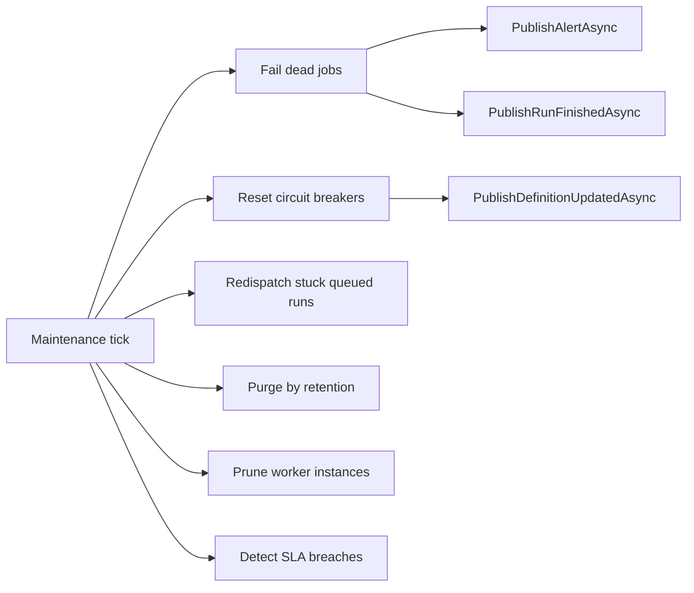

# Lyo.Job.Postgres

PostgreSQL persistence for Lyo job management. Wraps EF Core, the Lyo CRUD/QueryConcrete stack, hand-rolled `JobLyoMapper` (`ILyoMapper`), optional parameter encryption, audit recording, and `IJobEventPublisher` so a host can run a job service: definitions, parameters, schedules, triggers, calendars, workflows, worker registry, runs, batch children, run parameters, run results, run logs, and stats. HTTP mapping (`BuildJobGroup`) lives in `Lyo.Job.Api`.

## Examples

### Register jobs (Postgres)

```csharp
services.AddLyoQueryServices();
services.AddFusionCache(...); // or AddLocalCache(...)

services.AddPostgresJobManagement(o => {
    o.ConnectionString = connectionString;
    o.EnableAutoMigrations = true;
});

// Optional: encrypt sensitive parameter values at rest
services.AddJobParameterEncryption(keyName: "job-parameters");

// After IMqService is registered (e.g. AddRabbitMq):
services.AddMqJobEventPublisher();

// Dead-job watchdog, circuit-breaker reset, retention purge, SLA checks, worker pruning:
services.AddJobMaintenanceService(o => {
    o.DefaultRetentionDays = 90;
    o.PurgeBatchSize = 500;
    o.WorkerInstanceStaleMinutes = 5;
});

// Or bind maintenance from configuration (section JobMaintenance):
services.AddJobMaintenanceServiceFromConfiguration(configuration);
```

## Registration

`AddPostgresJobManagement` registers the `JobContext` factory, optional auto-migrations, the Lyo CRUD services, `JobService`, `JobLyoMapper` as `ILyoMapper`, and a default no-op
`IJobEventPublisher` (`NullJobEventPublisher`). Hosts that also use Mapster for non-job types should replace `ILyoMapper` with `Lyo.Api.Mapping.CompositeLyoMapper(job, mapsterFallback)`. Once an `IMqService` is available, replace
the publisher with `AddMqJobEventPublisher()` (API hosts with a job database only). **Scheduler and worker hosts must not use this package's
publisher**. use `Lyo.Job.Client.AddMqJobEventPublisher*` (`IMqService` + Job.Client) instead.

When `IAuditRecorder` is registered, CRUD hooks record `JobDefinition.*`, `JobRun.*`, and related entity events via `JobAuditHelper`.

## `PostgresJobOptions` (`PostgresJobOptions.SectionName` = `"PostgresJob"`)

| Property | Default | Notes |
| ---------------------- | ------- | --------------------------------------------------------------- |
| `ConnectionString` | `""` | Npgsql connection string. Required. |
| `EnableAutoMigrations` | `false` | When `true`, `Lyo.Postgres` runs pending migrations on startup. |

The schema is fixed as `job`. EF migrations history lives in `job.__EFMigrationsHistory`.

## `JobMaintenanceOptions` (`JobMaintenanceOptions.SectionName` = `"JobMaintenance"`)

| Property | Default | Notes |
| ------------------------------ | ------- | ---------------------------------------------------------------------------------------- |
| `CheckIntervalSeconds` | `30` | Tick cadence for all maintenance tasks. |
| `DefaultRetentionDays` | `0` | Global retention for finished runs; `0` = keep forever. |
| `PurgeBatchSize` | `500` | Max runs deleted per tick. |
| `WorkerInstanceStaleMinutes` | `5` | Prune worker registry rows without recent heartbeat. |
| `QueuedRunRedispatchMinutes` | `10` | Re-publish dispatch for due `Queued` runs untouched this long (`0` disables). See below. |
| `QueuedRunRedispatchBatchSize` | `200` | Max stuck queued runs re-published per tick. |

A per-definition `RetentionDays` value overrides the global default when &gt; 0.

## DI extension methods

| Method | Purpose |
| ---------------------------------------------------------- | ------------------------------------------------------------------------------------------------------------------------------------------------------------------------------------- |
| `AddJobDbContext(connectionString)` | Scoped `JobContext` (legacy). |
| `AddJobDbContextFactory(...)` / `FromConfiguration(...)` | `IDbContextFactory<JobContext>` + migrations. |
| `AddPostgresJobManagement(...)` / `FromConfiguration(...)` | Full job service: factory + CRUD + `JobService` + `NullJobEventPublisher`. |
| `AddJobMaintenanceService(...)` / `FromConfiguration(...)` | `JobMaintenanceService` hosted background service. |
| `AddMqJobEventPublisher(...)` / `FromConfiguration(...)` | `MqJobEventPublisher` + `JobEventPublisherStartupService` (calls `SetupAsync` on host start). Overloads: no-arg, `Action<JobMqOptions>`, options instance, and configuration binding. |
| `AddJobParameterEncryption(keyName)` | `JobParameterEncryptionService` + `IJobParameterEncryptionService`. |

## Run state machine

Every lifecycle transition is a compare-and-swap update (`ExecuteUpdateAsync` with the expected state in the `WHERE` clause), so duplicate MQ deliveries and races between workers,
the API, and maintenance resolve deterministically. Future endpoints that mutate `JobRun.State` must keep this CAS discipline. Create, delete, CAS, log, dead-job timeout, and retention purge also bust `entity:jobrun` and `entity:jobdefinition` query-cache tags so run and last-run grid pages do not stay stale.

| Transition | Performed by | Guard |
| --------------------------------------------- | ---------------------------------------------------------------------- | ----------------------------------------------------------------------------------------------------------------------------------------------------------------------- |
| *(create)* → `Queued` | `CreateJobRun` (API, scheduler, workflow engine, rerun, child fan-out) | Advisory lock per definition; idempotency key; rate/concurrency limits. |
| `Queued` → `Running` | `StartedJobRun` (worker picked up the dispatch message) | CAS on `State == Queued`. A redelivered dispatch, a second worker, or a start after a queued-run cancel is rejected with 400 (no-requeue), never double-executed. |
| `Queued` → `Finished`/`Cancelled` | `CancelJobRun` (user cancels before a worker starts) | CAS on `State == Queued`; publishes both `RunCancelled` and `RunFinished`. If a worker won the race, falls through to the `Cancelling` path. |
| `Running` → `Cancelling` | `CancelJobRun` (user cancels an active run) | Patch; the worker confirms via `FinishedJobRun`. |
| `Running` → `Queued` | `RequeueJobRun` (worker host shutdown hand-back) | CAS on `State == Running`; `Cancelling` is intentionally rejected so a pending user cancel is not forgotten by a restart. Clears `StartedTimestamp`/`LastHeartbeatUtc`. |
| `Running`/`Cancelling` → `Finished` | `FinishedJobRun` (worker reports outcome) | State check; stamps result, duration SLA. |
| `Running`/`Cancelling` → `Finished`/`Timeout` | `JobMaintenanceService` dead-job scan | Heartbeat older than `TimeoutMinutes`; publishes `RunFinished` so retries/triggers/circuit breaker still fire. |

## Dispatch suppression

Immediate `RunCreated` publish is skipped by `CreateJobRun` when `JobRunReq.SuppressDispatch` is set **or** `ScheduledSlotUtc` is in the future (metric `job.service.run.dispatch.deferred`). Dispatch then belongs to the caller: the scheduler's delayed-MQ envelope delivers backoff retries, and the workflow engine publishes step runs only after linking them to their run step. If the owner crashes before publishing, the maintenance service's stuck-queued recovery (below) is the safety net. With suppression requested, creation succeeds even while MQ is disconnected.

## Encryption flow

Values that match an encrypted definition parameter are stored encrypted (`EncryptedValue`) and masked (`***`) by `JobLyoMapper` on every API response. `StartedJobRun` is the single worker-trusted exception: it decrypts parameter values server-side in the response so the executing worker receives real values. Rerun and child-run creation build their requests from the stored entity (not the masked API response), so ciphertext survives cloning and masked `***` strings are never persisted as real values.

## `JobService` hardening

| Feature | Behavior |
| ------------------------- | ----------------------------------------------------------------------------------------------------------------------------------------------------------------------------------------------------------------------------------------------------------------------------------------------------------------------------------------------------------------------------------------------------------------------------------------------------------------------------------------------------------------------------------- |
| **Priority** | Run creation inherits `JobDefinition.Priority`; MQ publish passes priority to `x-max-priority` queues. |
| **Idempotency** | When `JobRunReq.IdempotencyKey` is set, returns the existing run instead of inserting a duplicate (`ix_job_run_idempotency_key_unique`). A second create for the same `(JobScheduleId, ScheduledSlotUtc)` also returns the existing run (`ix_job_run_schedule_slot_unique`) instead of failing the request. |
| **Rate limiting** | Rejects create when hourly run count ≥ `MaxRunsPerHour` (metric `job.service.run.create.rejected`). |
| **Concurrency** | Enforces `MaxConcurrentRuns` (Queued + Running). |
| **SLA** | On start: breaches `MustStartByMinutes` → `SlaBreached=true` + alert. On finish: breaches `ExpectedDurationMinutes` → same. |
| **Audit** | Stamps `DefinitionAuditVersion` from `JobDefinition.DefinitionVersion` on each new run; definition updates bump version. |
| **Tracing** | `JobTracing.StartCreateRun` / `StartRun` / `FinishRun` spans around lifecycle transitions. |
| **Alerting** | Publishes `PublishAlertAsync` for SLA breaches; scheduler/maintenance publish failure/dead-job alerts. |
| **Batch jobs** | `POST Job/Run/{parentId}/Children` creates fan-out child runs; scheduler aggregates parent progress when children finish. |
| **Encryption** | Parameter create/update encrypts via `IJobParameterEncryptionService`; API masks encrypted values; `StartedJobRun` decrypts server-side for the executing worker (see [Encryption flow](#encryption-flow)). |
| **Dry run** | When `JobRunReq.DryRun == true`, validates parameters and returns a synthetic `JobRunRes` without DB insert or MQ publish. |
| **Queued-run resync** | `POST Job/Run/Resync` peeks `job.run.{workerType}` and `.wait`, then republishes due `Queued` runs that are missing. Manual counterpart of stuck-queued maintenance; duplicates are harmless (`StartedJobRun` CAS). |
| **Parameter validation** | `PrepareRunParametersAsync` copies enabled schedule parameters onto omitted keys when `JobRunReq.JobScheduleId` is set (so a 'run this schedule' request can send only the schedule id), then back-fills every declared parameter the caller omitted that carries a default, then enforces the definition schema through `LyoParameterValidator`: required, regex, min/max length, `AllowedValues`, and the declared type. Definition `Options` (JSON text) is a UI picker source (static or root Query); not re-queried on create. |
| **Race-safe concurrency** | `pg_advisory_xact_lock` per definition serializes create + `MaxConcurrentRuns` / rate-limit checks inside a transaction. |
| **Expression defaults** | A definition parameter with `DefaultKind = Expression` renders its `DefaultTemplate` through the `LyoTemplateResolver` resolved from DI, then normalizes the result to the declared type — so a `System.DateTime` parameter can default to yesterday and still pass the type check. A host with no resolver registered fails only the parameters that declare one, naming the missing registration. |

For scheduled runs, a second create for the same `(JobScheduleId, ScheduledSlotUtc)` returns the existing run. `CreateService` swallows unique-constraint exceptions, so `CreateJobRun` looks up the existing row from the failure text (and also pre-checks under the advisory lock).

## Metrics (`job.service.*`, `job.maintenance.*`, `job.sla.*`). `job.service.*`

| Metric | When recorded |
| ----------------------------------- | -------------------------------------------------------------------------------------------------------------------------------------------------------------------------------------------------------------------------------- |
| `job.service.run.created` | Successful insert |
| `job.service.run.create.rejected` | Validation, concurrency, rate limit (tag `reason`: `invalid_parameters`, `mq_disconnected`, `definition_not_found`, `max_runs_per_hour`, `max_concurrent_runs`, `duplicate_slot` when the existing slot row could not be loaded) |
| `job.service.run.dispatch.deferred` | Create with suppressed/deferred dispatch (no immediate `RunCreated` publish) |
| `job.service.run.started` | `StartedJobRun` |
| `job.service.run.start.rejected` | Started CAS guard rejected a non-`Queued` run (duplicate delivery, cancelled, finished) |
| `job.service.run.requeued` | `RequeueJobRun` (worker shutdown hand-back) |
| `job.service.run.finished` | `FinishedJobRun` |
| `job.service.run.cancelled` | `CancelJobRun` |
| `job.service.run.rerun` | `RerunJob` |
| `job.service.run.resynced` | `ResyncQueuedRunsAsync` republished count |
| `job.service.run.duration` | Finished run wall time |
| `job.service.run.queue_latency` | Created → started |

## Metrics (`job.service.*`, `job.maintenance.*`, `job.sla.*`). `job.maintenance.*`

| Metric | When recorded |
| ----------------------------------------- | -------------------------------------- |
| `job.maintenance.tick.duration` | Each maintenance loop |
| `job.maintenance.tick.error` | Tick exception |
| `job.maintenance.dead_jobs.failed` | Heartbeat timeout → Finished/Timeout |
| `job.maintenance.circuit_breakers.reset` | Cooldown elapsed → re-enabled |
| `job.maintenance.runs.purged` | Retention batch delete |
| `job.maintenance.runs.redispatched` | Stuck queued run dispatch re-published |
| `job.maintenance.worker_instances.pruned` | Stale registry cleanup |

## Metrics (`job.service.*`, `job.maintenance.*`, `job.sla.*`). `job.sla.*`

| Metric | When recorded |
| ---------------- | -------------------------------------------------------------------------- |
| `job.sla.breach` | Queued past `MustStartByMinutes` or running past `ExpectedDurationMinutes` |

## `JobMaintenanceService`

`BackgroundService` (`IHealth`: `job-maintenance`) ticking every `CheckIntervalSeconds`:

1. **Dead jobs**. `Cancelling`/`Running` runs past `TimeoutMinutes` → `Timeout`/`Finished` + optional `DeadJob` alert. After commit, publishes `RunFinished` for each timed-out run
 so the scheduler's retry/trigger/circuit-breaker accounting fires (a late worker finish for the same run is rejected by the state check and dropped by the worker as terminal).
2. **Circuit breaker reset**. Re-enables definitions after `CircuitBreakerResetMinutes`; publishes `DefinitionUpdated` so scheduler caches refresh promptly.
3. **Stuck queued redispatch**. Re-publishes `RunCreated` for due `Queued` runs untouched for `QueuedRunRedispatchMinutes` (lost publishes, delayed retries whose slot came due,
 crashed suppressed-dispatch owners). Bumps `UpdatedTimestamp` so a stuck run retries once per threshold window; duplicate deliveries are harmless because `StartedJobRun` only
 transitions `Queued -> Running` once.
4. **Retention purge**. Deletes finished runs older than effective retention in `PurgeBatchSize` batches. Detaches FK references from surviving rows first: `ReRanFromJobRunId`/
 `TriggeredByJobRunId`/`ParentJobRunId` on related runs and `JobWorkflowRunStep.JobRunId` (workflow history is preserved with the run reference nulled), so purging
 workflow-created runs or parents with surviving children cannot violate FKs and wedge the purge.
5. **Worker pruning**. Removes stale `JobWorkerInstance` rows.
6. **SLA breach scan**. Marks `SlaBreached` and increments `job.sla.breach` for overdue queued/running jobs. Alerts for SLA breaches are published by `JobService` on start/finish
 transitions, not by this background scan.



## Event publishers (`Events/`)

- **`NullJobEventPublisher`.** default; `IsConnected() == false`.
- **`MqJobEventPublisher`.** declares `job.events` plus shared queues when missing; publishes run events with optional priority; routes alerts to `job.notifications.alert`. Resolves worker types from EF when `JobContext` is registered. For scheduler/worker hosts use `Lyo.Job.Client.MqJobEventPublisher` instead.

## Design-time migrations

Set `JOB_CONNECTION_STRING` and run:

```bash
export JOB_CONNECTION_STRING="Host=localhost;Database=postgres;Username=postgres;Password=password"
dotnet ef migrations add YourMigrationName --project Lyo.Job.Postgres
```

Recent migrations of note:

- **`ParameterClrTypeFullName`.** Widens parameter/result `type` to 1024, JSON-encodes stored values, folds `allow_multiple` into `List<T>` FullNames, then drops `allow_multiple`.
- **`WidenJobDefinitionWorkerType`.** Widens `job_definition.worker_type` from 7 to 50 characters, matching `job_worker_instance.worker_type` (worker type names longer than 7
 characters were previously truncated/rejected on the definition side only).
- **`AddParameterDefaultExpression`.** Adds `job_parameter.default_kind` (`Literal` | `Expression`, defaulting to `Literal`) and `job_parameter.default_template`. Existing rows read as `Literal`, so the change is backward compatible.
- **`AddJobBlackoutHolidayAndCalendarDays`.** Adds `holiday_slug`, `include_observed_date`, `month_flags`, and `days_of_month` on `job_blackout_window` so holiday and calendar-day windows are stored as rules instead of one dated row per year.

## Dependencies

Generated from `ProjectReference` / `PackageReference` (same model as `docs/Lyo.ProjectGraph.html`).

- `Lyo.Api` (direct, lyo)
- `Lyo.Api.Export` (direct, lyo)
- `Lyo.Audit` (direct, lyo)
- `Lyo.Common.Metadata` (direct, lyo)
- `Lyo.Encryption` (direct, lyo)
- `Lyo.Exceptions` (direct, lyo)
- `Lyo.Job.Models` (direct, lyo)
- `Lyo.MessageQueue` (direct, lyo)
- `Lyo.Parameters` (direct, lyo)
- `Lyo.Postgres` (direct, lyo)
- `Lyo.Scheduler` (direct, lyo)
- `Microsoft.EntityFrameworkCore` `10.0.5` (direct, microsoft)
- `Microsoft.EntityFrameworkCore.Design` `10.0.5` (direct, microsoft)
- `Microsoft.Extensions.Configuration.Binder` `10.0.5` (direct, microsoft)
- `Lyo.Api.Models` (transitive, lyo)
- `Lyo.Cache` (transitive, lyo)
- `Lyo.Common.Core` (transitive, lyo)
- `Lyo.Common.Json` (transitive, lyo)
- `Lyo.Compression` (transitive, lyo)
- `Lyo.DateAndTime` (transitive, lyo)
- `Lyo.Diagnostic` (transitive, lyo)
- `Lyo.Diagnostic.AspNetCore` (transitive, lyo)
- `Lyo.Diff` (transitive, lyo)
- `Lyo.EntityReference.Models` (transitive, lyo)
- `Lyo.Formatter` (transitive, lyo)
- `Lyo.Hashing` (transitive, lyo)
- `Lyo.Health` (transitive, lyo)
- `Lyo.KeyStore` (transitive, lyo)
- `Lyo.Metrics` (transitive, lyo)
- `Lyo.PackageMetadata` (transitive, lyo)
- `Lyo.Query` (transitive, lyo)
- `Lyo.Query.Evaluation` (transitive, lyo)
- `Lyo.Query.Models` (transitive, lyo)
- `Lyo.Result` (transitive, lyo)
- `Lyo.Schedule.Models` (transitive, lyo)
- `Lyo.Streams` (transitive, lyo)
- `Lyo.Validation` (transitive, lyo)
- `Lyo.Validation.Models` (transitive, lyo)
- `BouncyCastle.Cryptography` `2.6.2` (transitive, third-party, netstandard2.0)
- `DynamicExpresso.Core` `2.19.3` (transitive, third-party)
- `EasyCompressor` `2.1.0` (transitive, third-party)
- `Konscious.Security.Cryptography.Argon2` `1.3.1` (transitive, third-party)
- `Microsoft.AspNetCore.OpenApi` `10.0.5` (transitive, microsoft)
- `Microsoft.Bcl.AsyncInterfaces` `10.0.5` (transitive, microsoft, netstandard2.0)
- `Microsoft.EntityFrameworkCore.Analyzers` `10.0.5` (transitive, microsoft)
- `Microsoft.EntityFrameworkCore.Relational` `10.0.5` (transitive, microsoft)
- `Microsoft.Extensions.Caching.Memory` `10.0.5` (transitive, microsoft)
- `Microsoft.Extensions.DependencyInjection` `10.0.5` (transitive, microsoft)
- `Microsoft.Extensions.DependencyInjection.Abstractions` `10.0.5` (transitive, microsoft, net10.0, netstandard2.0)
- `Microsoft.Extensions.Hosting.Abstractions` `10.0.5` (transitive, microsoft)
- `Microsoft.Extensions.Logging.Abstractions` `10.0.5` (transitive, microsoft)
- `Microsoft.Extensions.Options` `10.0.5` (transitive, microsoft)
- `Microsoft.Extensions.Options.ConfigurationExtensions` `10.0.5` (transitive, microsoft)
- `Npgsql.EntityFrameworkCore.PostgreSQL` `10.0.3` (transitive, third-party)
- `SmartFormat.NET` `3.6.1` (transitive, third-party)
- `System.Buffers` `4.6.1` (transitive, microsoft, netstandard2.0)
- `System.ComponentModel.Annotations` `5.0.0` (transitive, microsoft)
- `System.Diagnostics.DiagnosticSource` `10.0.5` (transitive, microsoft, netstandard2.0)
- `System.IO.Hashing` `10.0.5` (transitive, microsoft, net10.0)
- `System.Memory` `4.6.3` (transitive, microsoft, netstandard2.0)
- `System.Text.Json` `10.0.5` (transitive, microsoft, netstandard2.0)
- `System.Threading.Tasks.Extensions` `4.6.3` (transitive, microsoft, netstandard2.0)