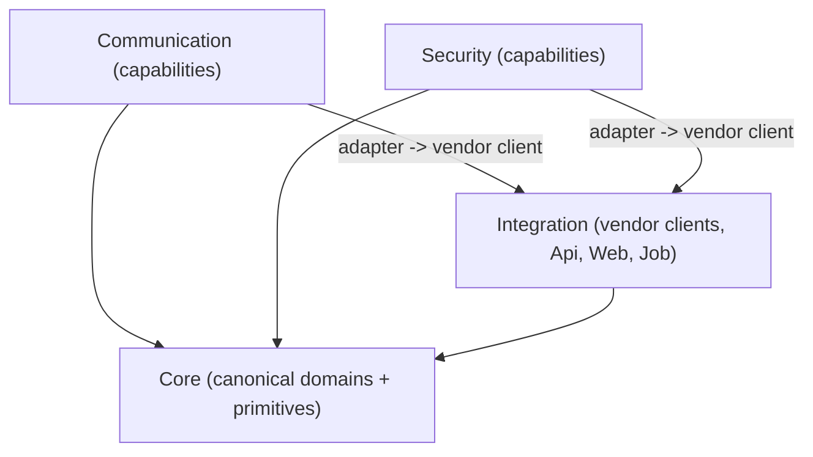

# Architecture

Lyo is a taxonomy-first monorepo: roughly one folder per NuGet-style package, grouped into top-level areas under [`Lyo.Net/`](../Lyo.Net/). A package's area is decided by *what kind of thing it is* (an archetype), not by which vendor it talks to. This page is the high-level map. The detailed standard is [`Lyo.Net/docs/package-layout.md`](../Lyo.Net/docs/package-layout.md).

## Areas

| Area            | Role                                                                                                                                                                                                                                       |
|-----------------|--------------------------------------------------------------------------------------------------------------------------------------------------------------------------------------------------------------------------------------------|
| `Core`          | Domain-agnostic primitives and canonical Lyo domains: caching, diagnostics, validation, metrics, resilience, exceptions, math/science, people, geolocation, entity references, locks, scheduling, streams, audit, change tracking, health. |
| `Data`          | Persistence and data handling: file storage (local/S3/Blob), compression, CSV/XLSX/PDF, images, QR codes, Postgres migration helpers, query shapes.                                                                                        |
| `Security`      | Cryptography (`Lyo.Encryption`), hashing, authentication providers, content-threat scanning, keystores.                                                                                                                                    |
| `Communication` | Messaging and media delivery: email, SMS, text-to-speech, translation, message queues.                                                                                                                                                     |
| `Integration`   | App-facing packages and vendor integrations: the `Lyo.Api` query engine, Blazor web components, jobs, and vendor clients (Google, Endato, Discord, Typecast, ...).                                                                         |
| `Features`      | Composable, often EF-backed product features: comments, notes, favorites, ratings, tags, typed config, contact forms, profanity, short URLs.                                                                                               |
| `Apps`          | Sample and reference HTTP hosts (for example the centralized config API).                                                                                                                                                                  |
| `Tools`         | Utilities and host apps for trying components end to end.                                                                                                                                                                                  |

A live, interactive view of the actual project-reference graph is generated into [`Lyo.ProjectGraph.html`](Lyo.ProjectGraph.html) by [`scripts/gen_graph.py`](../scripts/gen_graph.py).

## Archetypes

Every package is classified by archetype, which determines where it lives and how it may depend on other packages:

- **A. Lyo domain (canonical).** Shared business model and persistence owned by Lyo (for example `Lyo.People.Models`, `Lyo.Geolocation.Postgres`). Lives in `Core/{Domain}/`. Must not reference vendor SDKs or clients.
- **B. Capability + provider.** One Lyo interface, many vendor implementations (for example `ITranslationService` + `Lyo.Translation.Google`). Lives in `Communication/{Capability}/` or `Security/{Capability}/`.
- **C. Vendor client.** A thin HTTP/SDK wrapper (for example `Lyo.Endato.Client`, `Lyo.Google.Geolocation.Client`). Lives in `Integration/{Vendor}/`.
- **D. Vendor product vertical.** The integration *is* the product, with its own models and schema (for example `Lyo.Discord.*`). Lives in `Integration/{Vendor}/`.
- **E. Platform.** Cross-cutting app infrastructure (`Api`, `Web`, `Job`, `Data/*`, `Features/*`, `Tools/*`).

## Dependency law

The taxonomy exists to keep dependencies flowing one way. In short:

**Allowed**

- `Communication` / `Security` -> `Core`
- `Integration` vendor client -> `Core` (for example a vendor client maps onto a Core domain's models)
- A `Communication` / `Security` provider -> an `Integration` vendor client (the Typecast pattern: `Lyo.Tts.Typecast` -> `Lyo.Typecast.Client`)

**Forbidden**

- `Core` -> `Integration` or any vendor SDK
- Moving Archetype B providers out of `Communication`/`Security` into `Integration/{Vendor}/`

Hosts do the wiring: a vendor client's DTOs are mapped to Core stores (`IPeopleStore`, `IGeolocationStore`, ...) at ingest. External source-type strings are defined in the vendor/mapper package, never in Core.

## Adding a new package

1. Run the classification checklist in [`package-layout.md`](../Lyo.Net/docs/package-layout.md#classification-checklist).
2. Pick the folder and assembly name from the naming table.
3. Verify the project references obey the dependency law above.
4. Add a row to the relevant inventory section in `package-layout.md` if the package is Integration, Communication, or Security.

See [`package-layout.md`](../Lyo.Net/docs/package-layout.md) for worked examples (People + Endato, Geolocation + Google, Translation, Typecast, ESPN, Discord) and the full per-area inventory.
